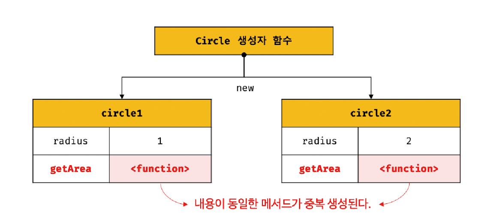
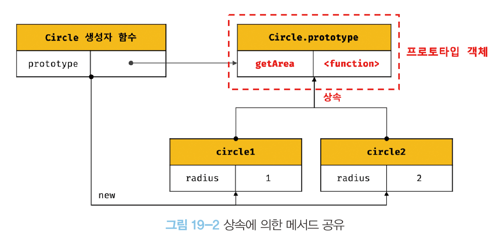
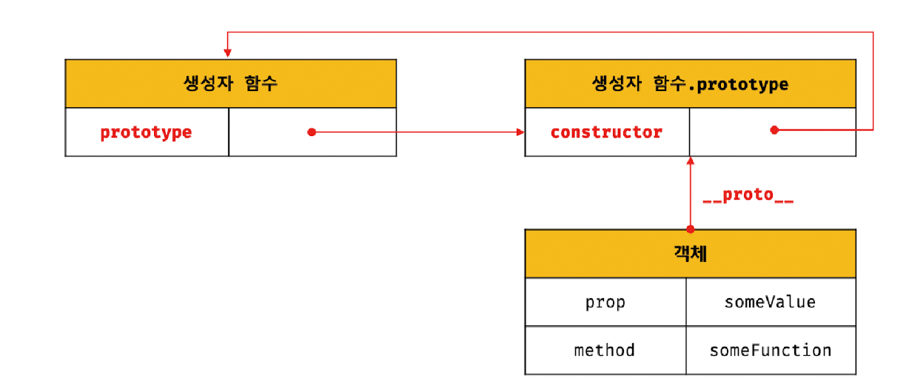
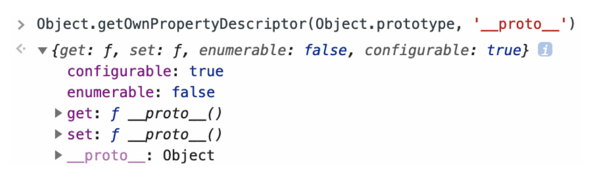
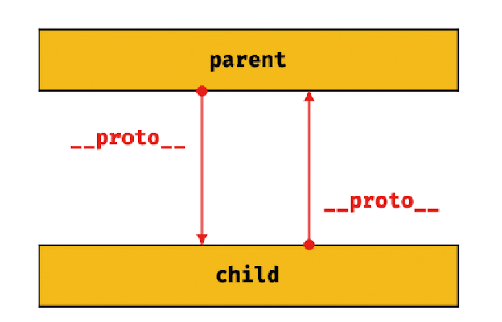
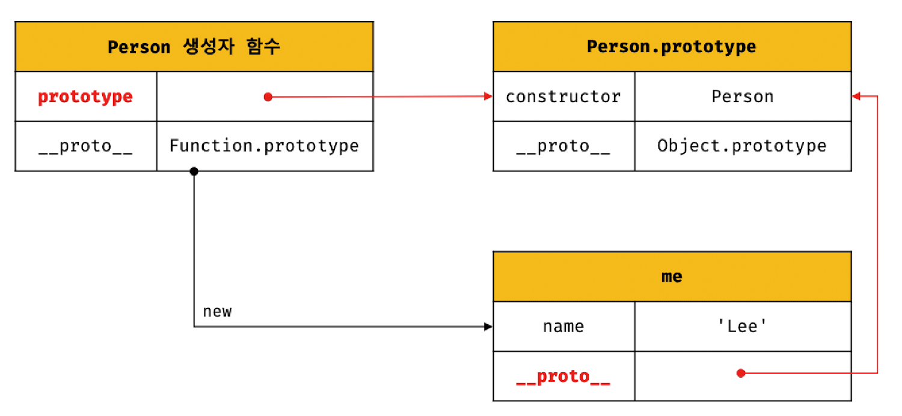
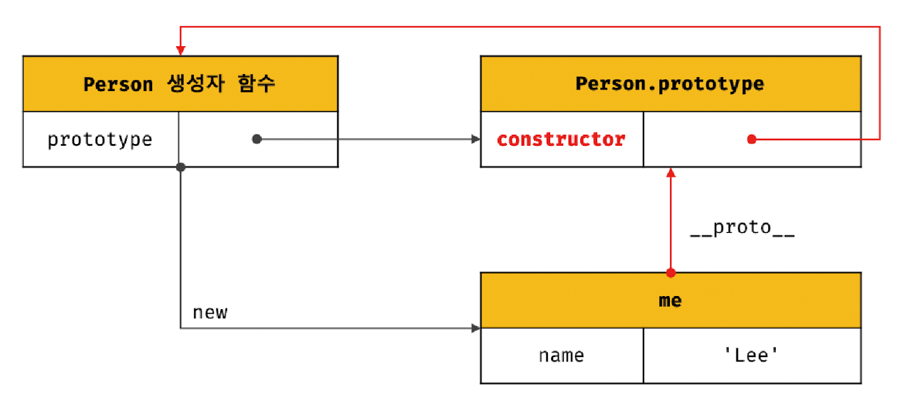
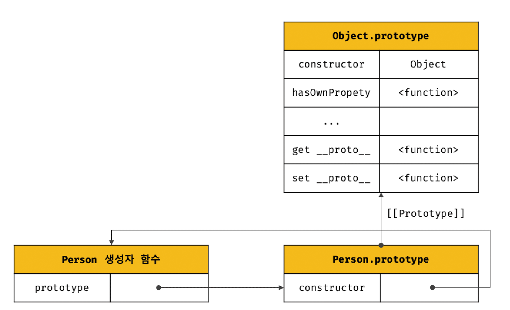
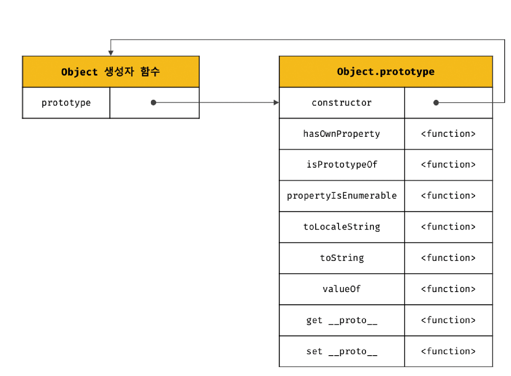

[19.1 객체지향 프로그래밍](#191-객체지향-프로그래밍)  
[19.2 상속과 프로토타입](#192-상속과-프로토타입)  
[19.3 프로토타입 객체](#193-프로토타입-객체)  
[19.4 리터럴 표기법에 의해 생성된 객체의 생성자 함수와 프로토타입](#194-리터럴-표기법에-의해-생성된-객체의-생성자-함수와-프로토타입)  
[19.5 프로토타입의 생성 시점](#195-프로토타입의-생성-시점)

> 자바스크립트는 명령형, 함수형, 프로토타입 기반 객체지향 프로그래밍을 지원하는 멀티 패러다임 프로그래밍 언어이다.

# 19.1 객체지향 프로그래밍

> 여러 개의 독립적 단위, 즉 객체의 집합으로 프로그램을 표현하려는 프로그래밍 패러다임을 의미한다.

객체지향 프로그래밍은 실세계의 실체를 인식하는 철학적 사고를 프로그래밍에 접목하려는 시도에서 시작한다.

- `추상화`: 다양한 속성 중에서 프로그램에 필요한 속성만 간추려 내어 표현하는 것

객체지향 프로그래밍은 객체의 `상태`를 나타내는 데이터와 상태 데이터를 조작할 수 있는 `동작`을 하나의 논리적인 단위로 묶어 생각한다.  
따라서 객체는 **상태 데이터와 동작을 하나의 논리적인 단위로 묶은 복합적인 자료구조**라고 할 수 있다.

- 프로퍼티: 객체의 상태 데이터
- 메서드: 동작

각 객체는 고유의 기능을 갖는 독집적인 부품으로 볼 수 있지만 자신의 고유한 기능을 수행하면서 다른 객체와 관계성을 가질 수 있다.

<br />

# 19.2 상속과 프로토타입

> 상속: 어떤 객체의 프로퍼티 또는 메서드를 다른 객체가 상속받아 그대로 사용할 수 있는 것

자바스크립트는 **프로토타입을 기반으로 상속을 구현**해 불필요한 중복을 제거한다.

```js
// 생성자 함수
function Circle(radius) {
  this.radius = radius;
  this.getArea = function () {
    return Math.PI * this.radius ** 2;
  };
}

const circle1 = new Circle(1);
const circle2 = new Circle(2);

console.log(circle1.getArea == circle2.getArea); // false
```

Circle 생성자 함수가 생성하는 모든 객체(인스턴스)는 `radius 프로퍼티`와 `getArea 메서드`를 갖는다.

radius 프로퍼티 값은 일반적으로 인스턴스마다 다르다.  
하지만 getArea 메서드는 모든 인스턴스가 동일한 내용의 메서드를 사용하므로 단 하나만 생성하여 모든 인스턴스가 공유해서 사용하는 것이 바람직하다.

그런데 Circle 생성자 함수는 인스턴스를 생성할 때마다 getArea 메서드를 중복 생성하고 모든 인스턴스가 중복 소유한다.


이것은 메모리를 불필요하게 낭비한다.
또한 인스턴스를 생성할 때마다 메서드를 생성하므로 퍼포먼스에도 악영향을 준다.

```js
function Circle(radius) {
  this.radius = radius;
}

Circle.prototype.getArea = function () {
  return Math.PI * this.radius ** 2;
};

const circle1 = new Circle(1);
const circle2 = new Circle(2);

console.log(circle1.getArea == circle2.getArea); // true
```



Circle 생성자 함수가 생성한 모든 인스턴스는 자신의 프로토타입, 즉 상위(부모) 객체 역할을 하는 `Circle.prototype`의 모든 프로퍼티와 메서드를 상속받는다.

getArea는 단 하나만 생성되어 프로토타입인 Circle.prototype의 메서드로 할당되어 있다. 따라서 Circle 생성자 함수가 생성하는 모든 인스턴스는 getArea 메서드를 상속받아 사용할 수 있다.  
즉, 자신의 상태를 나타내는 radius 프로퍼티만 개별적으로 소유하고 **내용이 동일한 메서드는 상속을 통해 공유**하여 사용하는 것이다.

상속은 코드의 재사용이란 관점에서 매우 유용하다.

<br />

# 19.3 프로토타입 객체

프로토타입 객체는 **객체지향 프로그래밍의 근간을 이루는 객체 간 상속을 구현하기 위해 사용된다.**

프로토타입은 **`어떤 객체의 상위 객체의 역할을 하는 객체`로서 다른 객체에 공유 프로퍼티를 제공한다.**  
프로토타입을 상속받은 하위 객체는 상위 객체의 프로퍼티를 자신의 프로퍼티처럼 자유롭게 사용할 수 있다.

모든 객체는 [[Prototype]] 이라는 내부 슬롯을 가지며, 이 내부 슬롯의 값은 프로토타입의 참조(null인 경우도 있다)다.
객체가 생성될 때 객체 생성 방식에 다라 프로토타입이 결정되고 [[Prototype]]에 저장된다.

모든 객체는 하나의 프로토타입을 갖는다. 그리고 모든 프로토타입은 생성자 함수와 연결되어 있다.



[[Prototype]] 내부 슬롯에는 직접 접근할 수 없지만. `__proto__` 접근자 프로퍼티를 통해 자신의 프로토타입에 간접적으로 접근할 수 있다.

<br>

## `__proto__` 접근자 프로퍼티

> 모든 객체는 `__proto__` 접근자 프로퍼티를 통해 자신의 프로토타입, 즉 [[Prototype]] 내부 슬롯에 간접적으로 접근할 수 있다.

접근자 프로퍼티는 자체적으로는 값([[Value]] 프로퍼티 어트리뷰트)을 갖지 않고 다른 데이터 프로퍼티의 값을 읽거나 저장할 때 사용하는 접근자 함수, 즉 [[Get]], [[Set]] 프로퍼티 어트리튜브로 구성된 프로퍼티다.

Object.prototype의 접근자 프로퍼티인 `__proto__`는 접근자 함수를 통해 [[Prototype]] 내부 슬롯의 값, 즉 프로토타입을 취득하거나 할당한다.



```js
const obj = {};
const parent = { x: 1 };

obj.__proto__; // getter 함수인 get __proto__ 호출

obj.__proto__ = parent; // setter 함수 호출, obj 객체의 프로토타입을 교체

console.log(obj.x); // 1
```

<br>

### `__proto__` 접근자 프로퍼티는 상속을 통해 사용된다.

** proto ** 접근자 프로퍼티는 객체가 직접 소유하는 프로퍼티가 아니라 Object.prototype의 프로퍼티다.

모든 객체는 상속을 통해 `Object.prototype.__proto__` 접근자 프로퍼티를 사용할 수 있다.

```js
const person = { name: "so" };

console.log(person.hasOwnProperty("__proto__")); // false

// 모든 객체는 Object.prototype의 프로퍼티 __proto__를 상속받아 사용할 수 있다.
console.log({}.__proto__ === Object.prototype); // true
```

<br>

### `__proto__` 접근자 프로퍼티를 통해 프로토타입에 접근하는 이유

> 상호 참조에 의해 프로토타입 체인이 생성되는 것을 방지하기 위해서다.

```js
const parent = {};
const chile = {};

child.__proto__ = parent;
parent.__proto__ = child; // TypeError: Cyclic __proto__ value
```

위 코드가 에러 없이 정상적으로 처리되면 서로가 자신의 프로토타입이 되는 비정상적인 프로토타입 체인이 만들어지기 때문에 에러를 발생시킨다.


프로토타입 체인은 단방향 링크드 리스트로 구현되어야 한다. 즉, 프로퍼티 검색 방향이 한쪽 방향으로만 흘러가야 한다.

하지만 위 그림과 같이 순환 참조하는 프로토타입 체인이 만들어지면 체인 종점이 존재하지 않기 때문에 프로토타입 체인에서 프로퍼티를 검색할 때 무한 루프에 빠진다.

따라서 아무런 체크 없이 무조건적으로 프로토타입을 교체할 수 없도록 `__proto__`접근자 프로퍼티를 통해 프로토타입에 접근하고 교체하도록 구현되어 있다.

<br>

### `__proto__` 접근자 프로퍼티를 코드 내에서 직접 사용하는 것은 권장하지 않는다.

모든 객체가 `__proto__` 접근자 프로퍼티를 사용할 수 있는 것은 아니다.

직접 상속을 통해 Object.prototype을 상속받지 않는 객체를 생성할 수도 있기 때문에 `__proto__` 접근자 프로퍼티를 사용할 수 없는 경우가 있다.

```js
// obj는 프로토타입 체인의 종점이다. 따라서 Object.__proto__를 상속받을 수 없다.
const obj = Object.create(null);

console.log(Object.getPrototypeOf(obj)); // null
```

따라서 `__proto__` 접근자 프로퍼티 대신 프로토타입의 참조를 취득하고 싶은 경우에는 `Object.getPrototypeOf` 메서드를 사용하고, 교체하고 싶은 경우에는 `Object.setPrototypeOf` 메서드를 사용할 것을 권장한다.

```js
const obj = {};
const parent = { x: 1 };

Object.getPrototypeOf(obj); // obj.__proto__
Object.setPrototypeOf(obj, parent); // obj.__proto__ = parent;
```

<br>

## 함수 객체의 prototype 프로퍼티

> 함수 객체만이 소유하는 prototype 프로퍼티는 **생성자 함수가 생성할 인스턴스의 프로토타입을 가리킨다.**

```js
(function () {}).hasOwnProperty("prototype"); // true

({}).hasOwnProperty("prototype"); // false
```

생성자 함수로서 호출할 수 없는 함수(non-constructor)인 화살표 함수와 메서드 축약 표현으로 정의한 메서드는 prototype 프로퍼티를 소유하지 않으며 프로토타입도 생성하지 않는다.

모든 객체가 가지고 있는(엄밀히 말하면 Object.prototype으로 부터 상속받은) `__proto__` 접근자 프로퍼티와 함수 객체만이 가지고 있는 prototype 프로퍼티는 결국 동일한 프로토타입을 가리킨다.
하지만 이들 프로퍼티를 사용하는 주체가 다르다.

| 구분                        | 소유        | 값                | 사용 주체   | 사용 목적                                                          |
| --------------------------- | ----------- | ----------------- | ----------- | ------------------------------------------------------------------ |
| `__proto__` 접근자 프로퍼티 | 모든 객체   | 프로토타입의 참조 | 모든 객체   | 객체가 자신의 프로토타입에 접근 또는 교체하기 위해 사용            |
| prototype 프로퍼티          | constructor | 프로토타입의 참조 | 생성자 함수 | 생성자 함수가 자신이 생성할 객체의 프로토타입을 할당하기 위해 사용 |

```js
function Person(name) {
  this.name = name;
}

const me = new Person("so");

console.log(Person.prototype === me.__proto__); //true
```


객체의 `__proto__` 접근자 프로퍼티와 함수 객체의 prototype 프로퍼티는 결국 동일한 프로토타입을 가리킨다.

<br>

## 프로토타입의 constructor 프로퍼티와 생성자 함수

모든 프로토타입은 constructor 프로퍼티를 갖는다. 이 프로퍼티는 prototype 프로퍼티로 자신을 참조하고 있는 생성자 함수를 가리킨다.

이 연결은 생성자 함수가 생성될 때, 즉 함수 객체가 생성될 때 이뤄진다.

```js
function Person(name) {
  this.name = name;
}

const me = new Person("so");

console.log(me.constructor === Person); //true
```


Person 생성자 함수는 me 객체를 생성했다. 이때 me는 프로토타입의 constructor 프로퍼티를 통해 생성자 함수와 연결된다.
me 객체는 프로토타입인 Person.prototype의 constructor 프로퍼티를 상속받아 사용할 수 있다.

<br>

# 19.4 리터럴 표기법에 의해 생성된 객체의 생성자 함수와 프로토타입

리터럴 표기법에 의한 객체 생성 방식과 같이 명시적으로 new 연산자와 함께 생성자 함수를 호출하여 인스턴스를 생성하지 않는 객체 생성 방식도 있다.

리터럴 표기법에 의해 생성된 객체의 경우 프로토타입의 constructor 프로퍼티가 가리키는 생성자 함수가 반드시 객체를 생성한 생성자 함수라고 단정할 수는 없다.

```js
// 객체 리터럴로 생성
const obj = {};
console.log(obj.constructor === Object); // false
```

> ECMAScript 사양을 살펴보면,
> Object 생성자 함수에 인수를 전달하지 않거나 undefined 또는 null을 인수로 전달하면서 호출하면 내부적으로 추상 연산 OrdinaryObjectCreate를 호출하여 Object.prototype을 프로토타입으로 갖는 빈 객체를 생성하고,  
> 객체 리터럴이 평가될 때는 추상 연산 OrdinaryObjectCreate를 호출하여 빈 객체를 생성하고 프로퍼티를 추가하도록 정의되어 있다.

Object 생성자 함수 호출과 객체 리터럴의 평가는 OrdinaryObjectCreate를 호출하여 빈 객체를 생성하는 점에서 동일하나 new.target의 확인이나 추가하는 처리 등 세부 내용은 다르다. 따라서 객체 리터럴에 의해 생성된 객체는 Object 생성자 함수가 생성한 객체가 아니다.

<br>

리터럴 표기법에 의해 생성된 객체도 상속을 위해 프로토타입이 필요하다. 따라서 이 객체도 가상적인 생성자 함수를 갖는다.
프로토타입은 생성자 함수와 더불어 생성되며 prototype, constructor 프로퍼티에 의해 연결되어 있기 때문이다. 다시 말해, **프로토타입과 생성자 함수는 단독으로 존재할 수 없고 언제나 쌍으로 존재한다.**

> 리터럴 표기법에 의해 생성된 객체는 생성자 함수에 의해 생성된 객체는 아니지만 큰 틀에서 생각해보면 본질적인 면에서 큰 차이는 없다.  
> 따라서 프로토타입의 constructor 프로퍼티를 통해 연결되어 있는 생성자 함수를 리터럴 표기법으로 생성한 객체를 생성한 생성자 함수로 생각해도 크게 무리는 없다.

<br>
<br>

# 19.5 프로토타입의 생성 시점

> 프로토타입은 생성자 함수가 생성되는 시점에 더불어 생성된다.

생성자 함수는 사용자 정의 생성자 함수와 자바스크립트가 기본 제공하는 빌트인 생성자 함수로 구분할 수 있다.

## 1. 사용자 정의 생성자 함수와 프로토타입 생성 시점

생성자 함수로서 호출할 수 있는 함수(constructor)는 **함수 정의가 평가되어 함수 객체를 생성하는 시점에 프로토타입도 더불어 생성된다.**

```js
console.log(Person.prototype); // {constructor: ƒ}

function Person(name) {
  this.name = name;
}
```

함수 선언문은 런타임 이전에 자바스크립트 엔진에 의해 먼저 실행된다. 따라서 Person 생성자 함수는 어떤 코드보다 먼저 평가되어 함수 객체가 되고 이때 프로토타입도 더불어 생성된다.  
생성된 프로토타입은 Person 생성자 함수의 prototype 프로퍼티에 바인딩된다.

프로토타입도 객체이고 모든 객체는 프로토타입을 가지므로 프로토타입도 자신의 프로토타입을 갖는다.
생성된 프로토타입의 프로토타입은 Object.prototype이다.


<br>

## 2. 빌트인 생성자 함수와 프로토타입 생성 시점

Object, String, Number, Function, Array, RegExp, Date, Promise 등과 같은 빌트인 생성자 함수도 마찬가지로 빌트인 생성자 함수가 생성되는 시점에 프로토타입이 생성된다.

모든 빌트인 생성자 함수는 전역 객체가 생성되는 시점에 생성되고, 생성된 프로토타입은 빌트인 생성자 함수의 prototype 프로퍼티에 바인딩 된다.



이처럼 객체가 생성되기 이전에 생성자 함수와 프로토타입은 이미 객체화되어 존재한다.  
이후 생성자 함수 또는 리터럴 표기법으로 객체를 생성하면 프로토타입은 생성된 객체의 [[Prototype]] 내부 슬롯에 할당된다. 이로써 생성된 객체는 프로토타입을 상속받는다.
