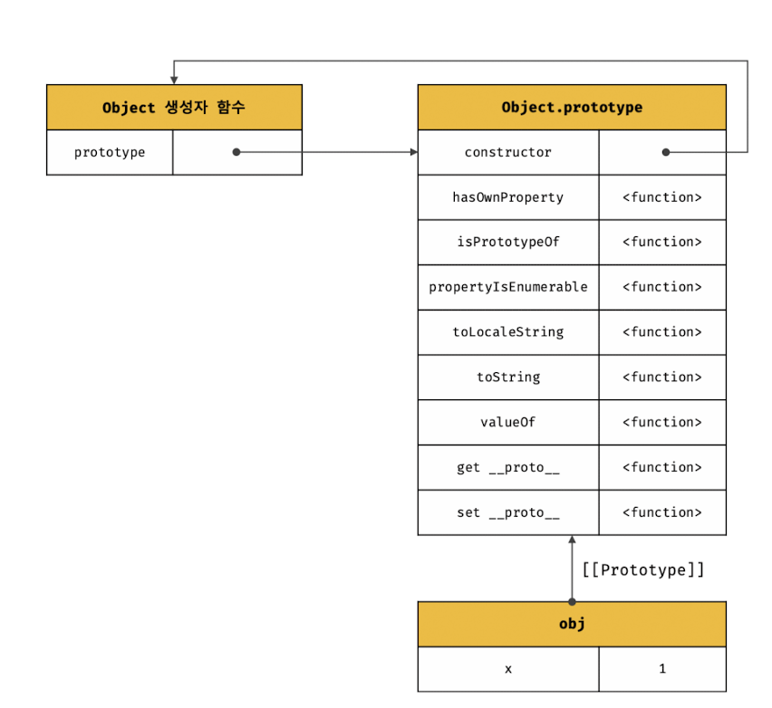
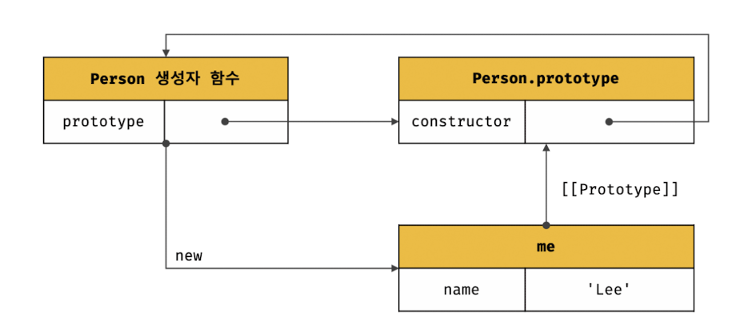
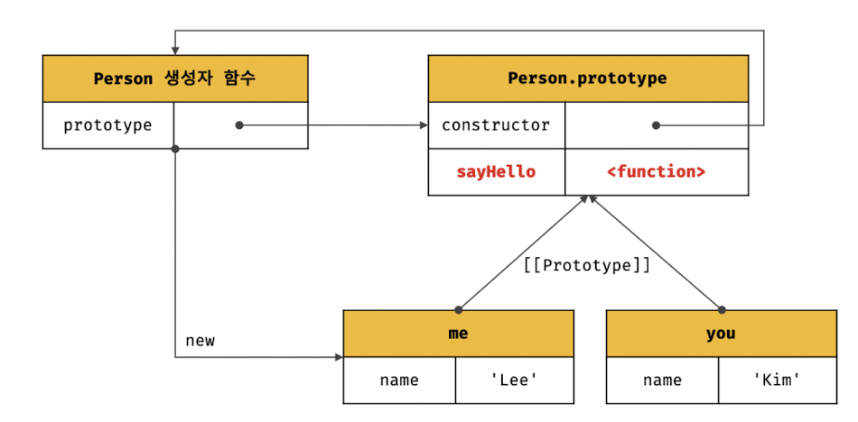
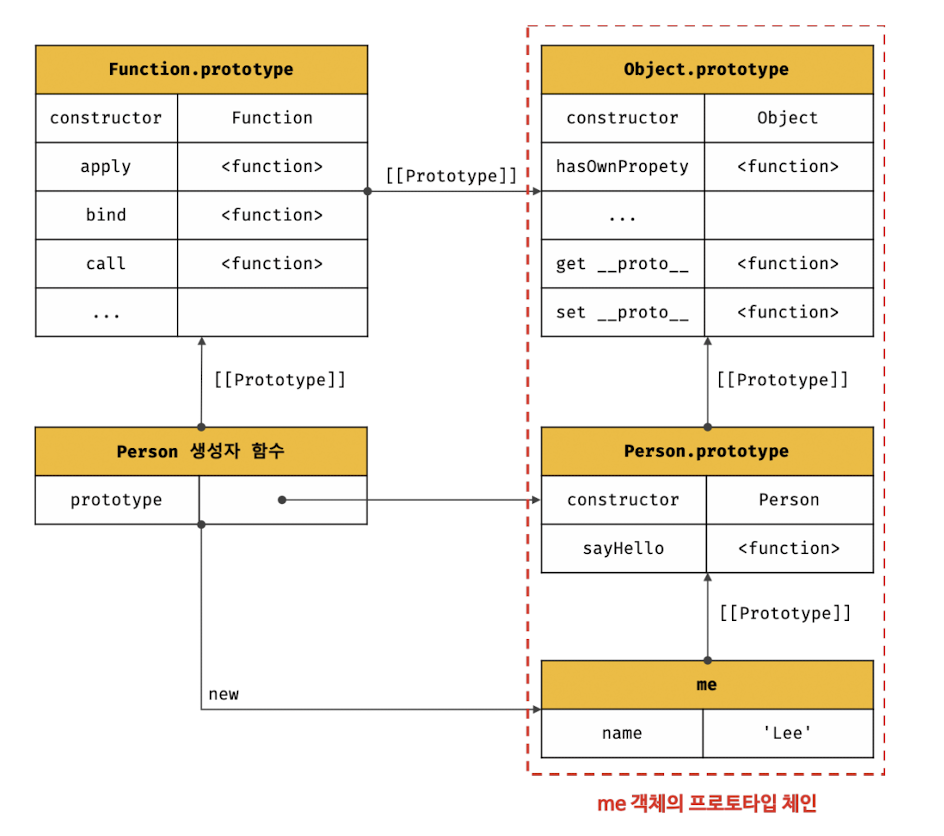
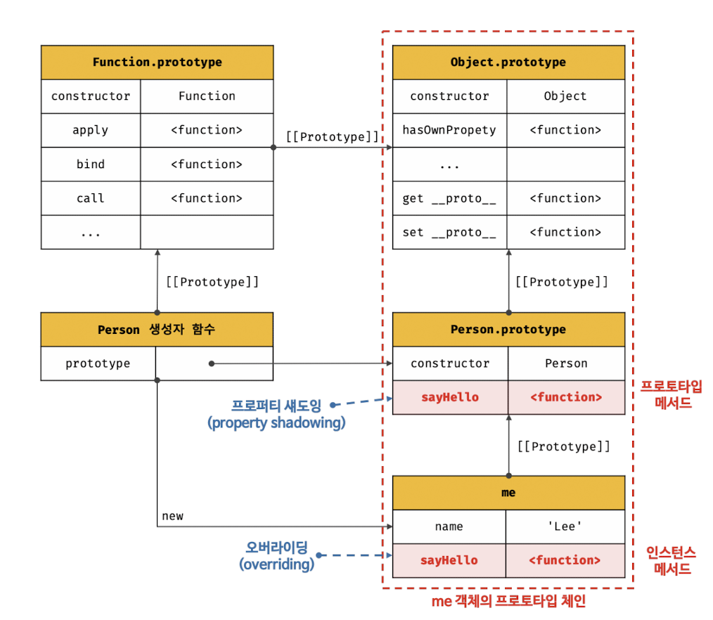
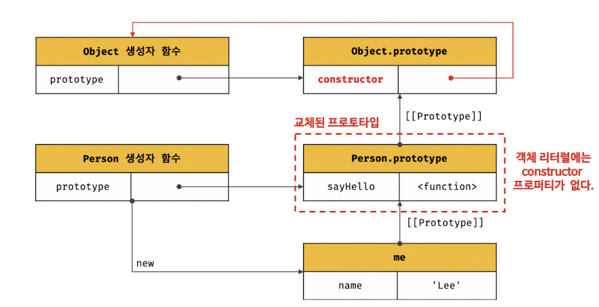
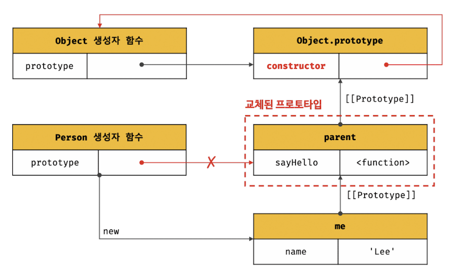
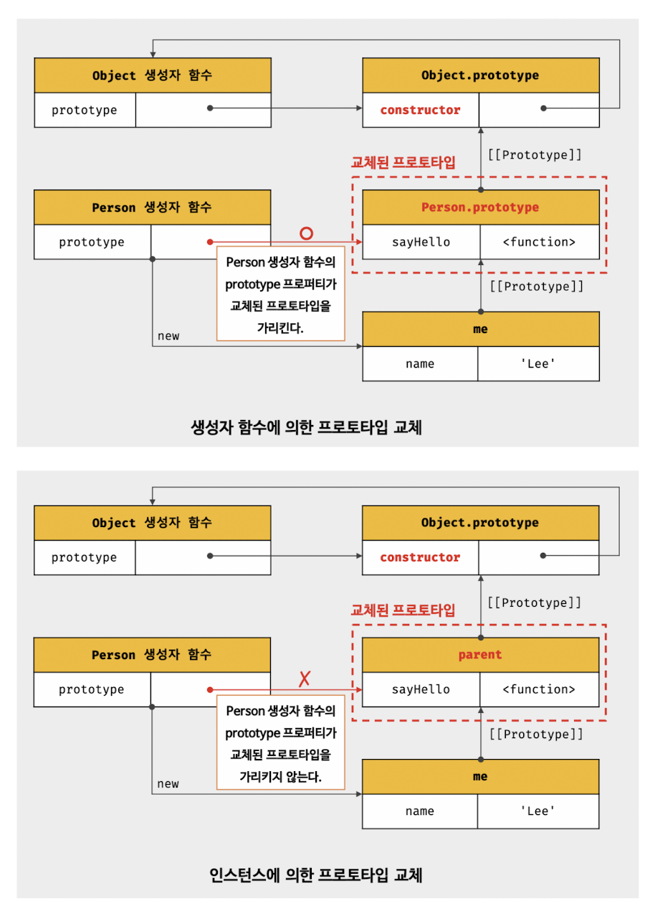
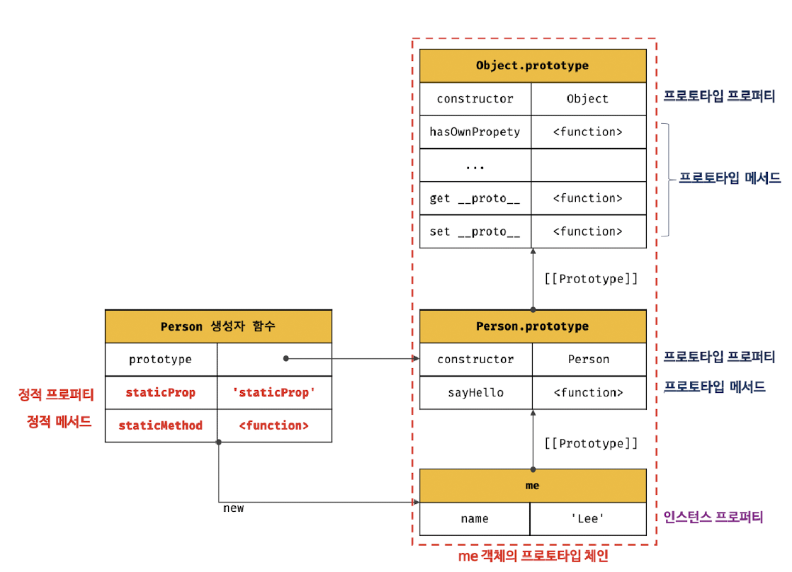

# 목차

[19.6 객체 생성 방식과 프로토타입의 결정](#196-객체-생성-방식과-프로토타입의-결정)  
[19.7 프로토타입 체인](#197-프로토타입-체인)  
[19.8 오버라이딩과 프로퍼티 섀도잉](#198-오버라이딩과-프로퍼티-섀도잉)  
[19.9 프로토타입의 교체](#199-프로토타입의-교체)  
[19.10 instanceof 연산자](#1910-instanceof-연산자)  
[19.11 직접 상속](#1911-직접-상속)  
[19.12 정적 프로퍼티/메서드](#1912-정적-프로퍼티메서드)  
[19.13 프로퍼티 존재 확인](#1913-프로퍼티-존재-확인)  
[19.14 프로퍼티 열거](#1914-프로퍼티-열거)

# 19.6 객체 생성 방식과 프로토타입의 결정

> 다양한 방식으로 생성된 모든 객체는 각 방식마다 세부적인 객체 생성 방식의 차이는 있으나 추상 연산 OrdinaryObjectCreate에 의해 생성된다는 공통점이 있다.

OrdinaryObjectCreate는 필수적으로 자신이 생성할 객체의 프로토타입을 인수로 전달받는다. 그리고 자신이 생성할 객체에 추가할 프로퍼티 목록을 옵션으로 전달할 수 있다.

OrdinaryObjectCreate에는 빈 객체를 생성한 후, 객체에 추가할 프로퍼티 목록이 인수로 전달된 경우 프로퍼티를 객체에 추가한다. 그리고 인수로 전달받은 프로토타입을 자신이 생성한 객체의 [[Prototype]] 내부 슬롯에 할당한 다음, 생성한 객체를 반환한다.

즉, 프로토타입은 추상 연산 OrdinaryObjectCreate에 전달되는 인수에 의해 결정된다. 이 인수는 객체가 생성되는 시점에 객체 생성 방식에 의해 결정된다.

<br>

## 객체 리터럴에 의해 생성된 객체의 프로토타입

자바스크립트 엔진은 객체 리터럴을 평가하여 객체를 생성할 때 추상 연산 OrdinaryObjectCreate를 호출한다.
이때 OrdinaryObjectCreate에 전달되는 프로토타입은 `Object.prototype`이다.

```js
const obj = { x: 1 };
```

위 객체 리터럴이 평가되면 추상 연산 OrdinaryObjectCreate에 의해 다음과 같이 Object 생성자 함수와 Object.prototype과 생성된 객체 사이에 연결이 만들어진다.



이철머 객체 리터럴에 의해 생성된 obj 객체는 Object.prototype을 프로토타입으로 갖게 되며, Object.prototype을 상속받는다.

<br>

## Object 생성자 함수에 의해 생성된 객체의 프로토타입

Object 생성자 함수를 인수 없이 호출하면 빈 객체가 생성된다. 객체 리터럴과 마찬가지로 추상 연산 OrdinaryObjectCreate가 호출된다.
이때 OrdinaryObjectCreate에 전달되는 프로토타입은 `Object.prototype`이다.

```js
const obj = new Object();
obj.x = 1;
```

객체 리터럴에 의해 생성된 객체와 동일한 구조를 갖는다.

Object 생성자 함수에 의해 생성된 객체는 Object.prototype을 프로토타입으로 갖게 되며, Object.prototype을 상속받는다.

> 객체 리터럴 vs Object 생성자 함수: 프로퍼티를 추가하는 방식에 차이가 있다.  
> 객체 리터럴 방식은 객체 리터럴 내부에 프로퍼티를 추가하지만 Object 생성자 함수 방식은 일단 빈 객체를 생성한 이후 프로퍼티를 추가해야 한다.

<br>

## 생성자 함수에 의해 생성된 객체의 프로토타입

new 연산자와 함께 생성자 함수를 호출해 인스턴스를 생성하면 다른 객체 생성 방식과 마찬가지로 OrdinaryObjectCreate가 호출된다.
이때 전달되는 프로토타입은 `생성자 함수의 prototype 프로퍼티에 바인딩되어 있는 객체`다.

```js
function Person(name) {
  this.name = name;
}
const me = new Person("Lee");
```

위 코드가 실행되면 OrdinaryObjectCreate에 의해 생성자 함수와 생성자 함수의 prototype 프로퍼티에 바인딩되어 있는 객체와 생성된 객체 사이에 연결이 만들어진다.



Object.prototype은 다양한 빌트인 메서드를 갖고 있지만 사용자 정의 생성자 함수 Person과 더불어 생성된 Person.prototype의 프로퍼티는 constructor뿐이다.

```js
Person.prototype.sayHello = function () {
  console.log(`Hi! My name is ${this.name}`);
};

const me = new Person("Lee");
const you = new Person("Kim");
```

일반 객체와 같이 프로토타입에도 프로퍼티를 추가/삭제할 수 있다.이렇게 추가/삭제된 프로퍼티는 프로토타입 체인에 즉각 반영된다.



<br>
<br>

# 19.7 프로토타입 체인

```js
const me = new Person("Lee");

console.log(me.hasOwnProperty("name")); // true
```

Person 생성자 함수에 의해 생성된 객체는 Object.prototype의 메서드인 hasOwnProperty를 호출할 수 있다.
이것은 me 객체가 Person.prototype 뿐만 아니라 Object.prototype도 상속받았다는 것을 의미한다.

```js
Object.getPrototypeOf(me) === Person.prototype; // true
```

me 객체의 프로토타입은 Person.prototype이고, Person.prototype의 프로토타입은 Object.prototype이다.

```js
Object.getPrototypeOf(Person.prototype) === Object.prototype; // true
```

`프로토타입의 프로토타입은 언제나 Object.prototype이다.`



자바스크립트는 객체의 프로퍼티(메서드 포함)에 접근하려고 할 때 해당 객에에 접근하려는 프로퍼티가 없다면 [[Prototype]] 내부 슬롯의 참조를 따라 자신의 부모 역할을 하는 프로토타입의 프로퍼티를 순차적으로 검색한다. 이를 `프로토타입 체인`이라 한다.

**프로토타입 체인은 자바스크립트가 객체 지향 프로그래밍의 상속을 구현하는 매커니즘이다.**

<br>

`me.hasOwnProperty('name')` 메서드 호출 시 메서드를 검색하는 과정:

1. hasOwnProperty 메서드를 호출한 me 객체에서 hasOwnProperty 메서드를 검색한다.  
   me 객체에는 해당 메서드가 없으므로 프로토타입 체인을 따라, [[Prototype]] 내부 슬롯에 바인딩되어 있는 프로토타입으로 이동하여 hasOwnProperty 메서드를 검색한다.

2. Person.prototype에도 hasOwnProperty 메서드가 없으므로 프로토타입 체인을 따라 [[Prototype]] 내부 슬롯에 바인딩되어 있는 프로토타입으로 이동하여 메서드를 검색한다.

3. Object.prototype에는 hasOwnProperty 메서드가 존재한다. 자바스크립트 엔진은 Object.prototype.hasOwnProperty 메서드를 호출한다.  
   이때 이 메서드의 this에는 me 객체가 바인딩 된다.

<br>

프로토타입 체인의 최상위에 위치하는 객체는 언제나 Object.prototype이다. 따라서 모든 객체는 Object.prototype을 상속받는다.
Object.prototype을 `프로토타입 체인의 종점`이라 하고, 이것의 프로토타입, 즉 [[Prototype]] 내부 슬롯의 값은 null이다.

프로토타입 체인의 종점인 Object.prototype에서도 프로퍼티를 검색할 수 없는 경우 에러가 발생하지 않고 `undefined`를 반환한다.

자바스크립트 엔진은 객체 간의 상속 관계로 이루어진 프로토타입의 계층적인 구조에서 객체의 프로퍼티를 검색한다.
이에 반해, 프로퍼티가 아닌 식별자는 스코프 체인에서 검색한다. 다시 말해 자바스크립트 엔진은 함수의 중첩 관계로 이루어진 스코프의 계층적 구조에서 식별자를 검색한다.

- **프로토타입 체인**: 상속과 프로퍼티 검색을 위한 매커니즘
- **스코프 체인**: 식별자 검색을 위한 매커니즘

```js
me.hasOwnProperty("name");
```

위의 경우, 먼저 스코프 체인에서 me 식별자를 검색한다.
me 식별자는 전역에서 선언되었으므로 전역 스코프에서 검색된다.  
me 식별자를 검색한 다음, me 객체의 프로토타입 체인에서 hasOwnProperty 메서드를 검색한다.

이처럼 스코프 체인과 프로토타입 체인은 서로 연관없이 별도로 동작하는 것이 아니라 서로 협력하여 식별자와 프로퍼티를 검색하는 데 사용된다.

<br><br>

# 19.8 오버라이딩과 프로퍼티 섀도잉

```js
const Person = (function () {
  function Person(name) {
    this.name = name;
  }

  Person.prototype.sayHello = function () {
    console.log(`Hi! My name is ${this.name}`);
  };

  // 생성자 함수 반환
  return Person;
})();

const me = new Person("Lee");

// 인스턴스 메서드
me.sayHello = function () {
  console.log(`Hey! My name is ${this.name}`);
};

me.sayHello(); // Hey! My name is Lee
```


프로포타입 프로퍼티와 같은 이름의 프로퍼티를 인스턴스에 추가하면 프로토타입 체인을 따라 프로토타입 프로퍼티를 검색하여 프로토타입 프로퍼티를 덮어쓰는 것이 아니라 인스턴스 프로퍼티로 추가한다.

이때 인스턴스 메서드 sayHello는 프로토타입 메서드 sayHello를 오버라이딩했고 프로토타입 메서드는 가려진다.

- 프로토타입 프로퍼티: 프로토타입이 소유한 프로퍼티(메서드 포함)

- 인스턴스 프로퍼티: 인스턴스가 소유한 프로퍼티

- `프로퍼티 섀도잉`: 상속 관계에 의해 프로퍼티가 가려지는 현상

> ### 📍 오버라이딩 vs 오버로딩
>
> - 오버라이딩: 상위 클래스가 가지고 있는 메서드를 하위 클래스가 재정의하여 사용하는 방식
> - 오버로딩: 함수의 이름은 동일하지만 매개변수의 타입 또는 개수가 다른 메서드를 구현하고 매개변수에 의해 메서드를 구별하여 호출하는 방식  
>   자바스크립트는 오버로딩을 지원하지 않지만 arguments 객체를 사용하여 구현할 수는 있다.

<br>

```js
delete me.sayHello;

me.sayHello(); // Hi! My name is Lee
```

프로퍼티를 삭제하는 경우 인스턴스 메서드가 삭제된다.

또한 하위 객체를 통해 프로토타입의 프로퍼티를 변경 또는 삭제하는 것은 불가능하다.

다시 말해 하위 객체를 통해 프로토타입에 get 액세스는 허용되나 set 액세스는 허용되지 않는다.

프로토타입 프로퍼티를 변경 또는 삭제하려면 프로토타입에 직접 접근해야 한다.

```js
delete Person.prototype.sayHello;
```

<br><br>

# 19.9 프로토타입의 교체

프로토타입은 생성자 함수 또는 인스턴스에 의해 교체할 수 있다.

## 생성자 함수에 의한 프로토타입의 교체

```js
const Person = (function () {
  function Person(name) {
    this.name = name;
  }

  // 1️⃣
  Person.prototype = {
    sayHello() {
      console.log(`Hi! My name is ${this.name}`);
    },
  };

  return Person;
})();

const me = new Person("Lee");
```

1️⃣에서 Person.prototype에 객체 리터럴을 할당했다. 이는 Person 생성자 함수가 생성할 객체의 프로토타입을 객체 리터럴로 교체한 것이다.



프로토타입으로 교체한 객체 리터럴에는 constructor 프로퍼티가 없다.
constructor 프로퍼티는 자바스크립트 엔진이 프로토타입을 생성할 때 암묵적으로 추가한 프로퍼티다.

따라서 me 객체의 생성자 함수를 검색하면 Person이 아닌 Object가 나온다.

```js
me.constructor === Person; // false

me.constructor === Object; // true
```

이처럼 프로토타입을 교체하면 constructor 프로퍼티와 생성자 함수 간의 연결이 파괴된다.

프로토타입으로 교체한 객체 리터럴에 constructor 프로퍼티를 추가해 프로토타입의 constructor 프로퍼티를 되살린다.

```js
Person.prototype = {
  constructor: Person,
  sayHello() {
    console.log(`Hi! My name is ${this.name}`);
  },
};
```

<br>

## 인스턴스에 의한 프로토타입의 교체

프로토타입은 생성자 함수의 prototype 프로퍼티뿐만 아니라 **인스턴스의 `__proto__` 접근자 프로퍼티(또는 Object.getPrototypeOf 메서드)를 통해 접근할 수 있다.**

생성자 함수의 prototype 프로퍼티에 다른 임의의 객체를 바인딩하는 것은 미래에 생성할 인스턴스의 프로토타입을 교체하는 것이다.

`__proto__` 접근자 프로퍼티를 통해 프로토타입을 교체하는 것은 **이미 생성된 객체의 프로토타입을 교체하는 것이다.**

```js
function Person(name) {
  this.name = name;
}

const me = new Person("Lee");

const parent = {
  sayHello() {
    console.log(`Hi! My name is ${this.name}`);
  },
};

Object.setPrototypeOf(me, parent);
// me.__proto__ = parent; 와 동일한 동작
```



[생성자 함수에 의한 프로토타입의 교체](#생성자-함수에-의한-프로토타입의-교체)와 마찬가지로 프로토타입으로 교체한 객체에는 constructor 프로퍼티가 없으므로 constructor 프로퍼티와 생성자 함수 간의 연결이 파괴된다.

두 방식에 의한 프로토타입 교체는 별다른 차이가 없어보이지만 미묘한 차이가 있다.



프로토타입으로 교체한 객체 리터럴에 constructor 프로퍼티를 추가하고 생성자 함수의 prototype 프로퍼티를 재설정하여 파괴된 연결을 되살려 보면 다음과 같다.

```js
const parent = {
  // constructor 프로퍼티와 생성자 함수 간의 연결을 설정
  constructor: Person,
  sayHello() {
    console.log(`Hi! My name is ${this.name}`);
  },
};

// 생성자 함수의 prototype 프로퍼티와 프로토타입 간의 연결 설정
Person.prototype = parent;
```

이처럼 프로토타입 교체를 통해 객체 간의 상속 관계를 동적으로 변경하는 것은 번거롭다. 따라서 프로토타입은 직접 교체하지 않는 것이 좋다.

<br><br>

# 19.10 instanceof 연산자

좌변에 객체를 가리키는 식별자, 우변에 생성자 함수를 가리키는 식별자를 피연산자로 받는다.
만약 우변의 피연산자가 함수가 아닌 경우 TypeError 발생

> `객체` **`instanceof`** `생성자 함수`

> 우변의 생성자 함수의 prototype에 바인딩된 객체가 좌변의 객체의 프로토타입 체인 상에 존재하면 true, 그렇지 않은 경우 false 평가

```js
const me = new Person("Lee");

me instanceof Person; // true

me instanceof Object; // true

const parent = {};

// 프로토타입 교체
Object.setPrototypeOf(me, parent);

// Person 생성자 함수와 parent 객체는 연결되어 있지 않다.
Person.prototype === parent; // false
parent.prototype === Person; //false

me instanceof Person; // false

me instanceof Object; // true
```

me 객체는 프로토타입이 교체되어 프로토타입과 생성자 함수 간의 연결이 파괴되었지만 Person 생성자 함수에 의해 생성된 인스턴스임에는 틀림이 없다.  
하지만 me instanceof Person은 false로 평가된다.

이는 Person.prototype이 me 객체의 프로토타입 체인 상에 존재하지 않기 때문이다.
따라서 프로토타입으로 교체한 parent 객체를 Person 생성자 함수의 prototype 프로퍼티에 바인딩하면 된다.

> instanceof 연산자는 프로토타입의 constructor 프로퍼티가 가리키는 생성자 함수를 찾는 것이 아니라 **생성자 함수의 prototype에 바인딩된 객체가 프로토타입 체인 상에 존재하는지 확인한다. **

instanceof 연산자를 함수로 표현하면 다음과 같다.

```js
function isInstanceof(instance, constructor) {
  // 프로토타입 취득
  const prototype = Object.getPrototypeOf(instance);

  // 재귀 탈출 조건
  // prototype이 null이면 프로토타입 체인의 종점에 다다른 것
  if (prototype === null) return false;

  return (
    prototype === constructor.prototype || isInstanceof(prototype, constructor)
  );
}
```

따라서 생성자 함수에 의해 프로토타입이 교체되어 constructor 프로퍼티와 생성자 함수 간의 연결이 파괴되어도 생성자 함수의 prototype 프로퍼티와 프로토타입 간의 연결은 파괴되지 않으므로 instanceof는 아무런 영향을 받지 않는다.

<br><br>

# 19.11 직접 상속

## Object.create에 의한 직접 상속

`Object.create` 메서드는 명시적으로 프로토타입을 지정하여 새로운 객체를 생성한다.
다른 객체 생성 방식과 마찬가지로 추상 연산 OrdinaryObjectCreate를 호출한다.

`Object.create(prototype[, propertiesObject])`

- 첫 번째 매개변수: 생성할 객체의 프로토타입으로 지정할 객체
- 두 번째 매개변수: 생성할 객체의 프로퍼티 키와 프로퍼티 디스크립터 객체로 이뤄진 객체 (옵션)

<br>

```js
// 프로토타입이 null인 객체 생성: 프로토타입 체인의 종점에 위치한다.
let obj = Object.create(null);

console.log(Object.getPrototypeOf(obj) === null); // true

// Object.prototype -> null
obj = Object.create(Object.prototype);

console.log(Object.getPrototypeOf(obj) === Object.prototype); // true

obj = Object.create(Object.prototype, {
  x: { value: 1, writable: true, enumerable: true, configurable: true },
});

console.log(obj.x); // 1

const myProto = { x: 10 };
obj = Object.create(myProto);
```

이처럼 Object.create 메서드는 첫 번째 매개변수에 전달한 객체의 프로토타입 체인에 속하는 객체를 생성한다.  
즉, 객체를 생성하면서 직접적으로 상속을 구현하는 것이다.

**메서드의 장점**

- new 연산자 없이 객체를 생성할 수 있다.

- 프로토타입을 지정하면서 객체를 생성할 수 있다.
- 객체 리터럴에 의해 생성된 객체도 상속 받을 수 있다.

<br>

모든 객체의 프로토타입 체인의 종점인 `Object.prototype`의 빌트인 메서드는 모든 객체가 상속받아 호출할 수 있다.

하지만 ESLint에서는 빌트인 메서드를 객체가 직접 호출하는 것을 권장하지 않는다. Object.create 메서드를 통해 프로토타입 체인의 종점에 위치하는 객체를 생성할 수 있기 때문이다.  
프로토타입 체인의 종점에 위치하는 객체는 Object.prototype의 빌트인 메서드를 사용할 수 없다.

따라서 Object.prototype의 빌트인 메서드는 **간접적으로 호출**하는 것이 좋다.

```js
const obj = Object.create(null);
obj.a = 1;

console.log(obj.hasOwnProperty("a")); // TypeError: obj.hasOwnProperty is not a function

console.log(Object.prototype.hasOwnProperty.call(obj, "a")); // true
```

<br>

## 객체 리터럴 내부에서 `__proto__`에 의한 직접 상속

```js
const myProto = { x: 10 };

// 객체 리터럴에 의해 객체를 생성하면서 프로토타입을 지정
const obj = {
  y: 20,
  __proto__: myProto,
};

console.log(obj.x, obj.y); // 10 20
```

<br><br>

# 19.12 정적 프로퍼티/메서드

> 생성자 함수로 인스턴스를 생성하지 않아도 참조/호출할 수 있는 프로퍼티/메서드

```js
function Person(name) {
  this.name = name;
}

Person.prototype.sayHello = function () {
  console.log(`Hi! My name is ${this.name}`);
};

// 정적 프로퍼티
Person.staticProp = "static prop";

// 정적 메서드
Person.staticMethod = function () {
  console.log("staticMethod");
};

const me = new Person("Lee");

Person.staticMethod();

me.staticMethod(); // TypeError: me.statiMethod() is not a function
```

Person 생성자 함수는 객체이므로 자신의 프로퍼티/메서드를 소유할 수 있다. 생성자 함수 객체가 소유한 프로퍼티/메서드를 정적 프로퍼티/메서드라 한다.

정적 프로퍼티/메서드는 생성자 함수가 생성한 인스턴스로 참조/호출할 수 없다.



<br>

Object.create 메서드는 Object 생성자 함수의 정적 메서드고 Object.prototype.hasOwnProperty 메서드는 Object.prototype의 메서드다.

따라서 Object.create 메서드는 Object 생성자 함수가 생성한 객체로 호출할 수 없다.

```js
const obj = Object.create({ name: "Lee" });

// Object.prototype.hasOwnProperty는 프로토타입 메서드다.
obj.hasOwnProperty("name"); // false
```

<br>

만약 인스턴스/프로토타입 메서드 내에서 this를 사용하지 않는다면 그 메서드는 정적 메서드로 변경할 수 있다. 인스턴스가 호출한 인스턴스/프로토타입 메서드 내에서 this는 인스턴스를 가리킨다.

메서드 내에서 인스턴스를 참조할 필요가 없다면 정적 메서드로 변경하여도 동작한다.

> **프로토타입 메서드를 호출하려면 인스턴스를 생성해야 하지만 정적 메서드는 인스턴스를 생성하지 않아도 호출할 수 있다.**

```js
function Foo() {}

// 프로토타입 메서드
Foo.prototype.x = function () {
  console.log("x");
};

const foo = new Foo();
foo.x();

// 정적 메서드
Foo.x = function () {
  console.log("x");
};
Foo.x();
```

<br><br>

# 19.13 프로퍼티 존재 확인

## in 연산자

```js
key in object;
```

- key: 프로퍼티 키를 나타내는 문자열
- object: 객체로 평가되는 표현식

in 연산자는 확인 대상 객체의 프로퍼티뿐만 아니라 확인 대상 객체가 상속받은 모든 프로토타입의 프로퍼티를 확인하므로 주의가 필요하다.

```js
const person = {
  name: "so",
  address: "Seoul",
};

console.log("toString" in person); // true
```

in 연산자가 person 객체에 속한 프로토타입 체인 상에 존재하는 모든 프로토타입에서 `toString` 프로퍼티를 검색했기 때문이다. toString은 Object.prototype의 메서드다.

in 연산자와 동일하게 동작하는 `Reflect.has` 메서드를 사용할 수도 있다.(ES6 도입)

```js
console.log(Reflect.has(person, "name")); // true
```

<br>

## Object.prototype.hasOwnProperty 메서드

인수로 전달받은 프로퍼티 키가 객체 고유의 프로퍼티 키인 경우에만 true를 반환하고 상속받은 프로토타입의 프로퍼티 키인 경우 false를 반환한다.

```js
person.hasOwnProperty("toString"); // false
```

<br><br>

# 19.14 프로퍼티 열거

## for ... in 문

> 객체의 모든 프로퍼티를 순회하며 열겨

```js
for (변수 선언문 in 객체) {...}
```

```js
for (const key in person) {
  console.log(key + ": " + person[key]);
}

// name: so
// address: Seoul
```

for ... in 문은 in 연산자처럼 상속받은 프로토타입의 프로퍼티까지 열거한다.
하지만 위에서 toString과 같은 Object.prototype의 프로퍼티가 열거되지 않는다.  
이는 toString 메서드가 열거할 수 없도록 정의되어 있는 프로퍼티이기 때문이다.
즉, Object.prototype.toString 프로퍼티의 프로퍼티 어트리뷰트 [[Enumerable]] 값이 false이기 때문이다.

> `for ... in` 문은 객체의 프로토타입 체인 상에 존재하는 모든 프로토타입의 프로퍼티 중에서 프로퍼티 어트리뷰트 [[Enumerable]]의 값인 true인 프로퍼티를 순회하며 열거한다.

```js
const person = {
  name: "so",
  address: "Seoul",
  __proto__: { age: 20 },
};

for (const key in person) {
  console.log(key + ": " + person[key]);
}

// name: so
// address: Seoul
// age: 20
```

- 프로퍼티 키가 심벌인 프로퍼티는 열거하지 않는다.

```js
const sym = Symbol();
const obj = {
  a: 1,
  [sym]: 10,
};
```

<br>

- 상속받은 프로퍼티는 제외하고 객체 자신의 프로퍼티만 열거하려면 `Object.prototype.hasOwnProperty` 메서드를 사용하여 객체 자신의 프로퍼티인지 확인해야 한다.

- for ... in 문은 프로퍼티를 열거할 때 순서를 보장하지 않는다.
  하지만 대부분의 모던 브라우저는 순서를 보장하고 숫자(사실은 문자열)인 프로퍼티 키에 대해서는 정렬을 실시한다.

- 배열에는 일반적인 `for`문이나 `for ... of` 문 또는 `Array.prototype.forEach` 메서드를 사용한다. 배열도 객체이므로 프로퍼티와 상속받은 프로퍼티가 포함될 수 있다.

<br>

## Object.keys/values/entries 메서드

> 객체 자신의 고유 프로퍼티만 열거

- `Object.keys`: 객체 자신의 열거 가능한 프로퍼티 키를 배열로 반환

```js
const person = {
  name: "so",
  address: "Seoul",
  __proto__: { age: 20 },
};

console.log(Object.keys(person)); //["name", "address"]
```

<br>

- `Object.values`: 객체 자신의 열거 가능한 프로퍼티 값을 배열로 반환한다.

```js
console.log(Object.values(person)); //["so", "Seoul"]
```

<br>

- `Object.entries`: 객체 자신의 열거 가능한 프로퍼티 키와 값의 쌍을 배열에 담아 반환

```js
console.log(Object.entries(person)); // [["name", "so"], ["address", "Seoul"]]

Object.entries(person).forEach(([key, value]) => console.log(key, value));
```
