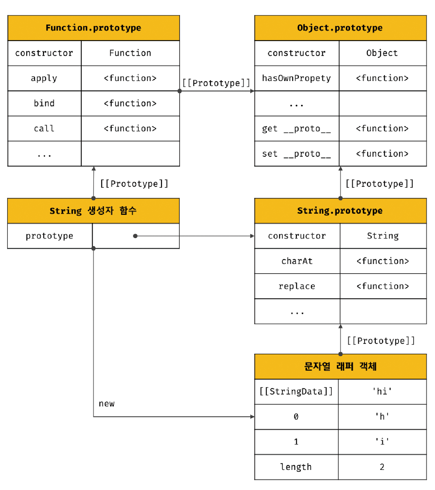
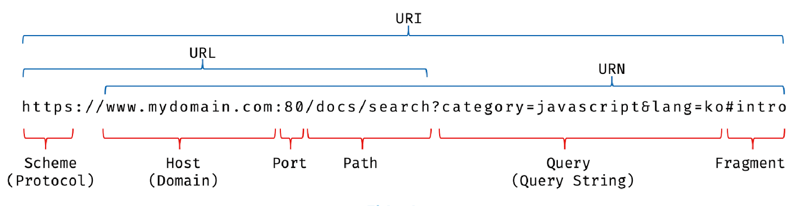

# 21.1 자바스크립트 객체의 분류

자바스크립트 객체는 크게 3개의 객체로 분류할 수 있다.

- **표준 빌트인 객체**  
  표준 빌트인 객체는 ECMAScript 사양에 정의된 객체를 말하며, 애플리케이션 전역의 공통 기능을 제공한다.  
  자바스크립트 실행 환경과 관계 없이 언제나 사용할 수 있고, 전역 객체의 프로퍼티로서 제공된다. 따라서 별도의 선언 없이 전역 변수처럼 언제나 참조할 수 있다.

- **호스트 객체**  
  ECMAScript 사양에 정의되어 있지 않지만 자바스크립트 실행 환경에서 추가로 제공하는 객체이다.

  브라우저 환경에서는 DOM, BOM, Canvas, XMLHttpRequest, fetch, requestAnimationFrame, SVG, Web Storage, Web Component, Web Worker와 같은 클라이언트 사이드 Web API를 호스트 객체로 제공하고,

  Node.js 환경에서는 Node.js 고유의 API를 호슽트 객체로 제공한다.

- **사용자 정의 객체**  
  기본 제공되는 객체가 아닌 사용자가 직접 정의한 객체

<br /><br />

# 21.2 표준 빌트인 객체

자바스크립트는 40여 개의 표준 빌트인 객체를 제공한다.  
(Object, String, Number, Boolean, Symbol, Date, Math, RegExp, Array, Map/Set, Function, Promise, Reflect, Proxy, Json, Error 등)

Math, Reflect, JSON을 제외한 표준 빌트인 객체는 모두 인스턴스를 생성할 수 있는 생성자 함수 객체다.

생성자 함수 객체인 표준 빌트인 객체는 프로토타입 메서드와 정적 메서드를 제공하고, 생성자 함수 객체가 아닌 표준 빌트인 객체는 정적 메서드만 제공한다.

생성자 함수인 표준 빌트인 객체가 생성한 인스턴스의 프로토타입은 표준 빌트인 객체의 prototype 프로퍼티에 바인딩된 객체다.

```js
const strObj = new String("so");

console.log(Object.getPrototypeOf(strObj) === String.prototype); // true
```

<br /><br />

# 21.3 원시값과 래퍼 객체

```js
const str = "hello";

console.log(str.length); // 5
console.log(str.toUpperCase()); // HELLO
```

원시값은 객체가 아니므로 프로퍼티나 메서드를 가질 수 없는데도 원시값인 문자열이 마치 객체처럼 동작한다.

이는 원시값인 문자열, 숫자, 불리언 값의 경우 이들 원시값에 대해 마치 객체처럼 마침표 표기법으로 접근하면 자바스크립트 엔진이 일시적으로 원시값을 연관된 객체로 변환해 주기 때문이다.

즉, 원시값을 객체처럼 사용하면 자바스크립트 엔진은 암묵적으로 연관된 객체를 생성하여 생성된 객체로 프로퍼티에 접근하거나 메서드를 호출하고 다시 원시값으로 되돌린다.

이처럼 문자열, 숫자, 불리언 값에 대해 객체처럼 접근하면 생성되는 임시 객체를 **`래퍼 객체`** 라고 한다.

<br />
예를 들어, 문자열에 대해 마침표 표기법으로 접근하면 그 순간 래퍼 객체인 String 생성자 함수의 인스턴스가 생성되고 문자열은 래퍼 객체의 [[StringData]] 내부 슬롯에 할당된다.

이때 문자열 래퍼 객체인 String 함수의 인스턴스는 String.prototype의 메서드를 상속받아 사용할 수 있다.


 
그 후 래퍼 객체의 처리가 종료되면 [[StringData]] 내부 슬롯에 할당된 원시값으로 원래의 상태, 즉 식별자가 원시값을 갖도록 되돌리고 래퍼 객체는 가비지 컬렉션의 대상이 된다.

<br />

```js
// 1️⃣ 식별자 str은 문자열을 값으로 가진다.
const str = "hello";

// 2️⃣ 식별자 str은 암묵적으로 생성된 래퍼 객체를 가리킨다.
// 식별자 str의 값 'hello'는 래퍼 객체의 [[StringData]] 내부 슬롯에 할당된다.
// 래퍼 객체에 name 프로퍼티가 동적 추가된다.
str.name = "so";

// 3️⃣ str은 다시 원래의 문자열(원시값)을 갖는다.
// 이때 2에서 생성된 래퍼 객체는 아무도 참조하지 않는 상태이므로 가비지 컬렉션의 대상이 된다.

// 4️⃣ str은 새롭게 암묵적으로 생성된(2에서 생성된 래퍼 객체와는 다른) 래퍼 객체를 가리킨다.
// 새롭게 생성된 래퍼 객체에는 name 프로퍼티 존재X
console.log(str.name); // undefined

// 5️⃣ str은 다시 원래의 문자열을 갖는다. 4에서 생성된 래퍼 객체는 가비지 컬렉션의 대상이 된다.
console.log(typeof str, str); // string hello
```

<br />

이처럼 문자열, 숫자, 불리언, 심벌은 암묵적으로 생성되는 래퍼 객체에 의해 마치 객체처럼 사용할 수 있으며, 표준 빌트인 객체인 String, Number, Boolean, Symbol의 프로토타입 메서드 또는 프로퍼티를 참조할 수 있다.

따라서 String, Number, Boolean 생성자 함수를 new 연산자와 함께 호출하여 인스턴스를 생성할 필요가 없으며 권장하지 않는다.

null 과 undefined는 래퍼 객체를 생성하지 않으므로 이 값들을 객체처럼 사용하면 에러가 발생한다.

<br /><br />

# 21.4 전역 객체

> 코드가 실행되기 이전 단계에 자바스크립트 엔진에 의해 어떤 객체보다도 먼저 생성되는 특수한 객체이며, 어떤 객체에도 속하지 않은 최상위 객체

- 브라우저 환경: window (또는 self, this, frames)

- Node.js 환경: global

<br />

`globalThis`는 ES11에서 도입된 브라우저 환경과 Node.js 환경에서 전역 객체를 가리키던 다양한 식별자를 통일한 식별자다.

전역 객체는 표준 빌트인 객체와 환경에 따른 호스트 객체, 그리고 var 키워드로 선언한 전역 변수와 전역 함수를 프로퍼티로 갖는다.

즉, 전역 객체는 어떤 객체에도 속하지 않은 모든 빌트인 객체의 최상위 객체다. 이것은 프로토타입 상속 관계상에서 취상위 객체라는 의미가 아니다.  
전역 객체 자신은 어떤 객체의 프로퍼티도 아니며 객체의 계층적 구조상 표준 빌트인 객체와 호스트 객체를 프로퍼티로 소유한다는 것을 말한다.

<br />

### 전역 객체의 특징

- 전역 객체는 개발자가 의도적으로 생성할 수 없다.

- 전역 객체의 프로퍼티를 참조할 때 window(또는 global)를 생략할 수 있다.

- 전역 객체는 모든 표준 빌트인 객체를 프로퍼티로 가지고 있다.

- var 키워드로 선언한 전역 변수와 선언하지 않은 변수에 값을 할당한 암묵적 전역, 그리고 전역 함수는 전역 객체의 프로퍼티가 된다.

- let이나 const 키워드로 선언한 전역 변수는 전역 객체의 프로퍼티가 아니다. let이나 const 키워드로 선언한 전역 변수는 보이지 않는 개념적인 블록(전역 렉시컬 환경의 선언적 환경 레코드) 내에 존재하게 된다.

- 브라우저 환경의 모든 자바스크립트 코드는 하나의 전역 객체 window를 공유한다.  
  여러 개의 script 태그를 통해 자바스크립트 코드를 분리해도 하나의 window를 공유하는 것은 변함이 없다.
  이는 분리되어 있는 자바스크립트 코드가 하나의 전역을 공유한다는 의미다.

<br />

## 빌트인 전역 프로퍼티

> 전역 객체의 프로퍼티, 주로 애플리케이션 전역에서 사용하는 값을 제공한다.

### `Infinity`

```js
console.log(window.Infinity === Infinity); // true

console.log(3 / 0); // Infinity
console.log(-3 / 0); // -Infinity

console.log(typeof Infinity); // number
```

<br />

### `NaN`

NaN 프로퍼티는 Number.NaN 프로퍼티와 같다.

```js
console.log(window.NaN); // NaN
console.log(Number("xyz")); //NaN
console.log(typeof NaN); // number
```

<br />

### `undefined`

undefined 프로퍼티는 원시 타입 undefined를 값으로 갖는다.

```js
console.log(window.undefined); // undefined
console.log(typeof undefined); // undefined
```

<br />

## 빌트인 전역 함수

> 애플리케이션 전역에서 호출할 수 있는 빌트인 함수로서 전역 객체의 메서드

### `eval`

eval 함수는 자바스크립트 코드를 나타내는 문자열을 인수로 전달받는다.

전달받은 문자열 코드가 표현식이라면 eval 함수는 문자열 코드를 런타임에 평가하여 값을 생성하고, 표현식이 아닌 문이라면 eval 함수는 문자열 코드를 런타임에 실행한다.

```js
// 표현식인 문
eval("1 + 2;"); // 3

// 표현식이 아닌 문
eval("var x = 5;"); // undefined

// 런타임에 변수 선언문이 실행되어 x 변수가 선언되었다.
console.log(x); // 5

// 객체 리터럴은 반드시 괄호로 둘러싼다.
const o = eval("({ a: 1 })");
console.log(o); // {a: 1}

const f = eval("(function() { return 1; })");
console.log(f()); // 1
```

<br />

문자열 코드가 여러 개의 문으로 이루어져 있다면 모든 문을 실행한 다음, 마지막 결과값을 반환한다.

```js
eval("1+2; 3+4;"); // 7
```

<br />

eval 함수는 자신이 호출된 위치에 해당하는 기존의 스코프를 런타임에 동적으로 수정한다.

```js
const x = 1;
function foo() {
  eval("var x = 2;");
  console.log(x); // 2
}
foo();
console.log(x); // 1
```

위 eval 함수는 새로운 x 변수를 선언하면서 foo 함수의 스코프에 선언된 변수를 동적으로 추가한다.  
함수가 호출되면 런타임 이전에 먼저 함수 몸체 내부의 모든 선언문을 먼저 실행하고 그 결과를 스코프에 등록한다.  
따라서 eval 함수가 호출되는 시점에는 이미 foo 함수의 스코프가 존재한다. 하지만 **eval 함수는 기존의 스코프를 런타임에 동적으로 수정한다.**

eval 함수에 전달된 코드는 이미 그 위치에 존재하던 코드처럼 동작한다. 즉, eval 함수가 호출된 foo 함수의 스코프에서 실행된다.

단, strict mode에서 eval 함수는 기존의 스코프를 수정하지 않고 eval 함수 자신의 자체적인 스코프를 생성한다.

또한 인수로 전달받은 문자열 코드가 let, const 키워드를 사용한 변수 선언문이라면 암묵적으로 strict mode가 적용된다.

```js
const x = 1;

function foo() {
  eval("var x = 2; console.log(x);"); // 2
  eval("const x = 3; console.log(x);"); // 3
  console.log(x); // 2
}

foo();
console.log(x); // 1
```

<br />

eval 함수를 통해 사용자로부터 입력받은 콘텐츠를 실행하는 것은 보안에 매우 취약하다. 또한 이 함수를 통해 실행되는 코드는 자바스크립트 엔진에 의해 최적화가 수행되지 않으므로 일반적인 코드 수행에 비해 처리 속도가 느리다.

**따라서 eval 함수의 사용은 금지해야 한다**

<br /><br />

### `isFinite`

> 전달받은 인수가 정상적인 유한수인지 검사하여 유한수이면 true, 무한수이면 false 반환,  
> 전달받은 인수의 타입이 숫자가 아닌 경우 숫자로 타입 변환 후 검사 수행한다. 인수가 NaN으로 평가되면 false 반환

```js
isFinite(2e64); // true
isFinite("10"); // true
isFinite(null); // true: null -> 0

isFinite(Infinity); // false

isFinite(NaN); // false
isFinite("hello"); // false
```

<br />

### `isNaN`

> 전달받은 인수가 NaN인지 검사, 숫자가 아닌 경우 숫자로 타입 변환 후 검사 수행

```js
isNaN(NaN); // true
isNaN(10); //false

isNaN("bla"); // true:  'bla' -> NaN
isNaN(""); // false
isNaN("10"); // false

isNaN(true); // false: true -> 1
isNaN(null); // false: null -> 0

isNaN(undefined); // true: undefined -> NaN
isNaN({}); // true

isNaN(new Date()); // false: new Date() -> Number
isNaN(new Date().toString()); // true
```

<br />

### `parseFloat`

> 전달받은 문자열 인수를 부동 소수점 숫자, 즉 실수로 해석하여 반환

```js
parseFloat("3.14"); // 3.14
parseFloat("10.00"); // 10

// 공백으로 구분된 문자열은 첫 번째 문자열만 반환
parseFloat("12 34 56"); // 12

// 숫자로 변할 수 없다면 NaN
parseFloat("he was 20"); // NaN

// 앞뒤 공백 무시
parseFloat(" 60 "); // 60
```

### `parseInt`

> 전달받은 문자열 인수를 정수로 해석해 반환, 문자열이 아니면 문자열로 변환 후 정수로 해석

두 번째 인수로 진법을 나타내는 기수(2~36)를 전달할 수 있다.
기수를 지정하면 첫 번째 인수로 전달된 문자열을 해당 기수의 숫자로 해석하여 반환한다.
**이때 반환값은 언제나 10진수다.**

```js
const x = 15;

// 15를 2진수로 변환하여 문자열로 반환
x.toString(2); // '1111'

// 문자열 '1111'을 2진수로 해석하고 그 결과 10진수로 반환
parseInt(x.toString(2), 2); // 15
```

두 번째 인수로 진법을 나타내는 기수를 지정하지 않아도 첫 번째 인수로 전달된 문자열이 "0x" 또는 "0X"로 시작하는 16진수 리터럴이라면 16진수로 해석해 10진수 정수로 반환한다.

```js
parseInt("0xf"); // 15
parseInt("f", 16); // 15
```

하지만 2진수("0b")와 8진수 리터럴("0o")은 제대로 해석하지 못한다.

첫 번째 인수로 전달한 문자열의 첫 번째 문자가 해당 지수의 숫자로 변환될 수 없다면 NaN을 반환한다.  
두 번째 문자부터 해당 진수를 나타내는 숫자가 아닌 문자와 마주치면 이 문자와 계속되는 문자들은 전부 무시되며 해석된 정수값만 반환한다.

```js
parseInt("A0"); //NaN

parseInt("1A0"); // 1
parseInt("102", 2); // 2
parseInt("58", 8); // 5
```

<br /><br />

### `encodeURI / decodeURI`

- `encodeURI`: 완전한 URI를 문자열로 전달받아 이스케이프 처리를 위해 인코딩한다.



- 인코딩: URI의 문자들을 이스케이프 처리하는 것
- 이스케이프 처리: 네트워크를 통해 정보를 공유할 때 어떤 시스템에서도 읽을 수 있는 아스키 문자 셋으로 변환하는 것

예를들어 특수 문자인 공백 문자는 %20, 한글 '가'는 %EC%9E%90으로 인코딩된다.

URI 문법 형식 표준에 따르면 URL은 아스키 문자 셋으로만 구성되어야 하며 한글을 포함한 대부분의 외국어나 아스키 문자 셋에 정의되지 않은 특수 문자의 경우 URL에 포함될 수 없다.

따라서 URL 내부에서 의미를 갖고 있는 문자(%, ?, #)나 URL에 올 수 없는 문자(한글, 공백) 또는 시스템에 의해 해석될 수 있는 문자(<, >)를 이스케이프 처리하여 야기될 수 있는 문제를 예방하기 위해 이스케이프 처리가 필요하다.

```js
const uri = "http://example.com?name=김보리&job=programmer&student";

const enc = encodeURI(uri);
console.log(enc);
// http://example.com?name=%22%EA%B9%80%EB%B3%B4%EB%A6%AC%22&job=programmer&student
```

-`decodeURI`: 인코딩된 URI를 인수로 전달받아 이스케이프 처리 이전으로 디코딩한다.

```js
const dec = decodeURI(enc);
console.log(dec);
// http://example.com?name=김보리&job=programmer&student
```

<br />

### `encodeURIComponent / decodeURIComponent`

- `encodeURIComponent`: URI 구성 요소를 인수로 전달받아 인코딩한다.
- `decodeURIComponent`: URI 구성 요소를 디코딩한다.

encodeURIComponent 함수는 인수로 전달된 문자열을 URI의 구성요소인 쿼리 스트링의 일부로 간주한다. 따라서 쿼리 스트링 구분자로 사용되는 =, ?, & 까지 인코딩한다.

반면 encodeURI 함수는 전달된 문자열을 완전한 URI 전체라고 간주한다. 따라서 =, ?, &은 인코딩하지 않는다.

```js
const uriComp = "name=김보리&job=programmer&student";

let enc = encodeURIComponent(uriComp);
console.log(enc);
// name%3D%EA%B9%80%EB%B3%B4%EB%A6%AC%26job%3Dprogrammer%26student

let dec = decodeURIComponent(enc);
console.log(dec);
// name=김보리&job=programmer&student

// =, ?, &를 인코딩하지 않는다.
enc = encodeURI(uriComp);
console.log(enc);
// name=%EA%B9%80%EB%B3%B4%EB%A6%AC&job=programmer&student

dec = decodeURI(enc);
console.log(dec);
// name=김보리&job=programmer&student
```

<br /><br />

## 암묵적 전역

```js
console.log(x); // undefined
console.log(y); // ReferenceError: y is not defined

var x = 10;
function foo() {
  y = 20; // window.y = 20;
}
foo();

console.log(x + y); // 30
```

자바스크립트 엔진은 y = 20을 window.y = 20으로 해석하여 전역 객체에 프로퍼티를 동적 생성한다.

하지만 y는 변수 선언 없이 단지 전역 객체의 프로퍼티로 추가되었을 뿐이므로 y는 변수가 아니다.
**y는 변수가 아니므로 변수 호이스팅이 발생하지 않는다.**

또한 y는 프로퍼티 이므로 `delete` 연산자로 삭제할 수 있다. 전역 변수는 프로퍼티이지만 delete 연산자로 삭제할 수 없다.

```js
console.log(window.x); // 10
console.log(window.y); // 20

delete x; // 전역 변수는 삭제되지 않는다.
delete y; // 프로퍼티는 삭제된다.

console.log(window.x); // 10
console.log(window.y); // undefined
```
