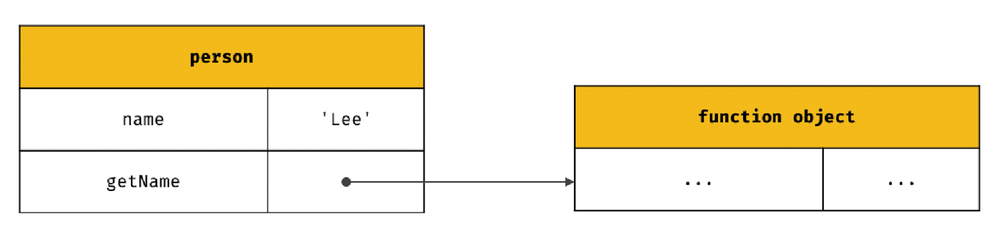
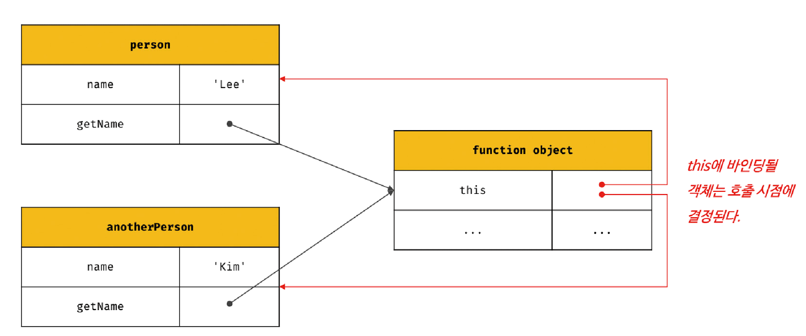
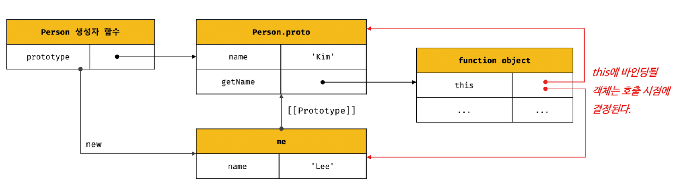

# 22.1 this 키워드

> 객체: 상태를 나타내는 프로퍼티와 동작을 나타내는 메서드를 하나의 논리적인 단위로 묶은 자료구조

메서드는 자신이 속한 객체의 상태(프로퍼티)를 참조하고 변경할 수 있어야 한다. 이때 메서드가 자신이 속한 객체의 프로퍼티를 참조하려면 먼저 자신이 속한 객체를 가리키는 식별자를 참조할 수 있어야 한다.

1️⃣ **객체 리터럴 방식으로 생성한 객체의 경우**  
메서드 내부에서 메서드 자신이 속한 객체를 가리키는 식별자를 재귀적으로 참조할 수 있다.

```js
const circle = {
  radius: 5,
  getDiameter() {
    return 2 * circle.radius;
  },
};
```

getDiameter 메서드 내에서 자신이 속한 객체를 가리키는 식별자 circle을 참조하고 있다. 이 참조 표현식이 평가되는 시점은 getDiameter 메서드가 호출되어 함수 몸체가 실행되는 시점이다.

객체 리터럴은 circle 변수에 할당되기 직전에 평가된다. 따라서 getDiameter 메서드가 호출되는 시점에는 이미 객체 리터럴의 평가가 완료되어 객체가 생성되었고 circle 식별자에 생성된 객체가 할당된 이후다. 따라서 메서드 내부에서 circle 식별자를 참조할 수 있다.

하지만 자기 자신이 속한 객체를 재귀적으로 참조하는 방식은 바람직하지 않다!!

<br />

2️⃣ **생성자 함수 방식으로 인스턴스를 생성하는 경우**

```js
function Circle(radius) {
  this.radius = radius;
}

Circle.prototype.getDiameter = function () {
  return 2 * this.radius;
};

const circle = new Circle(5);
```

생성자 함수를 정의하는 시점에는 아직 인스턴스를 생성하기 이전이므로 생성자 함수가 생성할 인스턴스를 가리키는 식별자를 알 수 없다. 이를 위해 자바스크립트는 this라는 특수한 식별자를 제공한다.

✔️ `this`는 자신이 속한 객체 또는 자신이 생성할 인스턴스를 가리키는 **`자기 참조 변수`** 다.

this는 자바스크립트 엔진에 의해 암묵적으로 생성되며, 코드 어디서든 참조할 수 있다. 함수를 호출하면 arguments 객체와 this가 암묵적으로 함수 내부에 전달된다.
함수 내부에서 arguments 객체를 지역 변수처럼 사용할 수 있는 것처럼 this도 지역 변수처럼 사용할 수 있다.

> 💡 **바인딩**  
> 식별자와 값을 연결하는 과정
>
> 예를 들어 변수 선언은 변수 이름과 확보된 메모리 공간의 주소를 바인딩하는 것이다. this 바인딩은 this와 this가 가리킬 객체를 바인딩 하는 것이다.

<br />

자바나 C++ 같은 클래스 기반 언어에서 this는 언제나 클래스가 생성하는 인스턴스를 가리킨다. 하지만 **자바스크립트의 this는 함수가 호출되는 방식에 따라 this 바인딩이 동적으로 결정된다.**

<br /><br />

# 22.2 함수 호출 방식과 this 바인딩

> **렉시컬 스코프와 this 바인딩은 결정 시기가 다르다.**  
> 함수의 상위 스코프를 결정하는 방식인 렉시컬 스코프는 함수 정의가 평가되어 함수 객체가 생성되는 시점에 상위 스코프를 결정한다. 하지만 this 바인딩은 **함수 호출 시점**에 결정된다.

함수를 호출하는 방식은 크게 4가지이다.  
1️⃣ 일반 함수 호출

2️⃣ 메서드 호출

3️⃣ 생성자 함수 호출

4️⃣ Function.prototype.apply/call/bind 메서드에 의한 간접 호출

<br />

## 1️⃣ 일반 함수 호출

> 기본적으로 this에는 `전역 객체`가 바인딩된다.

```js
function foo() {
  console.log(this); // window

  function bar() {
    console.log(this); // window
  }
  bar();
}
foo();
```

this는 객체의 프로퍼티나 메서드를 참조하기 위한 자기 참조 변수이므로 객체를 생성하지 않는 일반 함수에서 this는 의미가 없다.

- strict mode가 적용된 일반 함수 내부의 this에는 `undefined`가 바인딩된다.

<br />

- 메서드 내에서 정의한 중첩 함수도 일반 함수로 호출되면 중첩 함수 내부의 this에는 전역 객체가 바인딩된다.

```js
var value = 1;

const obj = {
  value: 100,
  foo() {
    console.log(this); // {value: 100, foo: f}
    console.log(this.value); // 100

    function bar() {
      console.log(this); // window
      console.log(this.value); //1
    }

    bar();
  },
};
obj.foo();
```

<br />

- 콜백 함수가 일반 함수로 호출된다면 콜백 함수 내부의 this에도 전역 객체가 바인딩된다.

<br />
이처럼 일반 함수로 호출된 모든 함수 내부의 this에는 전역 객체가 바인딩된다.  
중첩 함수 또는 콜백 함수는 외부 함수를 돕는 헬퍼 함수의 역할을 하므로 외부 함수의 일부 로직을 대신하는 경우가  대부분이다.

하지만 외부 함수인 메서드와 중첩 함수 또는 콜백 함수의 this가 일치하지 않는다는 것은 이 함수들을 헬퍼 함수로 동작하기 어렵게 만든다.

메서드 내부의 중첩 함수나 콜백 함수의 this 바인딩을 메서드의 this 바인딩과 일치시키기 위한 방법은 다음과 같다.

```js
var value = 1;

const obj = {
  value: 100,
  foo() {
    const that = this;

    setTimeout(function () {
      console.log(that.value); // 100
    }, 100);
  },
};
obj.foo();
```

this를 명시적으로 바인딩하는 방법: Function.prototype.apply/call/bind

```js
setTimeout(
  function () {
    console.log(this.value); // 100
  }.bind(this),
  100
);
```

화살표 함수를 사용하는 방법

```js
setTimeout(() => console.log(this.value), 100);
```

<br />

## 2️⃣ 메서드 호출

> 메서드 내부의 this에는 **메서드를 호출한 객체**(메서드를 호출할 때 메서드 이름 앞의 마침표 연산자 앞에 기술한 객체)가 바인딩된다.

```js
const person = {
  name: "Lee",
  getName() {
    return this.name;
  },
};

console.log(person.getName()); // Lee
```

person 객체의 getName 프로퍼티가 가리키는 함수 객체는 person 객체에 포함된 것이 아니라 독립적으로 존재하는 별도의 객체다. getName 프로퍼티가 함수 객체를 가리키고 있을 뿐이다.



따라서 getName 메서드는 다른 객체의 프로퍼티에 할당되는 것으로 다른 객체의 메서드가 될 수도 있고 일반 변수에 할당하여 일반 함수로 호출될 수도 있다.

```js
const anotherPerson = {
  name: "Kim",
};
anotherPerson.getName = person.getName;
console.log(anotherPerson.getName()); // Kim

const getName = person.getName;
console.log(getName()); //''  : window.name의 기본값
```

따라서 메서드 내부의 this는 프로퍼티로 메서드를 가리키고 있는 객체와는 관계가 없고 메서드를 호출한 객체에 바인딩된다.



<br />

프로토타입 메서드 내부에서 사용된 this도 해당 메서드를 호출한 객체에 바인딩된다.

```js
function Person(name) {
  this.name = name;
}

Person.prototype.getName = function () {
  return this.name;
};

const me = new Person("Lee");
console.log(me.getName()); //Lee

Person.prototype.name = "Kim";
console.log(Person.prototype.getName()); //Kim
```



<br />

## 3️⃣ 생성자 함수 호출

> 생성자 함수 내부의 this에는 **생성자 함수가 생성할 인스턴스**가 바인딩된다.

```js
function Circle(radius) {
  this.radius = radius;
  this.getDiameter = function () {
    return 2 * this.radius;
  };
}

const circle1 = new Circle(5);
console.log(circle1.getDiameter()); // 10

// new 연산자X -> 일반적인 함수의 호출
const circle2 = Circle(15);

// 일반 함수로 호출된 Circle에는 반환문이 없으므로 암묵적으로 undefined 반환
console.log(circle2); // undefined

// 일반 함수로 호출된 Circle 내부의 this는 전역 객체를 가리킨다.
console.log(radius); // 15
```

<br />

## 4️⃣ Function.prototype.apply/call/bind 메서드에 의한 간접 호출

apply, call, bind 메서드는 Function.prototype의 메서드이므로 이들 메서드는 모든 함수가 상속받아 사용할 수 있다.

apply와 call 메서드는 `this로 사용할 객체`와 `인수 리스트`를 인수로 전달받아 함수를 호출한다.

```js
function getThisBinding() {
  return this;
}

const thisArg = { a: 1 };

console.log(getThisBinding()); // window

console.log(getThisBinding.apply(thisArg)); //  {a: 1}
console.log(getThisBinding.call(thisArg)); // {a: 1}
```

apply와 call 메서드의 본질적인 기능은 함수를 호출하는 것이다. 함수를 호출하면서 첫 번째 인수로 전달된 특정 객체를 호출한 함수의 this에 바인딩한다.

```js
function getThisBinding() {
  console.log(arguments);
  return this;
}
const thisArg = { a: 1 };

// 호출할 함수의 인수를 배열로 묶어 전달
console.log(getThisBinding.apply(thisArg, [1, 2, 3]));

// 호출할 함수의 인수를 쉼표로 구분한 리스트 형식으로 전달
console.log(getThisBinding.call(thisArg, 1, 2, 3));
```

apply 메서드: 호출할 함수의 인수를 `배열로 묶어 전달`한다.  
call 메서드: 호출할 함수의 인수를 `쉼표로 구분한 리스트 형식으로 전달`한다.

이처럼 호출할 함수에 인수를 전달하는 방식만 다를 뿐 this로 사용할 객체를 전달하면서 함수를 호출하는 것은 동일하다.

- 메서드의 대표적인 용도: arguments 객체와 같은 유사 배열 객체에 배열 메서드를 사용하는 경우  
  arguments 객체는 배열이 아니기 때문에 배열의 메서드를 사용할 수 없으나 apply와 call 메서드를 이용하면 가능하다.

  ```js
  function convertArgsToArray() {
    console.log(arguments);

    const arr = Array.prototype.slice.call(arguments);
    console.log(arr);

    return arr;
  }
  convertArgsToArray(1, 2, 3); // [1, 2, 3]
  ```

<br />

bind메서드는 apply와 call 메서드와 달리 함수를 호출하지 않는다. 다만 **첫 번째 인수로 전달한 값으로 this 바인딩이 교체된 함수를 새롭게 생성해 반환**한다.

```js
function getThisBinding() {
  return this;
}

const thisArg = { a: 1 };

console.log(getThisBinding()); // window

console.log(getThisBinding.bind(thisArg)); //  getThisBinding

// 함수를 호출하지는 않으므로 명시적으로 호출해야 한다.
console.log(getThisBinding.call(thisArg)()); // {a: 1}
```

- 대표적 용도: 메서드의 this와 메서드 내부의 중첩 함수 또는 콜백 함수의 this가 불일치하는 문제를 해결하기 위해 유용하게 사용된다.

```js
const person = {
  name: "Lee",
  // ①
  foo(callback) {
    setTimeout(callback, 100);
  },
};

person.foo(function () {
  // ②
  console.log(this.name); // ''

  // 일반 함수로 호출된 콜백 함수 내부의 this.name은 브라우저 환경에서 window.name과 같다. (기본값 '')
});
```

person.foo의 콜백 함수가 호출되기 이전인 ①의 시점에서 this는 foo 메서드를 호출한 객체, 즉 person 객체를 가리킨다.

하지만 person.foo의 콜백 함수가 일반 함수로서 호출된 ②의 시점에서 this는 전역 객체 window를 가리킨다.

person.foo의 콜백 함수는 외부 함수 person.foo를 돕는 헬퍼 함수 역할을 하기 때문에 외부 함수 person.foo 내부의 this와 콜백 함수 내부의 this가 상이하면 문맥상 문제가 발생한다.

따라서 콜백 함수 내부의 this를 외부 함수 내부의 this와 일치시켜야 한다.

```js
const person = {
  name: "Lee",
  foo(callback) {
    setTimeout(callback.bind(this), 100);
  },
};
```
