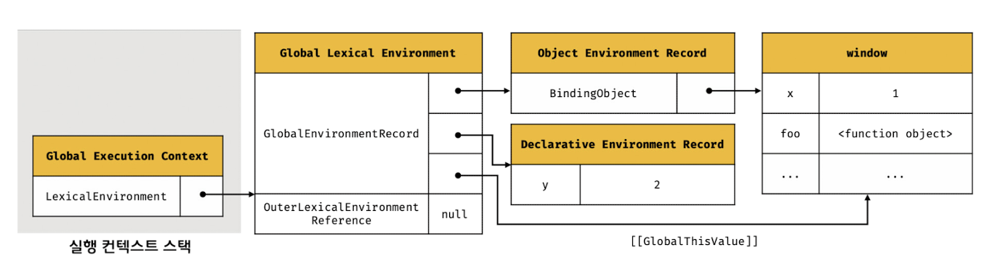

# 23.1 소스코드의 타입

ECMAScript 사양은 소스코드를 4가지 타입으로 구분한다.  
4가지 타입의 소스코드는 실행 컨텍스트를 생성한다.

## 1. 전역 코드

> 전역에 존재하는 소스코드이다. 전역에 정의된 함수, 클래스 등의 내부 코드는 포함되지 않는다.

전역 코드는 전역 변수를 관리하기 위해 최상위 스코프인 전역 스코프를 생성해야 한다.

var 키워드로 선언된 전역 변수와 함수 선언문으로 정의된 전역 함수를 전역 객체의 프로퍼티와 메서드로 바인딩하고 참조하기 위해 전역 객체와 연결되어야 한다.

이를 위해 전역 코드가 평가되면 전역 실행 컨텍스트가 생성된다.

## 2. 함수 코드

> 함수 내부에 존재하는 소스코드이다. 중첩 함수, 클래스 등의 내부 코드는 포함되지 않는다.

함수 코드는 지역 스코프를 생성하고 지역 변수, 매개변수, arguments 객체를 관리해야 한다.
생성한 지역 스코프를 전역 스코프에서 시작하는 스코프 체인의 일원으로 연결해야 한다.

이를 위해 함수 코드가 평가되면 함수 실행 컨텍스트가 생성된다.

## 3. eval 코드

> 빌트인 전역 함수인 eval 함수에 인수로 전달되어 실행되는 소스코드

strict mode에서 자신만의 독자적인 스코프를 생성한다. eval 코드가 평가되면 eval 실행 컨텍스트가 생성된다.

## 4. 모듈 코드

> 모듈 내부에 존재하는 소스코드이다. 모듈 내부의 함수, 클래스 등의 내부 코드는 포함되지 않는다.

모듈별로 독립적인 모듈 스코프를 생성한다. 모듈 실행 컨텍스트가 생성된다.

<br />
<br />

# 23.2 소스코드의 평가와 실행

자바스크립트 엔진은 소스코드를 2개의 과정, 즉 `소스코드의 평가`와 `소스코드의 실행` 과정으로 나누어 처리한다.


- 평가 과정에서는 실행 컨텍스트를 생성하고 변수, 함수 등의 **선언문**만 먼저 실행하여 생성된 변수나 함수 식별자를 키로 실행 컨텍스트가 관리하는 스코프에 등록한다.

- 평가 과정이 끝나면 선언문을 제외한 소스코드가 순차적으로 실행된다. 즉, 런타임이 시작된다.  
  이때 소스코드 실행에 필요한 정보, 즉 변수나 함수의 참조를 실행 컨텍스트가 관리하는 스코프에서 검색해서 취득한다.
  그리고 소스코드의 실행 결과는 다시 실행 컨텍스트가 관리하는 스코프에 등록된다.

<br /><br />

# 23.3 실행 컨텍스트의 역할

```js
const x = 1;
const y = 2;

function foo(a) {
  const x = 10;
  const y = 20;

  console.log(a + x + y);
}

foo(100);

console.log(x + y);
```

1️⃣ **전역 코드 평가**

전역 코드를 실행하기 전에 전역 코드 평가 과정을 거친다.
전역 코드의 변수, 함수 선언문이 먼저 실행되고, 그 결과 생성된 전역 변수와 전역 함수가 실행 컨텍스트가 관리하는 전역 스코프에 등록된다.

2️⃣ **전역 코드 실행**

전역 코드 평가 과정이 끝나면 런타임이 시작되어 전역 코드가 순차적으로 실행된다. 이때 전역 변수에 값이 할당되고 함수가 호출된다.

함수가 호출되면 순차적으로 실행되던 전역 코드의 실행을 일시 중단하고 코드의 실행 순서를 변경하여 함수 내부로 진입한다.

3️⃣ **함수 코드 평가**

함수 내부로 진입하면 함수 코드 평가 과정을 거치며 함수 코드를 실행하기 위한 준비를 한다.  
이때 매개변수와 지역 변수 선언문이 먼저 실행되고, 그 결과 생성된 매개변수와 지역 변수가 실행 컨텍스트가 관리하는 지역 스코프에 등록된다.  
또한 함수 내부에서 지역 변수처럼 사용할 수 있는 arguments 객체가 생성되어 지역 스코프에 등록되고 this 바인딩도 결정된다.

4️⃣ **함수 코드 실행**
함수 코드 평가 과정이 끝나면 런타임이 시작되어 함수 코드가 순차적으로 실행된다.

console.log 메서드를 호출하기 위해 식별자인 console을 스코프 체인을 통해 검색한다.  
이를 위해 함수 코드의 지역 스코프는 상위 스코프인 전역 스코프와 연결되어야 한다.
하지만 console 식별자는 스코프 체인에 등록되어 있지 않고 전역 객체에 프로퍼티로 존재한다.  
이는 전역 객체의 프로퍼티가 마치 전역 변수처럼 전역 스코프를 통해 검색 가능해야 한다는 것을 의미한다.

다음은 log 프로퍼티를 console 객체의 프로토타입 체인을 통해 검색한다. 그후 메서드에 인수로 전달된 표현식이 평가된다.

console.log 메서드의 실행이 종료되면 함수 호출 이전으로 되돌아가 전역 코드 실행을 계속한다.

<br />

이처럼 코드가 실행되려면 **스코프, 식별자, 코드 실행 순서** 등의 관리가 필요하다.

> 1. 선언에 의해 생성된 모든 식별자를 스코프를 구분하여 등록하고 상태 변화를 지속적으로 관리할 수 있어야 한다.
> 2. 스코프는 중첩 관계에 의해 스코프 체인을 형성해야 한다. 즉, 스코프 체인을 통해 상위 스코프로 이동하며 식별자를 검색할 수 있어야 한다.
> 3. 현재 실행 중인 코드의 실행 순서를 변경할 수 있어야 하며 다시 되돌아갈 수도 있어야 한다.

이 모든 것을 관리하는 것이 실행 컨텍스트다.

> ### 💡 실행 컨텍스트는 소스코드를 실행하는 데 필요한 환경을 제공하고 코드의 실행 결과를 실제로 관리하는 영역이다.

좀 더 구체적으로, 실행 컨텍스트는 식별자를 등록하고 관리하는 스코프와 코드 실행 순서 관리를 구현한 내부 메커니즘으로, 모든 코드는 실행 컨텍스트를 통해 실행되고 관리된다.

**`식별자와 스코프`는 실행 컨텍스트의 `렉시컬 환경`으로 관리하고 `코드 실행 순서`는 `실행 컨텍스트 스택`으로 관리한다.**

<br /><br />

# 23.4 실행 컨텍스트 스택

```js
const x = 1;

function foo() {
  const y = 2;
  function bar() {
    const z = 3;
    console.log(x + y + z);
  }
  bar();
}

foo();
```

자바스크립트 엔진은 먼저 전역 코드를 평가해 전역 실행 컨텍스트를 생성하고 함수가 호출되면 함수 코드를 평가하여 함수 실행 컨텍스트를 생성한다.

이때 생성된 실행 컨텍스트는 스택으로 관리된다.


1. 전역 코드의 평가와 실행  
   전역 변수 x와 전역 함수 foo는 전역 실행 컨텍스트에 등록된다. 이후 전역 코드가 실행되면 x에 값이 할당되고 foo가 호출된다.

2. foo 함수 코드의 평가와 실행  
   전역 함수 foo가 호출되면 전역 코드의 실행은 일시 중단되고 코드의 제어권이 foo 함수 내부로 이동한다.  
   자바스크립트 엔진은 foo 함수 내부의 함수 코드를 평가하여 foo 함수 실행 컨텍스트를 생성하고 실행 컨텍스트 스택에 푸시한다.  
   이때 foo 함수의 지역 변수 y와 중첩 함수 bar가 foo 함수 실행 컨텍스트에 등록된다.

   이후 foo 함수가 실행되기 시작하여 지역 변수 y에 값이 할당되고 bar가 호출된다.

3. bar 함수 코드의 평가와 실행  
   bar 함수의 지역 변수 z가 함수 실행 컨텍스트에 등록되고 함수 코드가 실행되기 시작하여 z에 값이 할당되고 console.log 메서드를 호출한 이후 bar는 종료된다.

4. foo 함수 코드로 복귀  
   bar 함수가 종료되면 코드의 제어권은 다시 foo 함수로 이동한다. 이때 자바스크립트 엔진은 bar 함수 실행 컨텍스트를 실행 컨텍스트 스택에서 pop하여 제거한다. 그리고 foo는 종료된다.

5. 전역 코드로 복귀
   코드의 제어권은 다시 전역 코드로 이동하고, foo 함수 실행 컨텍스트는 실행 컨텍스트 스택에서 제거된다.
   그리고 더 실행할 전역 코드가 남아 있지 않으므로 전역 실행 컨텍스트도 실행 컨텍스트에서 제거되어 스택에는 아무것도 남아있지 않게 된다.

이처럼 실행 컨텍스트 스택은 코드의 실행 순서를 관리한다.

소스코드가 평가되면 실행 컨텍스트가 생성되고 실행 컨텍스트 스택의 최상위에 쌓인다. **실행 컨텍스트 스택의 최상위에 존재하는 실행 컨텍스트는 언제나 현재 실행 중인 코드의 실행 컨텍스트다.** 이 컨텍스트를 실행 중인 실행 컨텍스트라 부른다.

<br /><br />

# 23.5 렉시컬 환경

> 식별자와 식별자에 바인딩된 값, 그리고 상위 스코프에 대한 참조를 기록하는 자료구조로 실행 컨텍스트를 구성하는 컴포넌트이다.

렉시컬 환경은 키와 값을 갖는 객체 형태의 스코프(전역, 함수, 블록 스코프)를 생성하여 식별자를 키로 등록하고 식별자에 바인딩된 값을 관리한다.  
즉, 렉시컬 환경은 스코프를 구분하여 식별자를 등록하고 관리하는 저장소 역할을 하는 렉시컬 스코프의 실체다.

실행 컨텍스트는 LexicalEnvironment 컴포넌트와 VariableEnvironment 컴포넌트로 구성된다.


생성 초기에 이 두 컴포넌트는 하나의 동일한 렉시컬 환경을 참조한다. 이후 몇 가지 상황을 만나면 VariableEnvironment 컴포넌트를 위한 새로운 렉시컬 환경을 생성하고, 이때부터 VariableEnvironment 컴포넌트와 LexicalEnvironment 컴포넌트는 내용이 달라지는 경우도 있다.

렉시컬 환경은 EnvironmentRecord, OuterLexicalEnvironmentReference 이 두 개의 컴포넌트로 구성된다.


- 환경 레코드(EnvironmentRecord): 스코프에 포함된 식별자를 등록하고 등록된 식별자에 바인딩된 값을 관리하는 저장소

- 외부 렉시컬 환경에 대한 참조(OuterLexicalEnvironmentReference): 상위 스코프를 가리킨다. 이때 상위 스코프란 외부 렉시컬 환경, 즉 해당 실행 컨텍스트를 생성한 소스코드를 포함하는 상위 코드의 렉시컬 환경을 말한다. 이것을 통해 단방향 링크드 리스트인 스코프 체인을 구현한다.

<br /><br />

# 23.6 실행 컨텍스트의 생성과 식별자 검색 과정

```js
var x = 1;
const y = 2;

function foo(a) {
  var x = 3;
  const y = 4;

  function bar(b) {
    const z = 5;
    console.log(a + b + x + y + z);
  }
  bar(10);
}
foo(20);
```

## 23.6.1 전역 객체 생성

전역 객체는 전역 코드가 평가되기 이전에 생성된다.
이때 전역 객체에는 빌트인 전역 프로퍼티와 빌트인 전역 함수, 그리고 표준 빌트인 객체가 추가되며 동작 환경에 따라 클라이언트 사이드 Web API 또는 특정 환경을 위한 호스트 객체를 포함한다.

## 23.6.2 전역 코드 평가

소스코드가 로드되면 자바스크립트 엔진은 전역 코드를 평가한다.

다음과 같은 순서로 평가가 진행된다.

1. 전역 실행 컨텍스트 생성

2. 전역 렉시컬 환경 생성  
   2.1 전역 환경 레코드 생성

   2.1.1 객체 환경 레코드 생성  
    2.1.2 선언적 환경 레코드 생성

   2.2 this 바인딩

   2.3 외부 렉시컬 환경에 대한 참조 설정

### 1. 전역 실행 컨텍스트 생성

비어있는 전역 실행 컨텍스트를 생성하여 실행 컨텍스트 스택에 푸시한다.

### 2. 전역 렉시컬 환경 생성

전역 렉시컬 환경을 생성하고 전역 실행 컨텍스트에 바인딩한다.

### 2.1 전역 환경 레코드 생성

전역 렉시컬 환경을 구성하는 컴포넌트인 전역 환경 레코드는 전역 변수를 관리하는 전역 스코프, 전역 객체의 빌트인 전역 프로퍼티와 빌트인 전역 함수, 표준 빌트인 객체를 제공한다.

모든 전역 변수가 전역 객체의 프로퍼티가 되는 ES6 이전에는 전역 객체가 전역 환경 레코드의 역할을 수행했다.

하지만 ES6의 let, const 키워드로 선언한 전역 변수는 전역 객체의 프로퍼티가 되지 않고 개념적인 블록 내에 존재하게 된다.

이처럼 기존의 var 키워드로 선언한 전역 변수와 let, const 로 선언한 전역 변수를 구분하여 관리하기 위해 전역 스코프 역할을 하는 **전역 환경 레코드는 객체 환경 레코드와 선언적 환경 레코드로 구성되어 있다.**

- `객체 환경 레코드`: var 키워드로 선언한 전역 변수와 함수 선언문으로 정의한 전역 함수, 빌트인 전역 프로퍼티와 빌트인 전역 함수, 표준 빌트인 객체 관리

- `선언적 환경 레코드`: let, const로 선언한 전역 변수 관리

이 두 레코드는 서로 협력하여 전역 스코프와 전역 객체를 관리한다.

<br />

#### 2.1.1 객체 환경 레코드 생성

객체 환경 레코드는 `BindingObject`라고 부르는 객체와 연결된다. 이는 "전역 객체 생성"에서 생성된 전역 객체이다.

> 전역 코드 평가 과정에서 var 키워드로 선언한 전역 변수와 함수 선언문으로 정의된 전역 함수는 전역 환경 레코드의 객체 환경 레코드에 연결된 BindingObject를 통해 전역 객체의 프로퍼티와 메서드가 된다.

예제의 x 변수는 var 키워드로 선언한 변수이기 때문에 `선언 단계`와 `초기화 단계`가 동시에 진행된다. 다시 말해 전역 코드 평가 시점에 객체 환경 레코드에 바인딩된 BindingObject를 통해 전역 객체에 변수 식별자를 키로 등록한 다음, 암묵적으로 undefined를 바인딩한다.

따라서 이 변수는 코드 실행 단계에서 변수 선언문 이전에도 참조할 수 있다. 이것이 변수 호이스팅이 발생하는 원인이다.

<br />

#### 2.1.2 선언적 환경 레코드 생성

> let, const 키워드로 선언한 전역 변수는 선언적 환경 레코드에 등록되고 관리된다.

예제의 y는 const로 선언한 변수이므로 전역 객체의 프로퍼티가 되지 않기 때문에 window.y로 참조할 수 없다.

[또한 const 키워드로 선언한 변수는 `선언 단계`와 `초기화 단계`가 분리되어 진행한다.](../ch15_let,const%20키워드와%20블록%20레벨%20스코프/README.md)
따라서 초기화 단계, **즉 런타임에 실행 흐름이 변수 선언문에 도달하기 전까지 일시적 사각지대(TDZ)에 빠지게 된다.**

<br />

### 2.2 this 바인딩

전역 환경 레코드의 [[GlobalThisValue]] 내부 슬롯에 this가 바인딩된다. 일반적으로 전역 코드에서 this는 전역 객체를 가리키므로 이 내부 슬롯에는 전역 객체가 바인딩된다.

this 바인딩은 전역 환경 레코드와 함수 환경 레코드에만 존재한다.

<br />

### 2.3 외부 렉시컬 환경에 대한 참조 결정

> 현재 평가 중인 소스코드를 포함하는 외부 소스코드의 렉시컬 환경, 즉 상위 스코프를 가리킨다.

현재 평가 중인 소스코드는 전역 코드이기 때문에 이를 포함하는 소스코드는 없으므로 전역 렉시컬 환경의 외부 렉시컬 환경에 대한 참조에 null이 할당된다.

<br />

위의 모든 전역 코드 평가 과정을 거친 생성된 전역 실행 컨텍스트와 렉시컬 환경이다.


<br /><br />

## 23.6.3 전역 코드 실행

이제 전역 코드가 순차적으로 실행되기 시작한다.

변수 할당문 또는 함수 호출문을 실행하려면 먼저 변수 또는 함수 이름이 선언된 식별자인지 확인해야 한다.
그리고 동일한 이름의 식별자가 다른 스코프에 여러 개 존재할 수도 있기 때문에 어느 스코프의 식별자를 참조하면 되는지 결정할 필요가 있다. 이를 `식별자 결정`이라 한다.

식별자 결정을 위해 식별자를 검색할 때는 실행 중인 실행 컨텍스트에서 식별자를 검색하기 시작한다.

현재 예제에서 실행 중인 실행 컨텍스트는 전역 실행 컨텍스트 이므로 전역 렉시컬 환경에서 식별자 x, y, foo를 검색하기 시작한다.

만약 여기서 식별자를 검색할 수 없으면 외부 렉시컬 환경에 대한 참조가 가리키는 렉시컬 환경, 즉 상위 스코프로 이동하여 식별자를 검색한다.

이것이 스코프 체인의 동작 원리다. 하지만 전역 렉시컬 환경은 스코프 체인의 종점이므로 전역 렉시컬 환경에서 검색할 수 없는 식별자는 참조 에러를 발생시킨다.

<br />

## 23.6.4 foo 함수 코드 평가

foo 함수가 호출되면 전역 코드의 실행을 일시 중단하고 foo 함수 내부로 코드의 제어권이 이동한다.

함수 코드 평가는 다음과 같은 순서로 진행된다.

1. 함수 실행 컨텍스트 생성

2. 함수 렉시컬 환경 생성  
   2.1 함수 렉시컬 환경 생성
   2.2 this 바인딩
   2.3 외부 렉시컬 환경에 대한 참조 결정

### 1. 함수 실행 컨텍스트 생성

먼저 foo 함수 실행 컨텍스트를 생성한다. 생성된 함수 실행 컨텍스트는 함수 렉시컬 환경이 완성된 다음 실행 컨텍스트 스택에 푸시된다.

### 2. 함수 렉시컬 환경 생성

foo 함수 렉시컬 환경을 생성하고 foo 함수 실행 컨텍스트에 바인딩한다.

### 2.1 함수 환경 레코드 생성

> 함수 환경 레코드는 매개변수, arguments 객체, 함수 내부에서 선언한 지역 변수와 중첩 함수를 등록하고 관리한다.

### 2.2 this 바인딩

함수 환경 레코드의 [[ThisValue]] 내부 슬롯에 this가 바인딩된다. 이 내부 슬롯에 바인딩될 객체는 [함수 호출 방식](../ch22_this/README.md#222-함수-호출-방식과-this-바인딩)에 따라 결정된다.

foo 함수는 일반 함수로 호출되었으므로 this는 전역 객체를 가리킨다.
foo 함수 내부에서 this를 참조하면 함수 환경 레코드의 [[ThisValue]] 내부 슬롯에 바인딩되어 있는 객체가 반환된다.

<br />

### 2.3 외부 렉시컬 환경에 대한 참조 결정

외부 렉시컬 환경에 대한 참조에 foo 함수 정의가 평가된 시점에 실행 중인 실행 컨텍스트의 렉시컬 환경의 참조가 할당된다. (따라서 여기선 전역 렉시컬 환경의 참조가 할당된다.)

[자바스크립트는 함수를 어디서 호출했는지가 아니라 어디서 정의했는지에 따라 상위 스코프를 결정한다.](../ch13_스코프/README.md#렉시컬-스코프)

자바스크립트 엔진은 함수 정의를 평가하여 함수 객체를 생성할 때 현재 실행 중인 실행 컨텍스트의 렉시컬 환경, 즉 함수의 상위 스코프를 함수 객체의 내부 슬롯 [[Environment]]에 저장한다.

함수 렉시컬 환경의 외부 렉시컬 환경에 대한 참조에 할당되는 것은 바로 함수 객체의 내부 슬롯 [[Environment]]에 저장된 렉시컬 환경의 참조다. 즉, 이 내부 슬롯이 바로 렉시컬 스코프를 구현하는 메커니즘이다.

<br />

위 과정을 거쳐 생성된 foo 함수 실행 컨텍스트와 렉시컬 환경이다.


<br />

## 23.6.5 foo 함수 코드 실행

런타임이 시작되어 foo 함수의 매개변수에 인수가 할당되고 변수 할당문이 실행되어 지역 변수 x, y에 값이 할당된다.

이때 식별자 결정을 위해 실행 중인 실행 컨텍스트의 렉시컬 환경에서 식별자를 검색하기 시작한다.

식별자를 검색할 수 없으면 외부 렉시컬 환경에 대한 참조가 가리키는 렉시컬 환경으로 이동하여 식별자를 검색한다.
이렇게 검색된 식별자에 값을 바인딩한다.

<br />

## 23.6.6 bar 함수 코드 평가

실행 컨텍스트와 렉시컬 환경의 생성 과정은 foo 함수 코드 평가와 동일하다.


## 23.6.7 bar 함수 코드 실행

런타임이 시작되어 bar 함수의 소스코드가 순차적으로 실행된다.

`console.log(a+b+x+y+z);` 가 실행되고 이 코드는 다음 순서로 실행된다.

### 1. console 식별자 검색

식별자를 현재 실행 중인 실행 컨텍스트의 렉시컬 환경에서 검색하기 시작한다.

bar 함수 렉시컬 환경에서 검색 -> foo 함수 렉시컬 환경에서 검색 -> 전역 렉시컬 환경에서 검색

전역 렉시컬 환경은 객체 환경 레코드와 선언적 환경 레코드로 구성되어 있다. console 식별자는 객체 환경 레코드의 BindingObject를 통해 전역 객체에서 찾을 수 있다.

### 2. log 메서드 검색

console 객체의 프로토타입 체인을 통해 메서드를 검색한다.
log 메서드는 상속된 프로퍼티가 아니라 console 객체가 직접 소유하는 프로퍼티다.

### 3. 표현식 a+b+x+y+z 의 평가

a, b, x, y, z 식별자를 검색한다.

a는 foo 함수 렉시컬 환경에서, b는 bar 함수 렉시컬 환경에서, x와 y는 foo 함수 렉시컬 환경에서, z는 bar 함수 렉시컬 환경에서 검색된다.

### 4. console.log 메서드 호출

표현식이 평가되어 생성한 값을 메서드에 전달하여 호출한다.

<br />

## 23.6.8 bar 함수 코드 실행 종료

실행 컨텍스트 스택에서 bar 함수 실행 컨텍스트가 제거되고 foo 실행 컨텍스트가 실행 중인 실행 컨텍스트가 된다.

bar 함수 실행 컨텍스트가 제거되었다고 해서 bar 함수 렉시컬 환경까지 즉시 소멸하는 것은 아니다.

렉시컬 환경은 실행 컨텍스트에 의해 참조되기는 하지만 독립적인 객체다. 객체를 포함한 모든 값은 누군가에 의해 참조되지 않을 때 비로소 가비지 컬렉터에 의해 메모리 공간의 확보가 해제되어 소멸한다.

<br />

## 23.6.9 foo 함수 코드 실행 종료

bar 함수가 종료하면 더 이상 실행할 코드가 없으므로 foo 함수 코드의 실행이 종료된다. 마찬가지로 실행 컨텍스트 스택에서 foo 함수 실행 컨텍스트가 제거된다.

## 23.6.10 전역 코드 실행 종료

<br /><br />

# 23.7 실행 컨텍스트와 블록 레벨 스코프

var 키워드로 선언한 변수는 오로지 함수의 코드 블록만 지역 스코프로 인정하는 함수 레벨 스코프를 따른다.

하지만 let, const 키워드로 선언한 변수는 모든 코드 블록을 지역 스코프로 인정하는 블록 레벨 스코프를 따른다.

```js
let x = 1;

if (true) {
  let x = 10;
  console.log(x); // 10
}

console.log(x); // 1
```

if 문의 코드 블록이 실행되면 if 문의 코드 블록을 위한 블록 레벨 스코프를 생성해야 한다. 이를 위해 선언적 환경 레코드를 갖는 렉시컬 환경을 새롭게 생성하여 기존의 전역 렉시컬 환경을 교체한다.

이때 새롭게 생성된 if 문의 코드 블록을 위한 렉시컬 환경의 외부 렉시컬 환경에 대한 참조는 if 문이 실행되기 이전의 전역 렉시컬 환경을 가리킨다.


<br />

if 문 코드 블록의 실행이 종료되면 if문 코드 블록이 실행되기 이전의 렉시컬 환경으로 되돌린다.


이는 if 문뿐 아니라 블록 레벨 스코프를 생성하는 모든 블록문에 적용된다.
