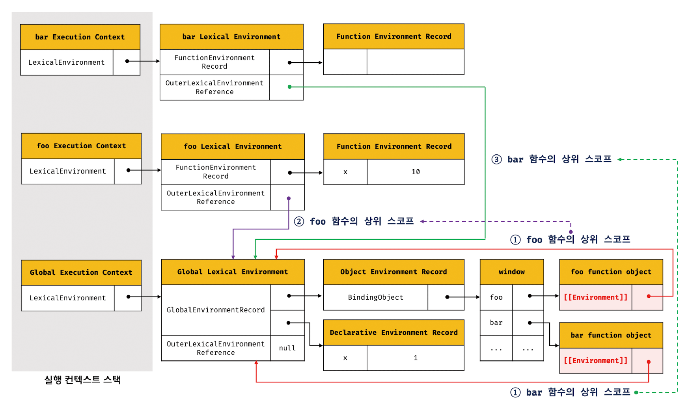
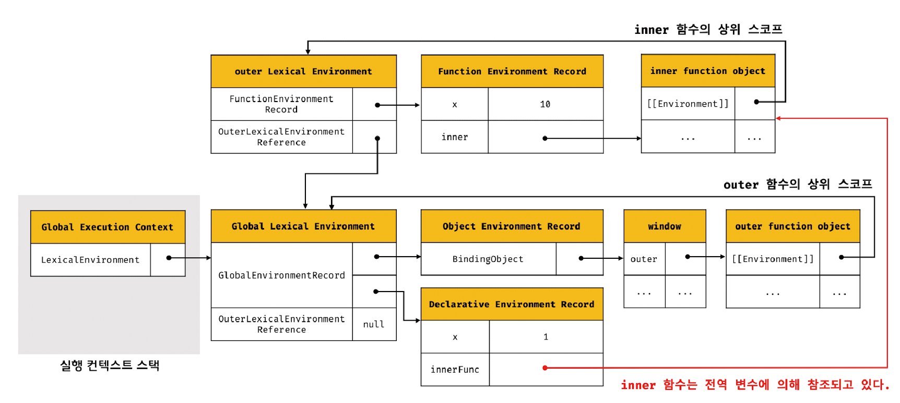
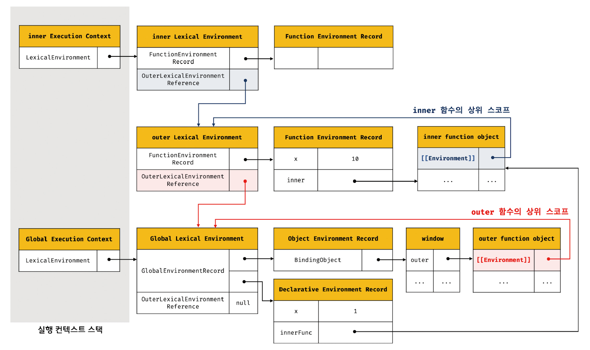
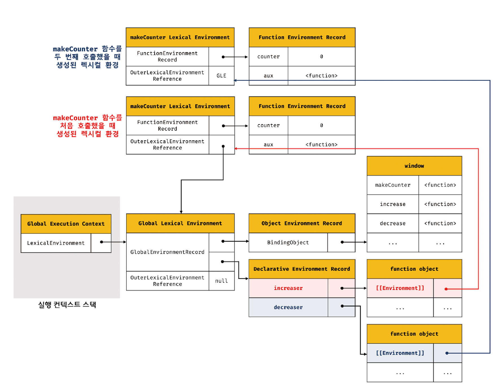
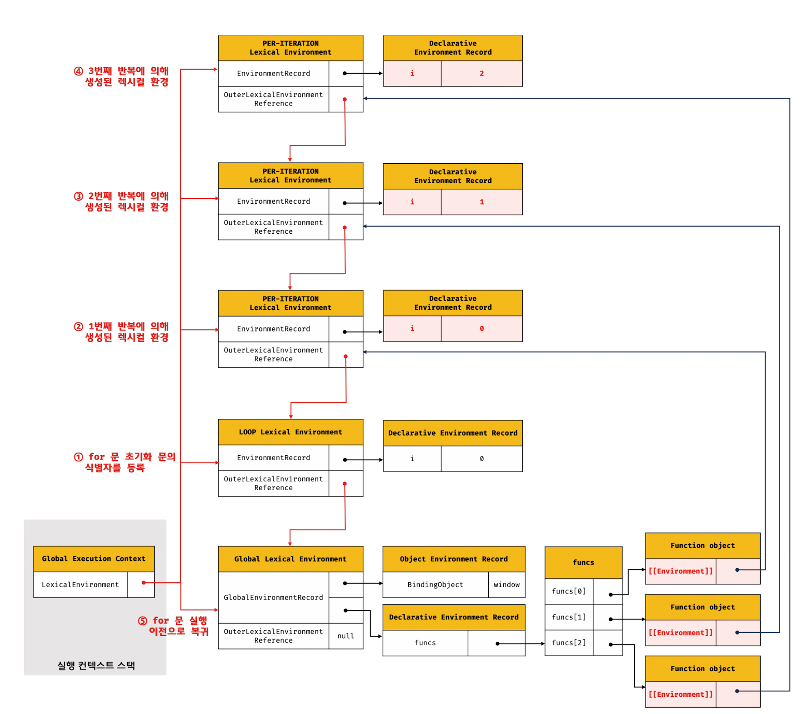

클로저는 자바스크립트 고유의 개념이 아니므로 정의가 ECMAScript에 등장하지 않는다.

MDN에서는 클로저에 대해 `클로저는 함수와 그 함수가 선언된 렉시컬 환경과의 조합이다.`라고 정의하고 있다.

# 24.1 렉시컬 스코프

> [자바스크립트 엔진은 함수를 어디서 호출했는지가 아니라 **함수를 어디서 정의했는지**에 따라 상위 스코프를 결정한다. 이를 `렉시컬 스코프(정적 스코프)`라 한다.](../ch13_스코프/README.md/#렉시컬-스코프)

스코프의 실체는 실행 컨텍스트의 렉시컬 환경이다. 이 렉시컬 환경은 자신의 `외부 렉시컬 환경에 대한 참조`를 통해 상위 렉시컬 환경과 연결된다. 이것이 바로 스코프 체인이다.

따라서 "함수의 상위 스코프를 결정한다"는 것은 "렉시컬 환경의 외부 렉시컬 환경에 대한 참조에 저장할 참조값을 결정한다"는 것과 같다.

✔️ 렉시컬 환경의 "외부 렉시컬 환경에 대한 참조"에 저장할 참조값, 즉 상위 스코프에 대한 참조는 함수 정의가 평가되는 시점에 함수가 정의된 환경(위치)에 의해 결정된다. 이것이 렉시컬 스코프다.

<br />

# 24.2 함수 객체의 내부 슬롯 [[Environment]]

함수가 정의된 환경과 호출되는 환경을 다를 수 있기 때문에 함수는 자신이 호출되는 환경과는 상관없이 자신이 정의된 환경, 즉 상위 스코프를 기억해야 한다.

따라서 함수 정의가 평가되어 함수 객체를 생성할 때 자신이 정의된 환경에 의해 결정된 상위 스코프의 참조를 함수 객체 자신의 내부 슬롯 [[Environment]]에 저장한다. 이때 이 상위 스코프의 참조는 현재 실행 중인 실행 컨텍스트의 렉시컬 환경을 가리킨다.

함수 객체는 내부 슬롯 [[Environment]]에 저장한 렉시컬 환경의 참조, 즉 상위 스코프를 자신이 존재하는 한 기억한다.

```js
const x = 1;

function foo() {
  const x = 10;
  bar();
}

function bar() {
  console.log(x);
}

foo();
bar();
```

foo와 bar 함수는 모두 전역에서 함수 선언문으로 정의되었다. 따라서 모두 전역 코드가 평가되는 시점에 평가되어 함수 객체를 생성하고 전역 객체 window의 메서드가 된다.

이때 생성된 함수 객체의 내부 슬롯 [[Environment]]에는 전역 코드 평가 시점에 실행 중인 실행 컨텍스트의 렉시컬 환경인 전역 렉시컬 환경의 참조가 저장된다.



함수가 호출되면 함수 코드를 평가하기 시작하고, 외부 렉시컬 환경에 대한 참조를 결정할 때 함수 객체의 내부 슬롯 [[Environment]]에 저장된 렉시컬 환경의 참조가 할당된다.

<br />

# 24.3 클로저와 렉시컬 환경

```js
const x = 1;
function outer() {
  const x = 10;
  const inner = function () {
    console.log(x);
  };
  return inner;
}

const innerFunc = outer();
innerFunc(); // 10
```

여기서 outer 함수를 호출하면 이 함수는 중첩 함수 inner 함수를 반환하고 생명 주기를 마감한다.
즉, outer 함수의 실행이 종료되면 outer 함수의 실행 컨텍스트는 실행 컨텍스트 스택에서 제거된다.

이때 outer 함수의 지역 변수 x와 변수 값 10을 저장하고 있던 outer 함수의 실행 컨텍스트가 제거되었으므로 지역 변수 x 또한 생명 주기를 마감한다.  
따라서 outer 함수의 지역 변수 x는 더는 유효하지 않아 이 변수에 접근할 수 있는 방법이 없어보인다.

하지만 위 코드의 실행 결과는 10이다. 이미 생명 주기가 종료되어 실행 컨텍스트 스택에서 제거된 outer 함수의 지역 변수 x가 다시 부활이라도 한 듯 동작하고 있다.

**이처럼 외부 함수보다 중첩 함수가 더 오래 유지되는 경우 중첩 함수는 이미 생명 주기가 종료한 외부 함수의 변수를 참조할 수 있다. 이러한 중첩 함수를 `클로저(closure)`라고 부른다.**

> 자바스크립트의 모든 함수는 자신의 상위 스코프를 기억한다. 모든 함수가 기억하는 상위 스코프는 함수를 어디서 호출하든 상관없이 유지된다. 따라서 **함수는 언제나 자신이 기억하는 상위 스코프의 식별자를 참조할 수 있으며 식별자에 바인딩된 값을 변경할 수도 있다.**

다시 예제로 돌아가서,

1.  outer 함수를 호출하면 outer 함수의 렉시컬 환경이 생성되고 앞서 outer 함수 객체의 [[Environment]]에 저장된 전역 렉시컬 환경을 outer 함수 렉시컬 환경의 "외부 렉시컬 환경에 대한 참조"에 할당된다.

2.  그리고 중첩 함수 inner가 평가된다. 이때 inner는 자신의 [[Environment]]에 현재 실행 중인 실행 컨텍스트의 렉시컬 환경, 즉 outer 함수의 렉시컬 환경을 상위 스코프로서 저장한다.

3.  outer 함수의 실행이 종료하면 inner 함수를 반환하면서 실행 컨텍스트 스택에서 제거된다. 이때 outer 함수의 실행 컨텍스트는 실행 컨텍스트 스택에서 제거되지만 outer 함수의 렉시컬 환경까지 소멸하는 것은 아니다.

outer 함수의 렉시컬 환경은 inner 함수의 [[Environment]] 내부 슬롯에 의해 참조되고 있고 inner 함수는 전역 변수 innerFunc에 의해 참조되고 있으므로 가비지 컬렉션의 대상이 되지 않기 때문이다.



4. outer 함수가 반환한 inner 함수를 호출하면 inner 함수의 실행 컨텍스트가 생성되고 실행 컨텍스트 스택에 푸시된다. 그리고 렉시컬 환경의 외부 렉시컬 환경에 대한 참조에는 inner 함수 객체의 [[Environment]]에 저장되어 있는 참조값이 할당된다.


외부 함수보다 더 오래 생존한 중첩 함수는 외부 함수의 생존 여부와 상관없이 자신이 정의된 위치에 의해 결정된 상위 스코프를 기억한다.

<br />

자바스크립트의 모든 함수는 상위 스코프를 기억하므로 이론적으로 모든 함수는 클로저다. 하지만 일반적으로 모든 함수를 클로저라고 하지는 않는다.

```js
function foo() {
  const x = 1;

  function bar() {
    const z = 3;

    debugger;
    console.log(z);
  }
  return bar;
}

const bar = foo();
bar();
```

중첩 함수 bar는 외부 함수 foo보다 오래 유지되지만 상위 스코프의 어떤 식별자도 참조하지 않는다.
이처럼 상위 스코프의 어떤 식별자도 참조하지 않는 경우 대부분의 모던 브라우저는 최적화를 통해 상위 스코프를 기억하지 않는다.

<br />

```js
function foo() {
  const x = 1;

  function bar() {
    debugger;
    console.log(x);
  }
  bar();
}
foo();
```

bar는 상위 스코프의 식별자를 참조하고 있으므로 클로저다. 하지만 외부 함수 foo의 외부로 중첩 함수 bar가 반환되지 않는다. 즉, 외부 함수보다 중첩 함수의 생명 주기가 짧다.

이런 경우 bar는 클로저였지만 외부 함수보다 일찍 소멸되기 때문에 생명 주기가 종료된 외부 함수의 식별자를 참조할 수 있다는 클로저의 본질에 부합하지 않는다. 따라서 bar는 일반적으로 클로저라고 하지 않는다.

<br />

```js
function foo() {
  const x = 1;

  function bar() {
    debugger;
    console.log(x);
  }
  return bar;
}

const bar = foo();
bar();
```

중첩 함수 bar는 상위 스코프의 식별자를 참조하고 있으므로 클로저다. 그리고 외부 함수의 외부로 반환되어 외부 함수보다 더 오래 살아 남는다.

이처럼 외부 함수보다 중첩 함수가 더 오래 유지되는 경우 중첩 함수는 이미 생명 주기가 종료한 외부 함수의 변수를 참조할 수 있다. 이러한 중첩 함수를 클로저라 한다.

> 🌟 클로저는 중첩 함수가 상위 스코프의 식별자를 참조하고 있고 중첩 함수가 외부 함수보다 더 오래 유지되는 경우에 한정하는 것이 일반적이다.

클로저에 의해 참조되는 상위 스코프의 변수(위 예제에서는 x)를 `자유 변수`라고 부른다.  
클로저란 "함수가 자유 변수에 대해 닫혀있다" 라는 의미이다. 즉, "자유 변수에 묶여있는 함수"라고 할 수 있다.

모던 자바스크립트 엔진은 최적화가 잘 되어 있어서 클로저가 참조하고 있지 않는 상위 스코프의 식별자는 기억하지 않는다. 따라서 클로저의 메모리 점유는 필요한 것을 기억하기 위한 것이므로 걱정할 대상이 아니다.

<br /> <br />

# 24.4 클로저의 활용

> 클로저는 상태를 안전하게 변경하고 유지하기 위해 사용한다. 즉, **상태가 의도치 않게 변경되지 않도록 상태를 안전하게 은닉하고 특정 함수에게만 상태 변경을 허용하기 위해 사용한다.**

```js
let num = 0;

const increase = function () {
  return ++num;
};
console.log(increase()); //1
console.log(increase()); //2
```

위 코드가 올바르게 동작하기 위한 조건

1. num 변수 값은 increase 함수가 호출되기 전까지 변경되지 않고 유지되어야 한다.
2. 이를 위해 num 변수 값은 increase 함수만이 변경할 수 있어야 한다.

하지만 카운트 상태는 전역 변수를 통해 관리되고 있기 때문에 언제든지 누구나 접근할 수 있고 변경할 수 있다.이는 의도치 않게 상태가 변경될 수 있다는 것을 의미한다.

따라서 increase 함수만이 num 변수를 참조하고 변경할 수 있도록 하는 것이 바람직하다.

```js
const increase = function () {
  let num = 0;
  return ++num;
};
console.log(increase()); // 1
console.log(increase()); // 1
```

num을 increase 함수의 지역 변수로 변경하여 의도치 않은 상태 변경을 방지했다. 하지만 increase 함수가 호출될 때마다 num은 다시 선언되고 0으로 초기화되기 때문에 언제나 출력 결과가 1이다.

```js
const increase = (function () {
  let num = 0;

  return function () {
    return ++num;
  };
})();

console.log(increase()); // 1
console.log(increase()); // 2
```

위 코드가 실행되면 즉시 실행 함수가 호출되고 즉시 실행 함수가 반환한 함수가 increase 변수에 할당된다.
increase 변수에 할당된 함수는 자신이 정의된 위치에 의해 결정된 상위 스코프인 즉시 실행 함수의 렉시컬 환경을 기억하는 클로저다.

즉시 실행 함수는 호출된 이후 소멸되지만 즉시 실행 함수가 반환한 클로저는 increase 변수에 할당되어 호출된다. 이 클로저는 카운트 상태를 유지하기 위한 자유 변수 num을 언제 어디서 호출하든지 참조하고 변경할 수 있다.

즉시 실행 함수는 한 번만 실행되므로 num 변수가 재차 초기화될 일은 없고, num 변수는 외부에서 직접 접근할 수 없는 은닉된 private 변수이므로 의도치 않은 변경을 걱정할 필요가 없다.

<br />

카운터를 발전시켜 보자.

```js
const counter = (function () {
  let num = 0;

  return {
    increase() {
      return ++num;
    },
    decrease() {
      return num > 0 ? --num : 0;
    },
  };
})();
```

위 즉시 실행 함수가 반환하는 객체 리터럴은 즉시 실행 함수의 실행 단계에서 평가되어 객체가 된다. 이때 객체의 메서드도 함수 객체로 생성된다. 객체 리터럴의 중괄호는 코드 블록이 아니므로 별도의 스코프를 생성하지 않는다.

increase, decrease 메서드의 상위 스코프는 이 두 메서드가 평가되는 시점에 실행 중인 실행 컨텍스트인 즉시 실행 함수의 실행 컨텍스트의 렉시컬 환경이다. 따라서 이 두 메서드는 언제 어디서든지 즉시 실행 함수의 스코프의 식별자를 참조할 수 있다.

<br />

외부 상태 변경이나 가변 데이터를 피하고 불변성을 지향하는 함수형 프로그래밍에서는 부수 효과를 최대한 억제하여 오류를 피하고 프로그램의 안정성을 높이기 위해 클로저는 적극적으로 사용된다.

```js
function makeCounter(aux) {
  let counter = 0;

  return function () {
    counter = aux(counter);
    return counter;
  };
}

function increase(n) {
  return ++n;
}

function decrease(n) {
  return --n;
}

const increaser = makeCounter(increase);
console.log(increaser()); // 1
console.log(increaser()); // 2

const decreaser = makeCounter(decrease);
console.log(decreaser()); // -1
console.log(decreaser()); // -2
```

makeCounter 함수는 보조 함수를 인자로 전달받고 함수를 반환하는 고차 함수다. makeCounter 함수가 반환하는 함수는 자신이 생성됐을 때의 렉시컬 환경인 makeCounter 함수의 스코프에 속한 counter 변수를 기억하는 클로저다.

makeCounter 함수는 인자로 전달받은 보조 함수를 합성하여 자신이 반환하는 함수의 동작을 변경할 수 있다.
이때 주의해야 할 것은 makeCounter 함수를 호출해서 반환되는 함수는 자신만의 독립된 렉시컬 환경을 갖는다는 것이다.  
이는 함수를 호출하면 그때마다 새로운 makeCounter 함수 실행 컨텍스트의 렉시컬 환경이 생성되기 때문이다.



전역 변수 increaser와 decreaser에 할당된 함수는 각각 자신만의 독립된 렉시컬 환경을 갖기 때문에 카운트를 유지하기 위한 자유 변수 counter를 공유하지 않아 카운터의 증감이 연동되지 않는다.

따라서 연동하여 증감이 가능한 카운터를 만들려면 렉시컬 환경을 공유하는 클로저를 만들어야 한다. 이를 위해서 makeCounter 함수를 두 번 호출하지 말아야 한다.

```js
const counter = (function () {
  let counter = 0;

  return function (aux) {
    counter = aux(counter);
    return counter;
  };
})();

function increase(n) {
  return ++n;
}

function decrease(n) {
  return --n;
}

console.log(counter(increase)); // 1
console.log(counter(increase)); // 2

console.log(counter(decrease)); // 1
console.log(counter(decrease)); // 0
```

<br /><br />

# 24.5 캡슐화와 정보 은닉

- 캡슐화(encapsulation): 객체의 상태를 나타내는 프로퍼티와 프로퍼티를 참조하고 조작할 수 있는 동작인 메서드를 하나로 묶는 것

캡슐화는 객체의 특정 프로퍼티나 메서드를 감출 목적으로 사용하기도 하는데 이를 정보 은닉이라 한다.

정보 은닉은 외부에 공개할 필요가 없는 구현의 일부를 외부에 공개되지 않도록 감추어 적절치 못한 접근으로부터 객체의 상태가 변경되는 것을 방지해 정보를 보호하고, 객체 간의 상호 의존성, 즉 결합도를 낮추는 효과가 있다.

자바스크립트는 public, private, protected 같은 접근 제한자를 제공하지 않는다. 따라서 자바스크립트 객체의 모든 프로퍼티와 메서드는 기본적으로 외부에 공개되어 있다.

```js
function Person(name, age) {
  this.name = name;
  let _age = age;

  this.sayHi = function () {
    console.log(`Hi! My name is ${this.name}. I am ${_age}.`);
  };
}

const me = new Person('so', 20);
me.sayHi(); // Hi! My name is so. I am 20.
console.log(me.name); // so
console.log(me._age); // undefined
```

name 프로퍼티는 public하지만 \_age 변수는 Person 생성자 함수의 지역 변수이므로 생성자 함수 외부에서 참조하거나 변경할 수 없다. 즉, \_age 변수는 private하다.

하지만 위 예제의 sayHi 메서드는 인스턴스 메서드이므로 객체가 생성될 때마다 중복 생성된다. 이 메서드를 프로토타입 메서드로 변경하면 된다.

```js
function Person(name, age) {
  this.name = name;
  let _age = age;
}

Person.prototype.sayHi = function () {
  console.log(`Hi! My name is ${this.name}. I am ${_age}.`);
};
```

이때 Person.prototype.sayHi 메서드 내에서 Person 생성자 함수의 지역 변수 \_age를 참조할 수 없는 문제가 발생한다. 다음과 같이 즉시 실행 함수로 Person 생성자 함수와 Person.prototype.sayHi 메서드를 하나의 함수 내에 모은다.

```js
const Person = (function () {
  let _age = 0;

  function Person(name, age) {
    this.name = name;
    _age = age;
  }

  Person.prototype.sayHi = function () {
    console.log(`Hi! My name is ${this.name}. I am ${_age}.`);
  };

  // 생성자 함수 반환
  return Person;
})();
```

즉시 실행 함수가 반환하는 Person 생성자 함수와 Person 생성자 함수의 인스턴스가 상속받아 호출할 Person.prototype.sayHi 메서드는 즉시 실행 함수가 종료된 이후 호출된다.
하지만 Person 생성자 함수와 sayHi 메서드는 이미 종료되어 소멸한 즉시 실행 함수의 지역 변수 \_age를 참조할 수 있는 클로저다.

하지만 위 코드에도 문제가 있다.

```js
const me = new Person('so', 20);
me.sayHi(); // Hi! My name is so. I am 20.

const you = new Person('kim', 30);
you.sayHi(); // Hi! My name is kim. I am 30.

me.sayHi(); // Hi! My name is so. I am 30
```

Person 생성자 함수가 여러 개의 인스턴스를 생성할 경우 \_age 변수의 상태가 유지되지 않는다는 것이다.

이는 Person.prototype.sayHi 메서드가 단 한 번 생성되는 클로저이기 때문에 발생하는 현상이다. 이 메서드는 즉시 실행 함수가 호출될 때 생성된다.
이때 이 메서드는 상위 스코프인 즉시 실행 함수의 실행 컨텍스트의 렉시컬 환경의 참조를 [[Environment]]에 저장해 기억한다.

따라서 Person 생성자 함수의 모든 인스턴스가 상속을 통해 호출할 수 있는 Person.prototype.sayHi 메서드의 상위 스코프는 어떤 인스턴스로 호출하더라도 하나의 동일한 상위 스코프를 사용하게 된다.
따라서 \_age 변수의 상태가 유지되지 않는 것이다.

이처럼 자바스크립트는 정보 은닉을 완전하게 지원하지 않는다. 인스턴스 메서드를 사용한다면 자유 변수를 통해 private을 흉내 낼 수는 있지만 프로토타입 메서드를 사용하면 이마저도 불가능해진다.

<br /><br />

# 24.6 자주 발생하는 실수

```js
var funcs = [];

for (var i = 0; i < 3; i++) {
  funcs[i] = function () {
    return i;
  };
}

for (var j = 0; j < funcs.length; j++) {
  console.log(funcs[j]());
}
```

위 코드의 결과값으로 0, 1, 2를 반환할 것 같지만 그렇지 않다.  
for 문의 변수 선언문에서 var 키워드로 선언한 i 변수는 함수 레벨 스코프를 갖기 때문에 전역 변수다. 전역 변수 i에는 0, 1, 2가 순차적으로 할당된다.
따라서 funcs 배열의 요소로 추가한 함수를 호출하면 전역 변수 i를 참조하여 i의 값 3이 출력된다.

```js
var funcs = [];

for (var i = 0; i < 3; i++) {
  funcs[i] = (function (id) {
    return function () {
      return id;
    };
  })(i);
}

for (var j = 0; j < funcs.length; j++) {
  console.log(funcs[j]());
}
```

즉시 실행 함수는 전역 변수 i에 할당되어 있는 값을 인수로 전달받아 매개변수 id에 할당한 후 중첩 함수를 반환하고 종료된다. 즉시 실행 함수가 반환한 함수는 funcs 배열에 순차적으로 저장된다.

이때 매개변수 id는 즉시 실행 함수가 반환한 중첩 함수의 상위 스코프에 존재한다. 중첩 함수는 자신의 상위 스코프를 기억하는 클로저이고, id는 즉시 실행 함수가 반환한 중첩 함수에 묶여있는 자유 변수가 되어 그 값이 유지된다.

위 예제는 자바스크립트의 함수 레벨 스코프 특성으로 인해 for 문의 변수 선언문에서 var 키워드로 선언한 변수가 전역 변수가 되기 때문에 발생하는 현상이다.

```js
const funcs = [];

for (let i = 0; i < 3; i++) {
  funcs[i] = function () {
    return i;
  };
}

for (let i = 0; i < funcs.length; i++) {
  console.log(funcs[i]()); // 0 1 2
}
```

for 문의 변수 선언문에서 let 키워드로 선언한 변수를 사용하면 for 문의 코드 블록이 반복 실행될 때마다 for 문 코드 블록의 새로운 렉시컬 환경이 생성된다.

만약 for 문의 코드 블록 내에서 정의한 함수가 있다면 이 함수의 상위 스코프는 for 문의 코드 블록이 반복 실행될 때마다 생성된 새로운 렉시컬 환경이다. 이때 함수의 상위 스코프는 for 문의 코드 블록이 반복 실행될 때마다 식별자의 값을 유지해야 한다.  
이를 위해 반복될 때마다 독립적인 렉시컬 환경을 생성하여 식별자의 값을 유지한다.



이처럼 **let 이나 const 키워드를 사용하는 반복문은 코드 블록을 반복 실행할 때마다 새로운 렉시컬 환경을 생성하여 반복할 당시의 상태를 스냅샷을 찍는 것처럼 저장한다.**

단, 이는 반복문의 코드 블록 내부에서 함수를 정의할 때 의미가 있다. 코드 블록 내부에 함수 정의가 없는 반복문이 생성하는 렉시컬 환경은 반복 직후, 아무도 참조하지 않기 때문에 가비지 컬렉션의 대상이 된다.
