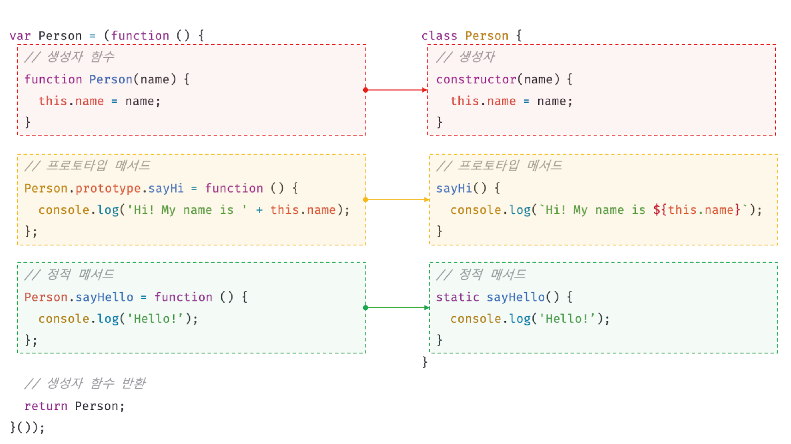
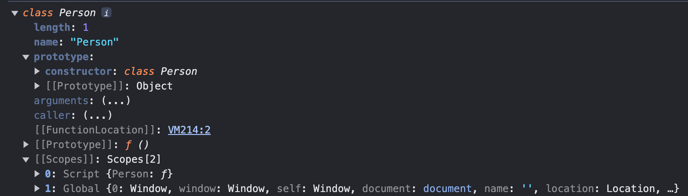
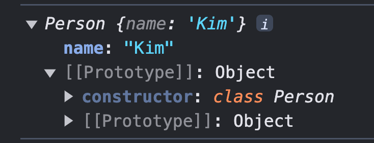
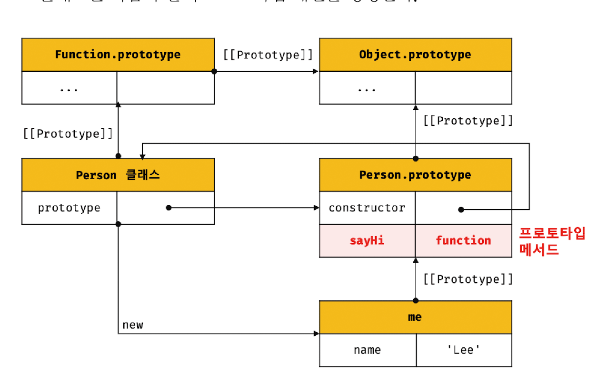
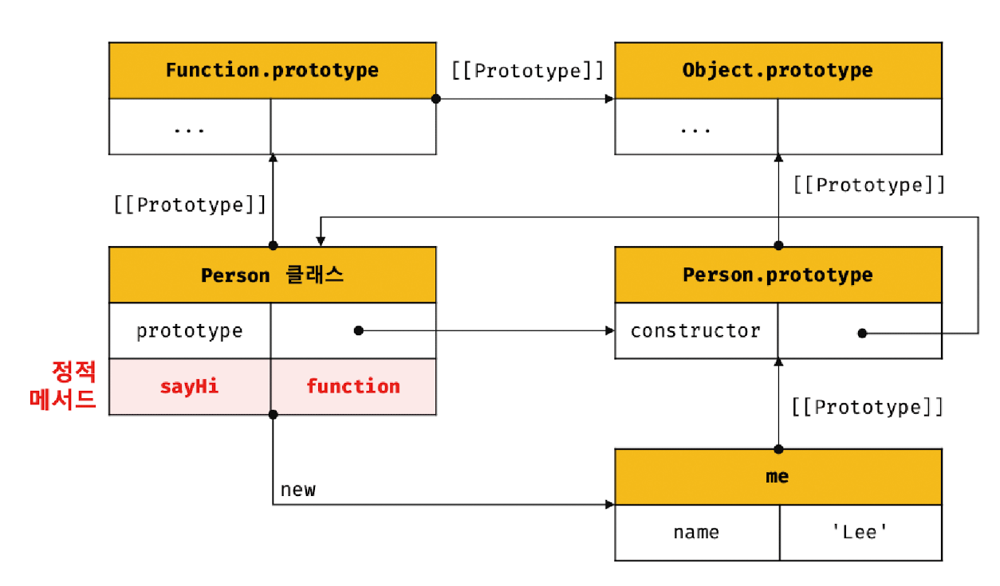
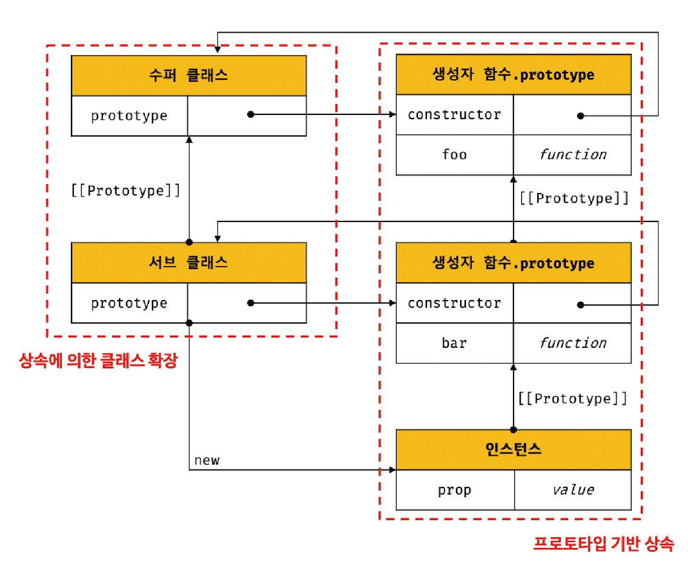
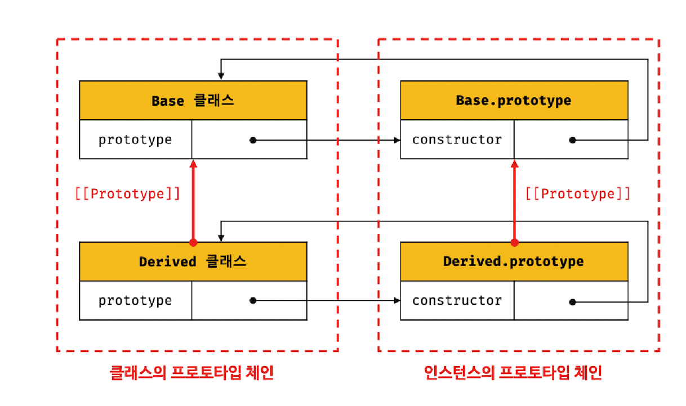
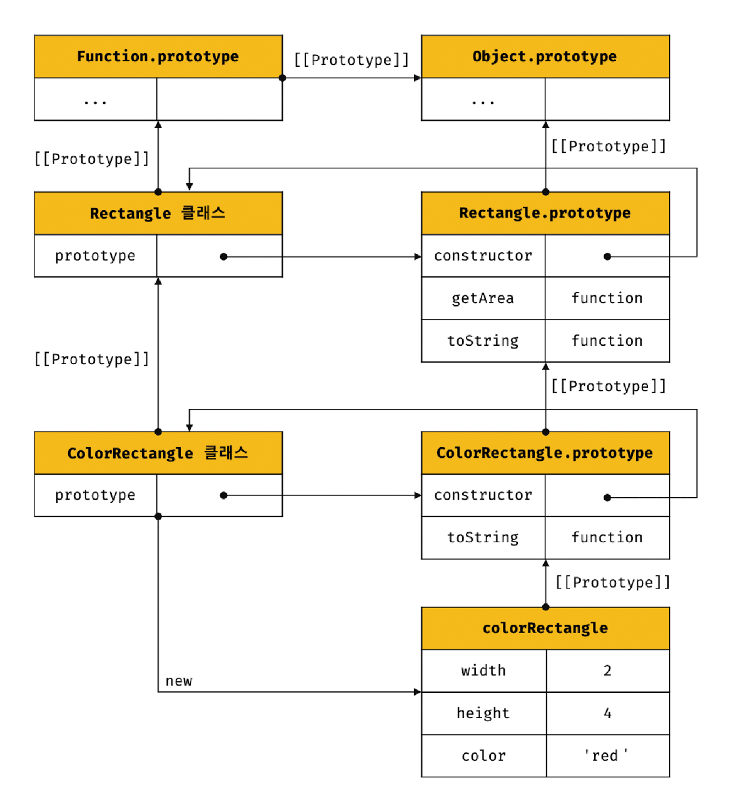

# 25.1 클래스는 프로토타입의 문법적 설탕인가?

자바스크립트는 프로토타입 기반 객체지향 언어다.

프로토타입 기반 객체지향 언어는 클래스가 필요 없는 객체지향 프로그래밍 언어다. ES5에서는 클래스 없이도 생성자 함수와 프로토타입을 통해 객체지향 언어의 상속을 구현할 수 있다.

```js
// ES5 생성자 함수
var Person = (function () {
  function Person(name) {
    this.name = name;
  }

  Person.prototype.sayHi = function () {
    console.log('Hi! My name is ' + this.name);
  };

  return Person;
})();

var me = new Person('Kim');
me.sayHi(); // Hi! My name is Kim
```

ES6에서 도입된 클래스는 기존 프로토타입 기반 객체지향 프로그래밍보다 클래스 기반 객체지향 프로그래밍에 익숙한 프로그래머가 더욱 빠르게 학습할 수 있도록 클래스 기반 객체지향 프로그래밍 언어와 매우 흡사한 새로운 객체 생성 매커니즘을 제시한다.

그렇다고 ES6의 클래스가 기존의 프로토타입 기반 객체지향 모델을 폐지하고 새롭게 클래스 기반 객체지향 모델을 제공하는 것은 아니다. 사실 클래스는 함수이며 기존 프로토타입 기반 패턴을 클래스 기반 패턴처럼 사용할 수 있도록 하는 문법적 설탕이라고 볼 수도 있다.

단, 클래스와 생성자 함수는 모두 프로토타입 기반의 인스턴스를 생성하지만 정확히 동일하게 동작하지는 않는다.
클래스는 생성자 함수보다 엄격하며 생성자 함수에서는 제공하지 않는 기능도 제공한다.

1. 클래스를 `new` 연산자 없이 호출하면 에러가 발생한다. 하지만 생성자 함수를 `new` 연산자 없이 호출하면 일반 함수로서 호출된다.
2. 클래스는 상속을 지원하는 `extends`와 `super` 키워드를 제공한다.
3. 클래스는 호이스팅이 발생하지 않는 것처럼 동작한다. 하지만 함수 선언문으로 정의된 생성자 함수는 함수 호이스팅이, 함수 표현식으로 정의한 생성자 함수는 변수 호이스팅이 발생한다.
4. 클래스 내의 모든 코드에는 암묵적으로 strict mode가 지정되어 실행되며 strict mode를 해제할 수 없다.
5. 클래스의 `constructor`, 프로토타입 메서드, 정적 메서드는 모두 프로퍼티 어트리뷰트 `[[Enumerable]]` 값이 `false`다. 다시 말해 열거되지 않는다.

클래스는 생성자 함수 기반의 객체 생성 방식보다 견고하고 명료하다. 특히 클래스의 `extends`와 `super` 키워드는 상속 관계 구현을 더욱 간결하고 명룜하게 한다.

따라서 클래스를 프로토타입 기반 객체 생성 패턴의 문법적 설탕이라고 보기보다는 새로운 객체 생성 매커니즘으로 보는 것이 더 합당하다.

<br />
<br />

# 25.2 클래스 정의

클래스는 `class` 키워드를 사용하여 정의하고, 이름은 생성자 함수와 마찬가지로 파스칼 케이스를 일반적으로 사용한다.

일반적이지는 않지만 함수와 마찬가지로 표현식으로 클래스를 정의할 수도 있다. 이 말은 클래스가 값으로 사용할 수 있는 일급 객체라는 것을 의미한다.

```js
class Person {}

const Person = class {};

const Person = class MyClass {};
```

<br />

클래스 몸체에는 0개 이상의 메서드만 정의할 수 있다. 정의할 수 있는 메서드는 constructor, 프로토타입 메서드, 정적 메서드의 세 가지가 있다.

클래스와 생성자 함수의 정의 방식을 비교해 보면 다음과 같다.

<p align="center">
  
</p>

<br />
<br />

# 25.3 클래스 호이스팅

클래스는 함수로 평가된다.

```js
class Person {}

console.log(typeof Person); // function
```

클래스 선언문으로 정의한 클래스는 함수 선언문과 같이 소스코드 평가 과정, 즉 런타임 이전에 먼저 평가되어 함수 객체를 생성한다.

이때 클래스가 평가되어 생성된 함수 객체는 생성자 함수로서 호출할 수 있는 함수, 즉 `constructor`다.

생성자 함수로서 호출할 수 있는 함수는 함수 정의가 평가되어 함수 객체를 생성하는 시점에 프로토타입도 더불어 생성된다.

단, 클래스는 클래스 정의 이전에 참조할 수 없다.

```js
console.log(Person); // ReferenceError

class Person {}
```

클래스 선언문은 마치 호이스팅이 발생하지 않는 것처럼 보인다.

```js
const Person = '';
{
  console.log(Person); // ReferenceError

  class Person {}
}
```

만약 호이스팅이 발생하지 않는다면 console.log()문에서는 ''이 출력되어야 한다.

let, const 키워드처럼 클래스 선언문 이전에 일시적 사각지대에 빠지기 때문에 호이스팅이 발생하지 않는 것처럼 동작한다.

<br />
<br />

# 25.4 인스턴스 생성

클래스는 생성자 함수이며 `new` 연산자와 함께 호출되어 인스턴스를 생성한다.

```js
class Person {}

const me = new Person();
console.log(me); // Person {}
```

클래스는 인스턴스를 생성하는 것이 유일한 존재 이유이므로 반드시 `new` 연산자와 함께 호출해야 한다.
만약 연산자 없이 호출하면 타입 에러가 발생한다.

클래스 표현식으로 정의된 클래스의 경우 클래스를 가리키는 식별자를 사용해 인스턴스를 생성하는 것이 아닌 기명 클래스 표현식의 클래스 이름을 사용해 인스턴스를 생성하면 오류가 발생한다.

```js
const Person = class MyClass {};

const me = new Person();

const you = new MyClass(); // ReferenceError: MyClass is not defined
```

<br />
<br />

# 25.5 메서드

## `constructor`

> 인스턴스를 생성하고 초기화하기 위한 특수한 메서드다.

```js
class Person {
  constructor(name) {
    this.name = name;
  }
}
```

<p align="center">
  
</p>

클래스는 평가되어 함수 객체가 된다. 함수와 동일하게 프로토타입과 연결되어 있으며 자신의 스코프 체인을 구성한다.

모든 함수 객체가 가지고 있는 `prototype` 프로퍼티가 가리키는 프로토타입 객체의 `constructor` 프로퍼티는 클래스 자신을 가리키고 있다.
이는 클래스가 인스턴스를 생성하는 생성자 함수라는 것을 의미한다.

```js
const me = new Person('Kim');
console.log(me);
```

<p align="center">
  
</p>

Person 클래스의 constructor 내부에서 this에 추가한 `name` 프로퍼티가 인스턴스의 프로퍼티로 추가된 것을 확인할 수 있다.

`constructor` 내부의 `this`는 생성자 함수와 마찬가지로 클래스가 생성한 인스턴스를 가리킨다.

<br />

클래스가 평가되어 생성된 함수 객체나 클래스가 생성한 인스턴스 어디에도 `constructor` 메서드가 보이지 않는다.

=> `constructor`는 메서드로 해석되는 것이 아니라 클래스로 평가되어 생성한 함수 객체 코드의 일부가 된다.
다시 말해, 클래스 정의가 평가되면 `constructor`의 기술된 동작을 하는 함수 객체가 생성된다.

> ✔️ 클래스의 `constructor` 메서드와 프로토타입의 `constructor` 프로퍼티는 이름이 같아 혼동하기 쉽지만 직접적인 관련이 없다.

<br />

- constructor는 클래스 내의 최대 한 개만 존재할 수 있다. 만약 2개 이상이 존재하면 문법 에러가 발생한다.
- constructor는 생략할 수 있다.
  - 생략하게 되면 빈 constructor가 암묵적으로 정의된다.

인스턴스를 생성할 때 클래스 외부에서 인스턴스 프로퍼티의 초기값을 전달하려면 constructor에 매개변수를 선언하고 인스턴스를 생성할 때 초기값을 전달한다.

```js
class Person {
  constructor(name, address) {
    this.name = name;
    this.address = address;
  }
}

const me = new Person('Kim', 'Seoul');
```

이처럼 constructor 내에서는 인스턴스의 생성과 동시에 인스턴스 프로퍼티 추가를 통해 인스턴스의 초기화를 실행한다.

- constructor는 별도의 반환문을 갖지 않아야 한다.
  - `new` 연산자와 함께 클래스가 호출되면 생성자 함수와 동일하게 암묵적으로 this를 반환하기 때문이다.

만약 this가 아닌 다른 객체를 명시적으로 반환하면 this, 즉 인스턴스가 반환되지 못하고 return 문에 명시된 객체가 반환된다.

```js
class Person {
  constructor(name, address) {
    this.name = name;
    this.address = address;

    return {};
  }
}

const me = new Person('Kim', 'Seoul');
console.log(me); // {}
```

하지만 명시적으로 원시값을 반환하면 원시값 반환은 무시되고 암묵적으로 this가 반환된다.

```js
class Person {
  constructor(name, address) {
    this.name = name;
    this.address = address;

    return 10;
  }
}

const me = new Person('Kim', 'Seoul');
console.log(me); // Person {name: 'Kim', address: 'Seoul'}
```

constructor 내부에서 명시적으로 다른 값을 반환하는 것은 클래스의 기본 동작을 훼손한다.
따라서 return 문을 반드시 생략해야 한다.

<br />
<br />

## 프로토타입 메서드

클래스 몸체에서 정의한 메서드는 클래스의 `prototype` 프로퍼티에 메서드를 추가하지 않아도 기본적으로 프로토타입 메서드가 된다.

```js
class Person {
  constructor(name) {
    this.name = name;
  }

  // 프로토타입 메서드
  sayHi() {
    console.log(`Hi! My name is ${this.name}`);
  }
}

const me = new Person('Lee');
```

위 코드의 Person 클래스는 다음과 같이 프로토타입 체인을 생성한다.

<p align="center">
  
</p>

클래스는 생성자 함수와 같이 인스턴스를 생성하는 생성자 함수라고 볼 수 있다. 다시 말해, 클래스는 생성자 함수와 마찬가지로 프로토타입 기반의 객체 생성 매커니즘이다.

<br />
<br />

## 정적 메서드

> 인스턴스를 생성하지 않아도 호출할 수 있는 메서드를 말한다.

클래스는 메서드에 `static` 키워드를 붙이면 정적 메서드(클래스 메서드)가 된다.

```js
class Person {
  constructor(name) {
    this.name = name;
  }

  static sayHi() {
    console.log('Hi!');
  }
}

Person.sayHi();
```

<p align="center">
  
</p>

정적 메서드는 클래스에 바인딩된 메서드가 된다.

클래스는 함수 객체로 평가되므로 자신의 프로프티/메서드를 소유할 수 있다.
클래스는 클래스 정의가 평가되는 시점에 함수 객체가 되므로 인스턴스와 달리 별다른 생성 과정이 필요 없다.

따라서 정적 메서드는 클래스 정의 이후 인스턴스를 생성하지 않아도 호출할 수 있다.

정적 메서드가 바인딩된 클래스는 인스턴스의 프로토타입 체인상에 존재하지 않기 때문에 정적 메서드는 인스턴스로 호출할 수 없다.

```js
const me = new Person('Lee');
me.sayHi(); // TypeError: me.sayHi is not a function
```

<br />
<br />

## 정적 메서드와 프로토타입 메서드의 차이

1. 정적 메서드와 프로토타입 메서드는 자신이 속해 있는 프로토타입 체인이 다르다.
2. 정적 메서드는 클래스로 호출하고 프로토타입 메서드는 인스턴스로 호출한다.
3. 정적 메서드는 인스턴스 프로퍼티를 참조할 수 없지만 프로토타입 메서드는 인스턴스 프로퍼티를 참조할 수 있다.

정적 메서드와 프로토타입 메서드 내부의 `this` 바인딩이 다르다. 따라서 메서드 내부에서 인스턴스 프로퍼티를 참조할 필요가 있다면 `this`를 사용해야 하며, 이런 경우 프로토타입 메서드로 정의해야 한다.

<br />

표준 빌트인 객체인 Math, Number, JSON, Object 등은 다양한 정적 메서드를 가지고 있다. 이들 정적 메서드는 애플리케이션 전역에서 사용할 유틸리티 함수다.

```js
Math.max(1, 2, 3);
Number.isNaN(NaN);
JSON.stringify({ a: 1 });
Object.is({}, {});
Reflect.has({ a: 1 }, 'a');
```

이처럼 클래스 또는 생성자 함수를 하나의 네임스페이스로 사용하여 정적 메서드를 모아 놓으면 이름 충돌 가능성을 줄여 주고 관련 함수들을 구조화할 수 있는 효과가 있다.

이 같은 이유로 정적 메서드는 애플리케이션 전역에서 사용할 유틸리티 함수를 전역 함수로 정의하지 않고 메서드로 구조화할 때 유용하다.

<br />
<br />

## 클래스에서 정의한 메서드의 특징

1. `function` 키워드를 생략한 메서드 축약 표현을 사용한다.
2. 객체 리터럴과는 다르게 클래스에 메서드를 정의할 때는 콤마가 필요 없다.
3. 암묵적으로 `strict mode`로 실행된다.
4. `for ... in` 문이나 `Object.keys` 메서드 등으로 열거할 수 없다.
5. 내부 메서드 `[[Construct]]` 를 갖지 않는 non-constructor다. 따라서 `new 연산자`와 함께 호출할 수 없다.

<br />
<br />
<br />

# 25.6 클래스의 인스턴스 생성 과정

### 1. 인스턴스 생성과 this 바인딩

`new` 연산자와 함께 클래스를 호출하면 `constructor`의 내부 코드가 실행되기에 앞서 암묵적으로 빈 객체가 생성된다.

이때 클래스가 생성한 인스턴스의 프로토타입으로 클래스의 prototype 프로퍼티가 가리키는 객체가 설정된다.

그리고 암묵적으로 생성된 빈 객체, 즉 인스턴스는 `this`에 바인딩된다.
따라서 constructor 내부의 this는 클래스가 생성한 인스턴스를 가리킨다.

### 2. 인스턴스 초기화

constructor의 내부 코드가 실행되어 this에 바인딩되어 있는 인스턴스를 초기화한다.

만약 constructor가 생략되었다면 이 과정도 생략된다.

### 3. 인스턴스 반환

클래스의 모든 처리가 끝나면 완성된 인스턴스가 바인딩된 this가 암묵적으로 반환된다.

<br /><br />

# 25.7 프로퍼티

## 인스턴스 프로퍼티

인스턴스 프로퍼티는 constructor 내부에서 정의해야 한다.

```js
class Person {
  constructor(name) {
    this.name = name;
  }
}

const me = new Person('Lee');
console.log(me.name); // Lee
```

constructor 내부에서 this에 추가한 프로퍼티는 언제나 클래스가 생성한 인스턴스의 프로퍼티가 된다.

ES6의 클래스는 다른 객체지향 언어처럼 `private, public, protected`와 같은 접근 제한자를 지원하지 않는다.

<br />

## 접근자 프로퍼티

접근자 프로퍼티는 자체적으로는 값을 갖지 않고 다른 데이터 프로퍼티의 값을 읽거나 저장할 때 사용하는 접근자 함수로 구성된 프로퍼티다.

```js
const person = {
  // 데이터 프로퍼티
  firstName: 'So',
  lastName:'Kim',

  // 접근자 프로퍼티
  get fullName(){
    return `${this.firstName} ${this.lastName}`
  }

  set fullName(name) {
    [this.firstName, this.lastName] = name.split(' ')
  }
}

// 접근자 프로퍼티 fullName에 값을 저장하면 setter 함수가 호출된다.
person.fullName = 'Bori Kim';
console.log(person); // {firstName:'Bori', lastName:'Kim'}

// 접근자 프로퍼티를 통한 프로퍼티 값의 참조
console.log(person.fullName); // Bori Kim

```

접근자 프로퍼티는 클래스에서도 사용할 수 있다.

```js
class Person {
  constructor(firstName, lastName) {
    this.firstName = firstName;
    this.lastName = lastName;
  }

  // 접근자 프로퍼티
  get fullName() {
    return `${this.firstName} ${this.lastName}`;
  }

  set fullName(name) {
    [this.firstName, this.lastName] = name.split(' ');
  }
}
```

접근자 프로퍼티는 다른 데이터 프로퍼티의 값을 읽거나 저장할 때 사용하는 접근자 함수, 즉 getter 함수와 setter 함수로 구성되어 있다.

이때 getter 와 setter 이름은 인스턴스 프로퍼티처럼 사용된다.
다시 말해 getter와 setter는 호출하는 것이 아니라 프로퍼티처럼 값을 각각 참조, 할당하는 형식으로 사용한다.

클래스의 접근자 프로퍼티는 인스턴스 프로퍼티가 아닌 프로토타입의 프로퍼티가 된다.

<br /><br />

## 클래스 필드 정의 제안

> 클래스 필드는 클래스 기반 객체지향 언어에서 클래스가 생성할 인스턴스의 프로퍼티를 가리키는 용어다.

```js
class Person {
  // 클래스 필드 정의
  name = 'Kim';
}

const me = new Person();
console.log(me); // Person {name: "Kim"}
```

- 클래스 필드를 정의하는 경우 this에 클래스 필드를 바인딩해서는 안된다.
  `this`는 클래스의 constructor와 메서드 내에서만 유효하다.

- 클래스 필드를 참조하는 경우 자바와 같은 클래스 기반 객체지향 언어에서는 this를 생략할 수 있으나 자바스크립트에서는 this를 반드시 사용해야 한다.

```js
class Person {
  name = 'Kim';

  constructor() {
    console.log(name); //ReferenceError: name is not defined
  }
}
```

- 클래스 필드에 초기값을 할당하지 않으면 `undefined`를 갖는다.

- 인스턴스를 생성할 때 외부의 초기값으로 클래스 필드를 초기화해야 할 필요가 있다면 constructor에서 클래스 필드를 초기화해야 한다.

- 함수는 일급 객체이므로 함수를 클래스 필드에 할당할 수 있다.

```js
class Person {
  name = 'Kim';

  // 클래스 필드에 함수를 할당
  getName = function () {
    return this.name;
  };
}
```

클래스 필드에 함수를 할당하는 경우, 이 함수는 인스턴스 메서드가 된다. 모든 클래스 필드는 인스턴스 프로퍼티가 되기 때문이다.

따라서 클래스 필드에 함수를 할당하는 것은 권장하지 않는다.

<br />

- 인스턴스를 생성할 때 외부 초기값으로 클래스 필드를 초기화할 필요가 있다면 constructor에서 인스턴스 프로퍼티를 정의
- 외부 초기값으로 클래스 필드를 초기화할 필요가 없다면 기존의 constructor에서 인스턴스 프로퍼티를 정의하는 방식과 클래스 필드 정의 제안 모두 사용할 수 있다.

<br />

## `private` 필드 정의 제안

인스턴스 프로퍼티는 인스턴스를 통해 클래스 외부에서 언제나 참조할 수 있다. 즉, 언제나 `public`이다.

`private` 필드의 선두에는 `#`을 붙여준다. 참조할 때도 #을 붙어주어야 한다.

```js
class Person {
  #name = '';

  constructor(name) {
    this.#name = name;
  }
}

const me = new Person('Kim');

console.log(me.#name); // Uncaught SyntaxError: Private field '#name' must be declared in an enclosing class
```

private 필드는 클래스 내부에서만 참조할 수 있다.
다만 접근자 프로퍼티를 통해 간접적으로 접근하는 방법은 유효하다.

```js
class Person {
  #name = '';

  constructor(name) {
    this.#name = name;
  }

  get name() {
    return this.#name.trim();
  }
}

const me = new Person('Kim');

console.log(me.name); // Kim
```

- **private 필드는 반드시 클래스 몸체에 정의해야 한다.** 직접 constructor에 정의하면 에러가 발생한다.

<br />

## `static` 필드 정의 제안

```js
class MyMath {
  static PI = 22 / 7;

  static #num = 10;

  static increment() {
    return ++MyMath.#num;
  }
}

console.log(MyMath.PI); //3.142857142857143
console.log(MyMath.increment()); // 11
```

<br />
<br />

# 25.8 상속에 의한 클래스 확장

프로토타입 기반 상속은 프로토타입 체인을 통해 다른 객체의 자산을 상속받는 개념이지만,
**상속에 의한 클래스 확장은 기존 클래스를 상속받아 새로운 클래스를 확장하여 정의하는 것이다.**

<p align="center">
  
</p>

<br />

클래스는 상속을 통해 기존 클래스를 확장할 수 있는 문법인 `extends` 키워드가 제공되지만 생성자 함수는 그렇지 않다.

## `extends` 키워드

상속을 통해 클래스를 확장하려면 `extends` 키워드를 사용하여 상속받을 클래스를 정의한다.

```js
class Base {}

class Derived extends Base {}
```

- **서브클래스(파생 클래스, 자식 클래스)**: 상속을 통해 확장된 클래스
- **수퍼클래스(베이스 클래스, 부모 클래스)**: 서브클래스에게 상속된 클래스

extends 키워드의 역할은 수퍼클래스와 서브클래스 간의 상속 관계를 설정하는 것이다.

클래스도 프로토타입을 통해 상속 관계를 구현한다.

<p align="center">
  
</p>

수퍼클래스와 서브클래스는 인스턴스의 프로토타입 체인뿐 아니라 클래스 간의 프로토타입 체인도 생성한다.

이를 통해 프로토타입 메서드, 정적 메서드 모두 상속이 가능하다.

<br />

## 동적 상속

extends 키워드는 클래스뿐만 아니라 생성자 함수를 상속받아 클래스를 확장할 수도 있다.

**단, extends 키워드 앞에는 반드시 클래스가 와야 한다.**

```js
function Base(a) {
  this.a = a;
}

class Derived extends Base {}

const derived = new Derived(1);
console.log(derived); // Derived {a: 1}
```

extends 키워드 다음에는 클래스뿐만이 아니라 `[[Construct]]` 내부 메서드를 갖는 함수 객체로 평가될 수 있는 모든 표현식을 사용할 수 있다.
이를 통해 동적으로 상속받을 대상을 결정할 수 있다.

```js
function Base1() {}

class Base2 {}

let condition = true;

class Derived extends (condition ? Base1 : Base2) {}
```

<br />

## 서브클래스의 constructor

서브클래스에서 constructor를 생략하면 클래스에 다음과 같은 constructor가 암묵적으로 정의된다.

```js
constructor(...args) { super(...args); }
```

`args`는 new 연산자와 함께 클래스를 호출할 때 전달한 인수의 리스트다.

`super()`는 수퍼클래스의 constructor를 호출하여 인스턴스를 생성한다.

<br />

## `super` 키워드

> super 키워드는 함수처럼 호출할 수도 있고 this와 같이 식별자처럼 참조할 수 있는 특수한 키워드다.

- super를 호출하면 수퍼클래스의 `constructor`를 호출한다.
- super를 참조하면 수퍼클래스의 메서드를 호출할 수 있다.

### super 호출

```js
class Base {
  constructor(a, b) {
    this.a = a;
    this.b = b;
  }
}

class Derived extends Base {
  // 암묵적으로 constructor 정의됨
  // constructor(...args) { super(...args); }
}

const derived = new Derived(1, 2);
console.log(derived); // Derived {a: 1, b: 2}
```

위와 같이 수퍼클래스의 constructor 내부에서 추가한 프로퍼티를 그대로 갖는 인스턴스를 생성한다면 서브클래스의 constructor를 생략할 수 있다.

<br />

```js
class Base {
  constructor(a, b) {
    this.a = a;
    this.b = b;
  }
}

class Derived extends Base {
  constructor(a, b, c) {
    super(a, b);
    this.c = c;
  }
}

const derived = new Derived(1, 2, 3);
console.log(derived); // Derived {a: 1, b: 2, c: 3}
```

위와 같이 수퍼클래스에서 추가한 프로퍼티와 서브클래스에서 추가한 프로퍼티를 갖는 인스턴스를 생성한다면 서브클래스의 constructor를 생략할 수 없다.

이때 new 연산자와 함께 서브클래스를 호출하면서 전달한 인수 중에서 수퍼클래스의 constructor에 전달할 필요가 있는 인수는 서브클래스의 constructor에서 호출하는 super를 통해 전달한다.

#### super를 호출할 때 주의할 사항

1. 서브클래스에서 constructor를 생략하지 않는 경우 서브클래스의 constructor에서는 반드시 super를 호출해야 한다.

   ```js
   class Base {}
   class Derived extends Base {
     constructor() {
       // ReferenceError: Must call super constructor in derived class before accessing 'this' or returning from derived constructor
       console.log('');
     }
   }
   const derived = new Derived();
   ```

2. 서브클래스의 constructor에서 super를 호출하기 전에는 this를 참조할 수 없다.

   ```js
   class Base {}
   class Derived extends Base {
     constructor() {
       //ReferenceError: Must call super constructor in derived class before accessing 'this' or returning from derived constructor
       this.a = 1;
       super();
     }
   }
   const derived = new Derived();
   ```

3. super는 반드시 서브클래스의 constructor에서만 호출한다. 서브클래스가 아닌 클래스의 constructor나 함수에서 super를 호출하면 에러가 발생한다.

<br />

### super 참조

1. 서브클래스의 프로토타입 메서드 내에서 `super.sayHi`는 수퍼클래스의 프로토타입 메서드 sayHi를 가리킨다.

   ```js
   class Base {
     constructor(name) {
       this.name = name;
     }

     sayHi() {
       return `Hi! ${this.name}`;
     }
   }

   class Derived extends Base {
     sayHi() {
       return `${super.sayHi()}. how are you doing?`;
     }
   }

   const derived = new Derived('Kim');
   console.log(derived.sayHi()); // Hi! Kim. how are you doing?
   ```

2. 서브클래스의 정적 메서드 내에서 `super.sayHi`는 수퍼클래스의 정적 메서드 sayHi를 가리킨다.

   ```js
   class Base {
     static sayHi() {
       return 'Hi!';
     }
   }

   class Derived extends Base {
     static sayHi() {
       return `${super.sayHi()} how are you doing?`;
     }
   }

   console.log(Derived.sayHi()); // Hi! how are you doing?
   ```

<br />
<br />

## 상속 클래스의 인스턴스 생성 과정

클래스가 단독으로 인스턴스를 생성하는 과정보다 상속관계에 있는 두 클래스가 협력하며 인스턴스를 생성하는 과정은 좀 더 복잡하다.

직사각형을 추상화한 Rectangle 클래스와 상속을 통해 Rectangle을 확장한 ColorRectangle 클래스를 정의해보자.

```js
class Rectangle {
  constructor(width, height) {
    this.width = width;
    this.height = height;
  }

  getArea() {
    return this.width * this.height;
  }

  toString() {
    return `width = ${this.width}, height = ${this.height}`;
  }
}

class ColorRectangle extends Rectangle {
  constructor(width, height, color) {
    super(width, height);
    this.color = color;
  }

  toString() {
    return super.toString() + `, color = ${this.color}`;
  }
}

const colorRect = new ColorRectangle(2, 4, 'red');

console.log(colorRect.getArea()); // 8
console.log(colorRect.toString()); //  width = 2, height = 4, color = red
```

ColorRectangle 클래스에 의해 생성된 인스턴스의 프로토타입 체인은 다음과 같다.

<p align="center">
  
</p>

<br />

### 서브클래스의 인스턴스 생성 과정

#### 1. 서브클래스의 super 호출

자바스크립트 엔진은 클래스를 평가할 때 수퍼클래스와 서브클래스를 구분하기 위해 `"base"` 또는 `"derived"`를 값으로 갖는 내부 슬롯 `[[ConstructorKind]]`를 갖는다.

다른 클래스를 상속받지 않는 클래스는 내부 슬롯 `[[ConstructorKind]]`의 값이 "base"로 설정되지만 다른 클래스를 상속받는 서브클래스는 값이 "derived"로 설정된다.

이를 통해 수퍼클래스와 서브클래스는 `new` 연산자와 함께 호출되었을 때의 동작이 구분된다.

다른 클래스를 상속받지 않는 클래스는 new 연산자와 함께 호출되었을 때 암묵적으로 빈 객체, 즉 인스턴스를 생성하고 이를 this에 바인딩한다.

하지만 **서브클래스는 자신이 직접 인스턴스를 생성하지 않고 수퍼클래스에게 인스턴스 생성을 위임한다.**
**`이것이 서브 클래스의 constructor에서 반드시 super를 호출해야 하는 이유다.`**

만약 서브클래스 constructor 내부에 super 호출이 없으면 에러가 발생한다. 실제로 인스턴스를 생성하는 주체는 수퍼클래스이므로 수퍼클래스의 constructor를 호출하는 super가 호출되지 않으면 인스턴스를 생성할 수 없기 때문이다.

<br />

#### 2. 수퍼클래스의 인스턴스 생성과 this 바인딩

```js
class Rectangle {
  constructor(width, height) {
    // 암묵적으로 빈 객체, 즉 인스턴스가 생성되고 this에 바인딩된다.
    console.log(this); // ColorRectangle {}

    // new 연산자와 함께 호출된 함수, 즉, new.target은 ColorRectangle이다.
    console.log(new.target); // ColorRectangle
  }
}
...
```

이때 인스턴스는 수퍼클래스가 생성한 것이다. 하지만 new 연산자와 함께 호출된 클래스가 서브클래스라는 것이 중요하다.

즉, new 연산자와 함께 호출된 함수를 가리키는 `new.target`은 서브클래스를 가리킨다. **따라서 인스턴스는 new.target이 가리키는 서브클래스가 생성한 것으로 처리된다.**

생성된 인스턴스의 프로토타입은 수퍼클래스의 prototype 프로퍼티가 가리키는 객체(Rectangle.prototype)가 아니라 new.target, 즉 서브클래스의 prototype 프로퍼티가 가리키는 객체(ColorRectangle.prototype)이다.

<br />

#### 3. 수퍼클래스의 인스턴스 초기화

수퍼클래스의 constructor가 실행되어 this에 바인딩 되어 있는 인스턴스를 초기화한다. 즉, this에 바인딩되어 있는 인스턴스에 프로퍼티를 추가하고 constructor가 인수로 전달받은 초기값으로 인스턴스의 프로퍼티를 초기화한다.

#### 4. 서브클래스 constructor로의 복귀와 this 바인딩

super의 호출이 종료되고 제어 흐름이 서브클래스 constructor로 돌아온다.

이때 super가 반환한 인스턴스가 this에 바인딩된다. **서브클래스는 별도의 인스턴스를 생성하지 않고 super가 반환한 인스턴스를 this에 바인딩하여 그래도 사용한다**.

```js
class ColorRectangle extends Rectangle {
  constructor(width, height, color) {
    super(width, height);

    console.log(this); // ColorRectangle {width: 2, height: 4}
  }
}
```

**이처럼 super가 호출되지 않으면 인스턴스가 생성되지 않으며 this 바인딩도 할 수 없다.**
서브클래스의 constructor에서 super를 호출하기 전에는 this를 참조할 수 없는 이유가 바로 이 때문이다.

<br />

#### 5. 서브클래스의 인스턴스 초기화

super 호출 이후, 서브클래스의 constructor에 기술되어 있는 인스턴스 초기화가 실행된다.

#### 6. 인스턴스 반환

클래스의 모든 처리가 끝나면 완성된 인스턴스가 바인딩된 this가 암묵적으로 반환된다.

<br />

## 표준 빌트인 생성자 함수 확장

String, Number, Array 같은 표준 빌트인 객체도 `[[Construct]]` 내부 메서드를 갖는 생성자 함수이므로 extends 키워드를 사용하여 확장할 수 있다.

```js
// Array 생성자 함수를 상속받아 확장한 MyArray
class MyArray extends Array {
  // 중복된 배열 요소를 제거하고 반환한다.
  uniq() {
    return this.filter((v, i, self) => self.indexOf(v) === i);
  }

  // 모든 배열 요소의 평균을 구한다.
  average() {
    return this.reduce((pre, cur) => pre + cur, 0) / this.length;
  }
}

const myArray = new MyArray(1, 1, 2, 3);
console.log(myArray); // MyArray(4) [1, 1, 2, 3]

console.log(myArray.uniq()); // MyArray(3) [1, 2, 3]
console.log(myArray.average()); // 1.75
```

Array 생성자 함수를 상속받아 확장한 MyArray 클래스가 생성한 인스턴스는 Array.prototype과 MyArray.prototype의 모든 메서드를 사용할 수 있다.

이때 주의할 것은 Array.prototype 메서드 중에서 map, filter와 같이 새로운 배열을 반환하는 메서드가 MyArray 클래스의 인스턴스를 반환한다는 것이다.

```js
console.log(myArray.filter((v) => v % 2) instanceof MyArray); // true
```

만약 새로운 배열을 반환하는 메서드가 MyArray 클래스의 인스턴스를 반환하지 않고 Array의 인스턴스를 반환하면 MyArray 클래스의 메서드와 메서드 체이닝이 불가능하다.

```js
// [1, 1, 2, 3] => [1, 1, 3] => [1, 3] => 2
console.log(
  myArray
    .filter((v) => v % 2)
    .uniq()
    .average(),
);
```

<br />

만약 MyArray 클래스의 uniq 메서드가 MyArray 클래스가 생성한 인스턴스가 아닌 Array가 생성한 인스턴스를 반환하게 하려면 다음과 같이 `Symbol.species`를 사용하여 정적 접근자 프로퍼티를 추가한다.

```js
class MyArray extends Array {
  // 모든 메서드가 Array 타입의 인스턴스를 반환하도록 한다.
  static get [Symbol.species]() {
    return Array;
  }

  uniq() {
    return this.filter((v, i, self) => self.indexOf(v) === i);
  }

  average() {
    return this.reduce((pre, cur) => pre + cur, 0) / this.length;
  }
}

const myArray = new MyArray(1, 1, 2, 3);
console.log(myArray.uniq() instanceof MyArray); // false

// uniq 메서드는 Array 인스턴스를 반환하므로 average 메서드를 호출할 수 없다.
console.log(myArray.uniq().average()); // TypeError: myArray.uniq(...).average is not a function
```
