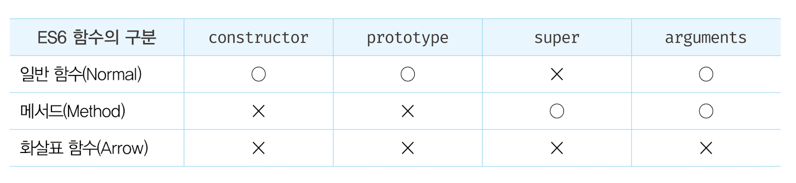

# 26.1 함수의 구분

ES6 이전의 함수는 동일한 함수라도 다양한 형태로 호출할 수 있다.

```js
var foo = function () {
  return 1;
};

// 1. 일반적인 함수로서 호출
foo();

// 2. 생성자 함수로서 호출
new foo();

// 3. 메서드로서 호출
var obj = { foo: foo };
obj.foo();
```

ES6 이전의 모든 함수는 일반 함수로서 호출할 수 있는 것은 물론 생성자 함수로서 호출할 수 있다. 즉, `callable`이면서 `constructor`다.

주의할 것은 ES6 이전에 일반적으로 메서드라고 부르던 객체에 바인딩된 함수도 callable이며 constructor라는 것이다. 따라서 객체에 바인딩된 함수도 일반 함수로서 호출할 수 있는 것은 물론 생성자 함수로서 호출할 수도 있다.

```js
var obj = {
  x: 10,
  f: function () {
    return this.x;
  },
};

console.log(obj.f()); // 10

var bar = obj.f;
console.log(bar()); // undefined

console.log(new obj.f()); // f {}
```

객체에 바인딩 된 함수가 constructor라는 것은 객체에 바인딩된 함수가 prototype 프로퍼티를 가지며, 프로토타입 객체도 생성한다는 것을 의미하기 때문에 성능 면에서도 문제가 있다.

또한 함수에 전달되어 보조 함수의 역할을 수행하는 콜백 함수도 constructor이기 때문에 불필요한 프로토타입 객체를 생성한다.

<br />

이처럼 ES6 이전의 모든 함수는 사용 목적에 따라 명확한 구분이 없으므로 호출 방식에 특별한 제약이 없고 생성자 함수로 호출되지 않아도 프로토타입 객체를 생성한다. 이는 혼란스러우며 실수를 유발할 가능성이 있고 성능에도 좋지 않다.

이러한 문제를 해결하기 위해 ES6에서는 함수를 사용 목적에 따라 세 가지 종류로 명확히 구분했다.

<p align="center">
  
</p>

<br />
<br />

# 26.2 메서드

> **메서드 축약 표현으로 정의된 함수만을 의미한다.**

ES6 사양에서 정의한 메서드는 인스턴스를 생성할 수 없는 `non-constructor`다. 따라서 생성자 함수로서 호출할 수 없다.

```js
const obj = {
  x: 1,

  foo() {
    return this.x;
  },

  // bar는 메서드가 아닌 일반 함수다.
  bar: function () {
    return this.x;
  },
};

new obj.foo(); // TypeError: obj.foo is not a constructor
new obj.bar(); // bar {}
```

ES6 메서드는 인스턴스를 생성할 수 없으므로 prototype 프로퍼티가 없고 프로토타입도 생성하지 않는다.

```js
obj.foo.hasOwnProperty('prototype'); // false
obj.bar.hasOwnProperty('prototype'); // true
```

<br />

ES6 메서드는 자신을 바인딩한 객체를 가리키는 내부 슬롯 `[[HomeObject]]`를 갖는다. `super`참조는 내부 슬롯 [[HomeObject]]를 사용하여 수퍼클래스의 메서드를 참조하므로 내부 슬롯 [[HomeObject]]를 갖는 ES6 메서드는 super 키워드를 사용할 수 있다.

```js
const base = {
  name: 'Kim',
  sayHi() {
    return `Hi! ${this.name}`;
  },
};

const derived = {
  __proto__: base,
  sayHi() {
    return `${super.sayHi()}. how are you doing?`;
  },
};
```

ES6 메서드가 아닌 함수는 내부 슬롯 [[HomeObject]] 를 갖지 않기 때문에 super 키워드를 사용할 수 없다.

```js
const derived = {
  __proto__: base,
  sayHi: function () {
    // SyntaxError: 'super' keyword unexpected here
    return `${super.sayHi()}. how are you doing?`;
  },
};
```

이처럼 ES6 메서드는 본연의 기능(super)을 추가하고 의미적으로 맞지 않는 기능(constructor)은 제거했다.

<br />
<br />

# 26.3 화살표 함수

## 화살표 함수 정의

### 함수 정의

화살표 함수는 함수 선언문으로 정의할 수 없고 **함수 표현식**으로 정의해야 한다.

```js
const multiply = (x, y) => x * y;
multiply(2, 3);
```

### 매개변수 선언

매개변수가 여러 개인 경우 소괄호 () 안에 매개변수를 선언한다.

```js
const arrow = (x, y) => { ... };

// 한 개인 경우 소괄호 생략 가능
const arrow = x => { ... };

// 없는 경우 소괄호 생략 불가
const arrow = () => { ... };
```

### 함수 몸체 정의

- 함수 몸체가 하나의 문으로 구성된다면 함수 몸체를 감싸는 중괄호 {}를 생략할 수 있다.

  함수 몸체 내부의 문이 값으로 평가될 수 있는 표현식인 문이라면 암묵적으로 반환된다.

  ```js
  const power = (x) => x ** 2;

  // 다음과 동일
  const power = (x) => {
    return x ** 2;
  };
  ```

- 함수 몸체가 하나의 문으로 구성된다 해도 함수 몸체의 문이 `표현식이 아닌 문`이라면 중괄호를 생략할 수 없다.

  ```js
  const arrow = () => {
    const x = 1;
  };
  ```

<br />

- 객체 리터럴을 반환하는 경우 객체 리터럴을 소괄호 ()로 감싸주어야 한다.

  ```js
  const create = (id, content) => ({ id, content });

  // 다음과 동일
  const create = (id, content) => {
    return { id, content };
  };
  ```

<br />

- 함수 몸체가 여러 개의 문으로 구성된다면 중괄호를 생략할 수 없다. 이때 반환값이 있다면 명시적으로 반환해야 한다.

  ```js
  const sum = (a, b) => {
    const result = a + b;
    return result;
  };
  ```

- 화살표 함수도 즉시 실행 함수로 사용할 수 있다.

  ```js
  const person = (name) =>
    ({
      sayHi() {
        return `Hi? My name is ${name}.`;
      },
    }('Kim'));

  console.log(person.sayHi());
  ```

- 화살표 함수도 일급 객체이므로 Array.prototype.map, Array.prototype.filter와 같은 고차 함수에 인수로 전달할 수 있다.
  ```js
  [1, 2, 3].map((v) => v * 2);
  ```

<br />

## 화살표 함수와 일반 함수의 차이

1. 화살표 함수는 인스턴스를 생성할 수 없는 `non-constructor`다.
2. 중복된 매개변수 이름을 선언할 수 없다.

   - 일반 함수는 중복된 매개변수 이름을 선언해도 에러가 발생하지 않는다.

   ```js
   function normal(a, a) {
     return a + a;
   }

   const arrow = (a, a) => a + a;
   // SyntaxError: Duplicate parameter name not allowed in this context
   ```

3. 화살표 함수는 함수 자체의 `this`, `arguments`, `super`, `new.target` 바인딩을 갖지 않는다.

   따라서 화살표 함수 내부에서 이것들을 참조하면 **스코프 체인을 통해 상위 스코프의 것들을 참조**한다.

<br />
<br />

## `this`

화살표 함수가 일반 함수와 구별되는 가장 큰 특징이 바로 this다. 그리고 화살표 함수는 다른 함수의 인수로 전달되어 콜백 함수로 사용되는 경우가 많다.

화살표 함수의 this는 `콜백 함수 내부의 this 문제`, 즉 콜백 함수 내부의 this가 외부 함수의 this와 다르기 때문에 발생하는 문제를 해결하기 위해 의도적으로 설계된 것이다.

```js
class Prefixer {
  constructor(prefix) {
    this.prefix = prefix;
  }

  add(arr) {
    return arr.map(function (item) {
      return this.prefix + item;
      // TypeError: Cannot read property 'prefix' of undefined
    });
  }
}

const prefixer = new Prefixer('-webkit-');
console.log(prefixer.add(['transition', 'user-select']));
```

위 예제를 실행했을 때 기대하는 결과는 ['-webkit-transition', '-webkit-user-select']다. 하지만 TypeError가 발생한다.

프로토타입 메서드 내부인 add 안에서 this는 메서드를 호출한 객체(위 예제의 경우 prefixer 객체)를 가리킨다.

그런데 Array.prototype.map의 인수로 전달한 콜백 함수의 내부에서의 this는 undefined를 가리킨다. 이는 map 메서드가 콜백 함수를 일반 함수로서 호출하기 때문이다.

일반 함수로서 호출되는 모든 함수 내부의 this는 전역 객체를 가리킨다. 그런데 클래스 내부의 모든 코드에는 `strict mode`가 암묵적으로 적용된다.

> strict mode에서 일반 함수로 호출된 모든 함수 내부의 this는 전역 객체가 아니라 `undefined`가 바인딩된다.

이때 발생하는 문제가 바로 "콜백 함수 내부의 this 문제"이다.
즉 콜백 함수의 this와 외부 함수의 this가 서로 다른 값을 가리키고 있기 때문에 TypeError가 발생한 것이다.

<br />

이 문제를 해결하기 위해 ES6 이전에는 다음과 같은 방법을 사용했다.

1. add 메서드를 호출한 prefixer 객체를 가리키는 this를 일단 회피시킨 후에 콜백 함수 내부에서 사용한다.
   ```js
   add(arr){
     const that = this;
     return arr.map(function (item){
       return that.prefix + item;
     })
   }
   ```
2. Array.prototype.map의 두 번째 인수로 add 메서드를 호출한 prefixer 객체를 가리키는 this를 전달한다.

   ```js
   add(arr){
    return arr.map(function (item){
      return this.prefix + item;
    }, this) // this에 바인딩된 값이 콜백 함수 내부의 this에 바인딩된다.
   }
   ```

3. Function.prototype.bind 메서드를 사용한다.
   ```js
   add(arr){
    return arr.map(function (item){
       return that.prefix + item;
    }.bind(this))
   }
   ```

<br />

ES6에서는 화살표 함수를 사용해 "콜백 함수 내부의 this 문제"를 해결할 수 있다.

```js
add(arr){
  return arr.map(item => this.prefix + item);
}
```

화살표 함수는 함수 자체의 this 바인딩을 갖지 않는다. 따라서 화살표 함수 내부에서 this를 참조하면 상위 스코프의 this를 그대로 참조한다. 이를 `lexical this`라 한다.

이는 마치 렉시컬 스코프와 같이 화살표 함수의 this가 함수가 정의된 위치에 의해 결정된다는 것을 의미한다.

<br />

화살표 함수 내부에서 this를 참조하면 일반적인 식별자처럼 스코프 체인을 통해 상위 스코프에서 this를 탐색한다.

- 화살표 함수와 화살표 함수가 중첩되어 있다면 상위 화살표 함수에도 this 바인딩이 없으므로 스코프 체인 상에서 가장 가까운 상위 함수 중에서 화살표 함수가 아닌 함수의 this를 참조한다.

- 화살표 함수가 전역 함수라면 화살표 함수의 this는 전역 객체를 가리킨다.

- 프로퍼티에 할당한 화살표 함수도 스코프 체인 상에서 가장 가까운 상위 함수 중에서 화살표 함수가 아닌 함수의 this를 참조한다.

- 화살표 함수는 함수 자체의 this 바인딩을 갖지 않기 때문에 `Function.prototype.call, Function.prototype.apply, Function.prototype.bind` 메서드를 사용해도 화살표 함수 내부의 this를 교체할 수 없다.

  ```js
  window.x = 1;

  const normal = function () {
    return this.x;
  };
  const arrow = () => this.x;

  console.log(normal.call({ x: 10 })); // 10
  console.log(arrow.call({ x: 10 })); // 1
  ```

<br />

메서드를 화살표 함수로 정의하는 것은 피해야 한다. (여기서 말하는 메서드는 ES6 메서드가 아니고 일반적인 의미의 메서드다.)

```js
// Bad
const person = {
  name: 'Lee',
  sayHi: () => console.log(`Hi ${this.name}`),
};

person.sayHi(); // Hi
```

위에서 sayHi 프로퍼티에 할당한 화살표 함수 내부의 this는 상위 스코프인 전역의 this가 가리키는 `전역 객체`를 가리킨다. 따라서 this.name은 window.name과 같기 때문에 화살표 함수로 메서드를 정의하는 것은 바람직하지 않다.

> => 메서드를 정의할 때는 ES6 메서드 축약 표현으로 정의한 ES6 메서드를 사용하는 것이 좋다

<br />

프로토타입 객체의 프로퍼티에 화살표 함수를 할당하는 경우도 동일한 문제가 발생한다.

```js
// Bad
function Person(name) {
  this.name = name;
}

// 마찬가지로 this.name은 window.name과 같다.
Person.prototype.sayHi = () => console.log(`Hi ${this.name}`);
```

<br />

클래스 필드 정의 제안을 사용해 클래스 필드에 화살표 함수를 할당할 수도 있다.

```js
// Bad
class Person {
  name = 'Lee';
  sayHi = () => console.log(`Hi ${this.name}`);
}
```

이때 sayHi 클래스 필드에 할당한 화살표 함수 내부에서 this를 참조하면 상위 스코프의 this 바인딩을 참조한다.

sayHi 클래스 필드는 인스턴스 프로퍼티이므로 다음과 같은 의미이다.

```js
class Person {
  constructor() {
    this.name = 'Lee';
    this.sayHi = () => console.log(`Hi ${this.name}`);
  }
}
```

sayHi 클래스 필드에 할당한 화살표 함수의 상위 스코프는 클래스 외부다. 하지만 this는 클래스 외부의 this를 참조하지 않고 클래스가 생성할 인스턴스를 참조한다.

따라서 sayHi 클래스 필드에 할당한 화살표 함수 내부에서 참조한 this는 **constructor 내부의 this 바인딩과 같다**. 이것은 클래스가 생성한 인스턴스를 가리킨다.

하지만 클래스 필드에 할당한 화살표 함수는 프로토타입 메서드가 아닌 **인스턴스 메서드가 된다.**

> 결론: 메서드를 정의할 때는 ES6 메서드를 사용하자

<br />
<br />

## `super`

화살표 함수는 함수 자체의 super 바인딩을 갖지 않는다. 따라서 this와 마찬가지로 상위 스코프의 super를 참조한다.

```js
class Base {
  constructor(name) {
    this.name = name;
  }

  sayHi() {
    return `Hi! ${this.name}`;
  }
}

class Derived extends Base {
  sayHi = () => `${super.sayHi()} how are you doing?`;
}
```

super는 내부 슬롯 [[HomeObject]]를 갖는 ES6 메서드 내에서만 사용할 수 있는 키워드다.
sayHi 클래스 필드에 할당한 화살표 함수는 ES6 메서드는 아니지만 함수 자체의 super 바인딩을 갖지 않으므로 super를 참조해도 에러가 발생하지 않고 constructor의 super 바인딩을 참조한다.

<br />
<br />

## `arguments`

화살표 함수는 함수 자체의 arguments 바인딩을 갖지 않는다. 따라서 상위 스코프의 arguments를 참조한다.

```js
(function () {
  // 상위 스코프인 즉시 실행 함수의 arguments를 가리킨다.
  const foo = () => console.log(arguments); // [Arguments] {'0': 1, '1':2 }

  foo(3, 4);
})(1, 2);

// 아래에서의 arguments는 상위 스코프인 전역의 arguments를 가리키지만 전역에는 arguments가 존재하지 않는다.
const foo = () => console.log(arguments);
foo(1, 2); // ReferenceError: arguments is not defined
```

arguments 객체는 함수를 정의할 때 매개변수의 개수를 확정할 수 없는 가변 인자 함수를 구현할 때 유용하다.

화살표 함수에서는 상위 스코프의 arguments 객체를 참조할 수는 있지만 화살표 함수 자신에게 전달된 인수 목록을 확인할 수 없고 상위 함수에 전달된 인수 목록을 참조하므로 그다지 도움이 되지 않는다.

> 따라서 화살표 함수로 가변 인자 함수를 구현해야 할 떄는 반드시 Rest 파라미터를 사용해야 한다.

<br />
<br />

# 26.4 Rest 파라미터 (나머지 매개변수)

> 매개변수 이름 앞에 세개의 점 ...을 붙여서 정의한 매개변수를 의미한다.

## 기본 문법

**Rest 파라미터는 함수에 전달된 인수들의 목록을 배열로 전달받는다.**

```js
function foo(...rest) {
  console.log(rest); // [1, 2, 3, 4, 5]
}

foo(1, 2, 3, 4, 5);
```

- 일반 매개변수와 Rest 파라미터는 함께 사용할 수 있다.

  ```js
  function bar(param1, param2, ...rest) {
    console.log(param1); // 1
    console.log(param2); // 2
    console.log(rest); // [3, 4, 5]
  }

  bar(1, 2, 3, 4, 5);
  ```

- Rest 파라미터는 반드시 마지막 파라미터이어야 한다.

  ```js
  function foo(...rest, param1) { }
  foo(1, 2, 3, 4, 5); // SyntaxError: Rest parameter must be last formal parameter
  ```

- Rest 파라미터는 단 하나만 선언할 수 있다.

- Rest 파라미터는 함수 정의 시 선언한 매개변수 개수를 나타내는 객체의 length 프로퍼티에 영향을 주지 않는다.

  ```js
  function foo(..rest) {}
  console.log(foo.length); // 0

  function bar(x, ...rest) {}
  console.log(bar.length); // 1
  ```

<br />

## Rest 파라미터와 arguments 객체

`arguments` 객체는 함수 호출 시 전달된 인수들의 정보를 담고 있는 순회 가능한 유사 배열 객체이며, 함수 내부에서 지역 변수처럼 사용할 수 있다.

```js
function sum() {
  console.log(arguments); // {length: 2, '0': 1, '1': 2}
}

sum(1, 2);
```

하지만 arguments 객체는 배열이 아닌 유사 배열 객체이므로 배열 메서드를 사용하려면 `Function.prototype.call` 이나 `Function.prototype.apply` 메서드를 사용해 객체를 배열로 변환해야 하는 번거로움이 있었다.

```js
function sum() {
  var array = Array.prototype.slice.call(arguments);

  // ...
}
```

ES6에서는 rest 파라미터를 사용하여 가변 인자 함수의 인수 목록을 배열로 직접 전달받을 수 있다. 이를 통해 arguments 객체를 배열로 변환하는 번거로움을 피할 수 있다.

<br />
<br />

# 26.5 매개변수 기본값

함수를 호출할 때 매개변수의 개수만큼 인수를 전달하는 것이 바람직하지만 그렇지 않은 경우에도 에러가 발생하지 않는다.

이는 자바스크립트 엔진이 매개변수의 개수와 인수의 개수를 체크하지 않기 때문이다.
인수가 전달되지 않은 매개변수의 값은 undefined이다.

이는 의도치 않은 결과가 나올 수 있기 때문에 매개변수에 인수가 전달되었는지 확인하여 전달되지 않은 경우 매개변수에 기본값을 할당할 필요가 있다. 즉, **방어 코드**가 필요하다.

```js
function sum(x, y) {
  x = x || 0;
  y = y || 0;

  return x + y;
}

console.log(sum(1, 2)); // 3
console.log(sum(1)); // 1
```

ES6에서 도입된 매개변수 기본값을 사용하면 함수 내에서 수행하던 인수 체크 및 초기화를 간소화할 수 있다.

```js
function sum(x = 0, y = 0) {
  return x + y;
}
```

- 매개변수 기본값은 **매개변수에 인수를 전달하지 않은 경우**와 **`undefined`를 전달한 경우**에만 유효하다.

  ```js
  function logName(name = 'Lee') {
    console.log(name);
  }

  logName(); // Lee
  logName(undefined); // Lee
  logName(null); // null
  ```

- Rest 파라미터에는 기본값을 지정할 수 없다.

  ```js
  function foo(...rest =[]){
    console.log(rest);
  }
  // SyntaxError: Rest parameter may not have a default initializer
  ```

- 매개변수 기본값은 함수 정의 시 선언한 매개변수 개수를 나타내는 함수 객체의 length 프로퍼티와 arguments 객체에 아무런 영향을 주지 않는다.

  ```js
  function sum(x, y = 0) {
    console.log(arguments);
  }

  console.log(sum.length); // 1

  sum(1); // Arguments { '0': 1 }
  sum(1, 2); // Arguments { '0': 1, '1': 2 }
  ```
