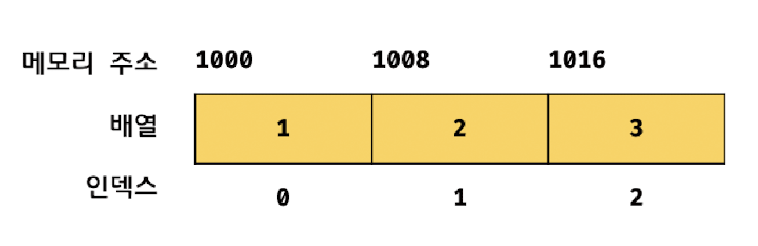

# 27.1 배열이란?

> 배열은 여러 개의 값을 순차적으로 나열한 자료구조다.

- 자바스크립트에서 값으로 인정하는 모든 것은 배열의 요소가 될 수 있다.

- 자바스크립트에 배열이라는 타입은 존재하지 않고, 배열은 객체 타입이다.

- 배열은 배열 리터럴, Array 생성자 함수, Array.of, Array.from 메서드로 생성할 수 있다.

  배열의 생성자 함수는 Array이며, 배열의 프로토타입 객체는 Array.prototype이다. Array.prototype은 배열을 위한 빌트인 메서드를 제공한다.

- 일반 객체와 배열을 구분하는 가장 명확한 차이는 `값의 순서`와 `length 프로퍼티`다.

<br />

# 27.2 자바스크립트 배열은 배열이 아니다

### 자료구조에서의 일반적인 의미의 배열

자료구조에서 말하는 배열은 동일한 크기의 메모리 공간이 빈틈없이 연속적으로 나열된 자료구조를 말한다.

즉, 배열의 요소는 하나의 데이터 타입으로 통일되어 있으며 서로 연속적으로 인접해 있다. 이러한 배열을 `밀집 배열(dense array)`이라 한다.

<p align="center">
  
</p>

이처럼 일반적인 의미의 배열은 각 요소가 동일한 데이터 크기를 가지며 빈틈없이 연속적으로 이어져 있으므로 인덱스를 통해 단 한 번의 연산으로 임의의 요소에 접근`(임의 접근(random access))`, 시간 복잡도 O(1)에 할 수 있다.

> `검색 대상 요소의 메모리 주소 = 배열의 시작 메모리 주소 + 인덱스 * 요소의 바이트 수`

하지만 정렬되지 않은 배열에서 특정한 요소를 검색하는 경우 배열의 모든 요소를 처음부터 차례대로 검색(선형 검색, 시간 복잡도 O(n))해야 한다.

<br />

또한 배열에 요소를 삽입하거나 삭제하는 경우 배열의 요소를 연속적으로 유지하기 위해 요소를 이동시켜야 하는 단점도 있다.

<p align="center" >
  
</p>

<br />

### 자바스크립트에서의 배열

자바스크립트의 배열은 배열의 요소를 위한 각각의 메모리 공간은 동일한 크기를 갖지 않아도 되며, 연속적으로 이어져 있지 않을 수도 있다.

배열의 요소가 연속적으로 이어져 있지 않는 배열을 `희소 배열(sparse array)`이라 한다.

이처럼 자바스크립트의 배열은 엄밀히 말해 일반적 의미의 배열이 아니다. **자바스크립트의 배열은 일반적인 배열의 동작을 흉내 낸 특수한 객체다.**

```js
console.log(Object.getOwnPropertyDescriptors([1, 2, 3]));
```

<p align="center">
  
</p>

자바스크립트 배열은 인덱스를 나타내는 문자열을 프로퍼티 키로 가지며, length 프로퍼티를 갖는 특수한 객체다.

자바스크립트에서 사용할 수 있는 모든 값은 객체의 프로퍼티 값이 될 수 있으므로 어떤 타입의 값이라도 배열의 요소가 될 수 있다.

### 일반적인 배열과 자바스크립트 배열의 장단점

- 일반적인 배열은 인덱스로 요소에 빠르게 접근할 수 있다. 하지만 요소를 삽입 또는 삭제하는 경우에는 효율적이지 않다.
- 자바스크립트 배열은 **해시 테이블로 구현된 객체**이므로 인덱스로 요소에 접근하는 경우 일반적인 배열보다 성능적인 면에서 느릴 수밖에 없는 구조적인 단점이 있다.

  하지만 요소를 삽입 또는 삭제하는 경우 일반적인 배열보다 빠른 성능을 기대할 수 있다.

인덱스로 배열 요소에 접근할 때 일반적인 배열보다 느릴 수 밖에 없는 구조적인 단점을 보완하기 위해 대부분의 모던 자바스크립트 엔진은 배열을 일반 객체와 구별하여 좀 더 배열처럼 동작하도록 최적화하여 구현했다.

```js
const arr = [];

console.time('Array Performance Test');
for (let i = 0; i < 10000000; i++) {
  arr[i] = i;
}
console.timeEnd('Array Performance Test');

const obj = {};

console.time('Object Performance Test');
for (let i = 0; i < 10000000; i++) {
  obj[i] = i;
}
console.timeEnd('Object Performance Test');
```

성능을 테스트해 보면 배열이 일반 객체보다 빠르다는 것을 알 수 있다.

<br />
<br />

# 27.3 length 프로퍼티와 희소 배열

length 프로퍼티의 값은 0과 2<sup>32</sup> - 1 미만의 양의 정수다.
즉, 배열은 요소를 최대 2<sup>32</sup> - 1 개 가질 수 있다.

length 프로퍼티의 값은 배열에 요소를 추가하거나 삭제하면 자동 갱신된다.

length 프로퍼티 값은 배열의 길이를 바탕으로 결정되지만 임의의 숫자 값을 명시적으로 할당할 수도 있다.

```js
const arr = [1, 2, 3, 4, 5];

arr.length = 3;

console.log(arr); // [1, 2, 3]
```

현재 length 프로퍼티 값보다 작은 숫자 값을 할당하면 배열의 길이가 줄어든다.

```js
const arr = [1];

arr.length = 3;
console.log(arr); // [1, empty × 2]
```

현재 length 프로퍼티 값보다 큰 숫자 값을 할당하면 실제로 배열의 길이가 늘어나지는 않는다.

값 잆이 비어 있는 요소를 위해 메모리 공간을 확보하지 않으며 빈 요소를 생성하지도 않는다.

이처럼 배열의 요 소가 연속적으로 위치하지 않고 일부가 비어 있는 배열을 희소 배열이라 한다.

```js
const sparse = [, 2, , 4];

console.log(sparse.length); // 4
console.log(sparse); // [empty, 2, empty, 4]

console.log(Object.getOwnPropertyDescriptors(sparse));

/*
{
  1: {value: 2, writable: true, enumerable: true, configurable: true}, 
  3: {value: 4, writable: true, enumerable: true, configurable: true}, 
  length: {value: 4, writable: true, enumerable: false, configurable: false}
}
*/
```

일반적인 배열의 length는 배열 요소의 개수, 즉 배열의 길이와 언제나 일치한다. 하지만 희소 배열은 length와 배열 요소의 개수가 일치하지 않는다.

희소 배열의 length는 희소 배열의 실제 요소 개수보다 언제나 크다.

<br />

자바스크립트는 문법적으로 희소 배열을 허용하지만 사용하지 않는 것이 좋다.

최적화가 잘 되어 있는 모던 자바스크립트 엔진은 요소의 타입이 일치하는 배열을 생성할 때 일반적인 의미의 배열처럼 연속된 메모리 공간을 확보하는 것으로 알려져 있다.

> 배열을 생성할 경우에는 희소 배열을 생성하지 않도록 주의하자. 배열에는 같은 타입의 요소를 연속적으로 위치시키는 것이 최선이다.

<br />
<br />

# 27.4 배열 생성

## 배열 리터럴

```js
const arr = [1, 2, 3];
```

배열 리터럴은 객체 리터럴과 달리 프로퍼티 키가 없고 값만 존재한다.

<br />

## Array 생성자 함수

- 전달된 인수가 1개이고 숫자인 경우 length 프로퍼티 값이 인수인 배열을 생성한다.

  ```js
  const arr = new Array(10);
  console.log(arr); // [empty × 10]
  ```

  length 프로퍼티 값은 0이 아니지만 실제로 배열의 요소는 존재하지 않는다.

  배열은 요소를 최대 2<sup>32</sup> - 1(4,294,967,295)개 가진다고 했다. 전달된 인수가 범위를 벗어나면 `RangeError`가 발생한다.

- 전달된 인수가 없는 경우 빈 배열을 생성한다. 즉, 배열 리터럴 `[]`과 같다.

- 전달된 인수가 2개 이상이거나 숫자가 아닌 경우 인수를 요소로 갖는 배열을 생성한다.

  ```js
  new Array(1, 2, 3); // [1, 2, 3]
  new Array({}); // [{}]
  ```

  Array 생성자 함수는 new 연산자와 함께 호출하지 않더라도, 배열을 생성하는 생성자 함수로 동작한다. 이는 Array 생성자 함수 내부에서 `new.target`을 확인하기 때문이다.

<br />
<br />

## Array.from

ES6에서 도입된 Array.from 메서드는 유사 배열 객체 또는 이터러블 객체를 인수로 전달받아 배열로 변환하여 반환한다.

> **✔️ 유사 배열 객체(array-like object)**: 마치 배열처럼 인덱스로 프로퍼티 값에 접근할 수 있고 length 프로퍼티를 갖는 객체

```js
Array.from({ length: 2, 0: 'a', 1: 'b' }); // ['a', 'b']

Array.from('Hello'); // ['H', 'e', 'l', 'l', 'o']
```

Array.from을 사용하면 두 번째 인수로 전달한 콜백 함수를 통해 값을 만들면서 요소를 채울 수 있다.

콜백 함수에 첫 번째 인수에 의해 생성된 배열의 요소값과 인덱스를 순차적으로 전달하면서 호출하고, 콜백 함수의 반환값으로 구성된 배열을 반환한다.

```js
Array.from({ length: 3 }); // [undefined, undefined, undefined]

Array.from({ length: 3 }, (_, i) => i); // [0, 1, 2]
```

<br />
<br />

# 27.5 배열 요소의 참조

배열의 요소를 참조할 때는 대괄호 표기법을 사용하고, 대괄호 안에는 인덱스가 와야 한다.

존재하지 않는 요소에 접근하면 `undefined`가 반환된다.

# 27.6 배열 요소의 추가와 갱신

객체에 프로퍼티를 동적으로 추가할 수 있는 것처럼 배열에도 요소를 동적으로 추가할 수 있다.

존재하지 않는 인덱스를 사용해 값을 할당하면 새로운 요소가 추가된다. 이때 length 프로퍼티 값은 자동 갱신된다.

```js
const arr = [0];
arr[1] = 1;

console.log(arr); // [0, 1]
console.log(arr.length); // 2
```

만약 현재 배열의 length 프로퍼티 값보다 큰 인덱스로 새로운 요소를 추가하면 희소 배열이 된다.

```js
arr[100] = 100;
console.log(arr); // [0, 1, empty × 98, 100]
console.log(arr.length); // 101
```

인덱스는 요소의 위치를 나타내므로 반드시 0 이상의 정수(또는 정수 형태의 문자열)를 사용해야 한다.

만약 정수 이외의 값을 인덱스처럼 사용하면 요소가 생성되는 것이 아니라 프로퍼티가 생성된다. 이때 추가된 프로퍼티는 length 프로퍼티 값에 영향을 주지 않는다.

```js
const arr = [];
arr[0] = 1;
arr['1'] = 2;

arr['foo'] = 3;
arr.bar = 4;
arr[1.1] = 5;
arr[-1] = 6;

console.log(arr); // [1, 2, foo: 3, bar: 4, '1.1': 5, '-1': 6]
console.log(arr.length); // 2
```

<br />

# 27.7 배열 요소의 삭제

배열의 특정 요소를 삭제하기 위해 `delete` 연산자를 사용할 수 있다.

```js
const arr = [1, 2, 3];

delete arr[1];
console.log(arr); // [1, empty, 3]

console.log(arr.length); // 3
```

이때 배열은 희소 배열이 되며 length 프로퍼티 값은 변하지 않는다. 따라서 희소 배열을 만드는 delete 연산자는 사용하지 않는 것이 좋다.

희소 배열을 만들지 않으면서 배열의 특정 요소를 완전히 삭제하려면 `Array.prototype.splice` 메서드를 사용한다.

<br />
<br />

---

<br />

# 27.8 배열 메서드

배열 메서드는 결과물을 반환하는 패턴이 두 가지이므로 주의가 필요하다.

- 원본 배열(배열 메서드를 호출한 배열, 즉 배열 메서드의 구현체 내부에서 this가 가리키는 객체)을 직접 변경하는 메서드 (mutator method)

- 원본 배열을 직접 변경하지 않고 새로운 배열을 생성하여 반환하는 메서드 (accessor method)

<br />

ES5부터 도입된 배열 메서드는 대부분 원본 배열을 직접 변경하지는 않지만 초창기 배열 메서드는 원본 배열을 직접 변경하는 경우가 많다.

원본 배열을 직접 변경하는 메서드는 외부 상태를 직접 변경하는 부수 효과가 있으므로 사용할 때 주의해야 한다. 따라서 가급적 원본 배열을 직접 변경하지 않는 메서드를 사용하는 편이 좋다.

<br />

## `Array.isArray`

Array 생성자 함수의 정적 메서드다.

> Array.isArray 메서드는 전달된 인수가 배열이면 true, 아니면 false를 반환한다.

```js
// true
Array.isArray([1, 2]);
Array.isArray(new Array());

// false
Array.isArray();
Array.isArray({});
Array.isArray(null);
Array.isArray(1);
Array.isArray('Array');
Array.isArray({ 0: 1, length: 1 });
```

<br />

## `Array.prototype.indexOf`

> 원본 배열에서 인수로 전달된 요소를 검색하여 인덱스를 반환한다.

- 원본 배열에 인수로 전달한 요소와 중복되는 요소가 여러 개 있다면 첫 번째로 검색된 요소의 인덱스를 반환한다.

- 인수로 전달한 요소가 존재하지 않으면 -1을 반환한다.

indexOf는 배열에 특정 요소가 존재하는지 확인할 때 유용하다.

```js
const food = ['apple', 'banana', 'orange'];

if (foods.indexOf('orange') === -1) {
  foods.push('orange');
}
```

indexOf 메서드 대신 ES7에서 도입된 `Array.prototype.includes` 메서드를 사용하면 가독성이 더 좋다.

<br />

## `Array.prototype.push`

> 인수로 전달받은 모든 값을 원본 배열의 마지막 요소로 추가하고 변경된 length 프로퍼티 값을 반환한다.
>
> push 메서드는 원본 배열을 직접 변경한다.

```js
const arr = [1, 2];

let result = arr.push(3, 4);
console.log(result); // 4

console.log(arr); // [1, 2, 3, 4]
```

push 메서드는 성능 면에서 좋지 않다. 마지막 요소로 추가할 요소가 하나뿐이라면 push 메서드를 사용하지 않고 length 프로퍼티를 사용하여 배열의 마지막에 요소를 직접 추가할 수도 있다. 이 방법이 push 메서드보다 빠르다.

```js
const arr = [1, 2];
arr[arr.length] = 3;
```

push 메서드는 원본 배열을 직접 변경하는 부수 효과가 있다. 따라서 ES6의 스프레드 문법을 사용하는 편이 좋다.

```js
const arr = [1, 2];

const newArr = [...arr, 3];
```

<br />

## `Array.prototype.pop`

> 원본 배열에서 마지막 요소를 제거하고 제거한 요소를 반환한다. 빈 배열이면 undefined를 반환한다.
>
> pop 메서드는 원본 배열을 직접 변경한다.

```js
const arr = [1, 2];
let result = arr.pop(); // 2
console.log(arr); // [1]
```

<br />

## `Array.prototype.unshift`

> 인수로 전달받은 모든 값을 **원본 배열의 선두에** 요소로 추가하고 변경된 length 프로퍼티 값을 반환한다.
> 원본 배열을 직접 변경한다.

```js
const arr = [1, 2];
let result = arr.unshift(3, 4);

console.log(result); // 4
console.log(arr); // [3, 4, 1, 2]
```

push 메서드에서와 마찬가지로 ES6의 스프레드 문법을 사용하는 편이 좋다.

```js
const arr = [1, 2];

const newArr = [3, ...arr];
```

<br />

## `Array.prototype.shift`

> 원본 배열에서 **첫 번째 요소**를 제거하고 제거한 요소를 반환한다.

```js
const arr = [1, 2];
let result = arr.shift(); // 1

console.log(arr); // [2]
```

<br />

## `Array.prototype.concat`

> 인수로 전달된 값들(배열 또는 원시값)을 원본 배열의 마지막 요소로 추가한 새로운 배열을 반환한다.
>
> 인수로 전달한 값이 배열인 경우 배열을 해체하여 새로운 배열의 요소로 추가한다.

```js
const arr1 = [1, 2];
const arr2 = [3, 4];

let result = arr1.concat(arr2);
console.log(result); // [1, 2, 3, 4]

result = arr1.concat(3);
console.log(result); // [1, 2, 3]

result = arr1.concat(arr2, 5);
console.log(result); // [1, 2, 3, 4, 5]

console.log(arr1); // [1, 2]
```

push와 unshift 메서드는 concat 메서드와 유사하게 동작하지만 다음과 같이 미묘한 차이가 있다.

- push와 unshift 메서드는 원본 배열을 직접 변경하지만 concat 메서드는 원본 배열을 변경하지 않고 새로운 배열을 반환한다.
  따라서 push와 unshift 메서드를 사용할 경우 원본 배열을 반드시 변수에 저장해 두어야 하며 concat 메서드를 사용할 경우 반환값을 반드시 변수에 할당받아야 한다.

- 인수로 전달받은 값이 배열인 경우 push와 unshift 메서드는 배열을 그대로 원본 배열의 마지막/첫 번째 요소로 추가하지만 concat 메서드는 인수로 전달받은 배열을 해체하여 새로운 배열의 마지막 요소로 추가한다.

  ```js
  const arr = [3, 4];

  arr.unshift([1, 2]);
  arr.push([5, 6]);
  console.log(arr); // [[1, 2], 3, 4 ,[5, 6]]

  let result = [1, 2].concat([3, 4]);
  result = result.concat([5, 6]);
  console.log(result); // [1, 2, 3, 4, 5, 6]
  ```

concat 메서드는 스프레드 문법으로 대체할 수 있다.

```js
let result = [...[1, 2], ...[3, 4]]; // [1, 2].concat([3, 4])와 동일
```

<br />

## `Array.prototype.splice`

> 원본 배열의 중간에 요소를 추가하거나 중간에 있는 요소를 제거하는 경우 splice 메서드를 사용한다.

3개의 매개변수가 있으며 원본 배열을 직접 변경한다.

- `start`: 원본 배열의 요소를 제거하기 시작할 인덱스
  - start만 지정하면 원본 배열의 start부터 모든 요소를 제거한다.
  - 음수인 경우 배열의 끝에서의 인덱스를 나타낸다. (만약 -1이면 마지막 요소를 가리키고 -n이면 마지막에서 n번째 요소를 가리킨다.)
- `deleteCount`: start부터 제거할 요소의 개수다. (옵션)
- `items`: 제거한 위치에 삽입할 요소들의 목록이다. 생략할 경우 원본 배열에서 요소들을 제거하기만 한다. (옵션)

<br />

```js
const arr = [1, 2, 3, 4];

// 원본 배열의 인덱스 1부터 2개의 요소를 제거하고, 그 자리에 새로운 요소 20, 30을 삽입한다.
const result = arr.splice(1, 2, 20, 30);

console.log(result); // [2, 3]
console.log(arr); // [1, 20, 30, 4]
```

<p align="center">
  
</p>

```js
const arr = [1, 2, 3, 4];

// 원본 배열의 인덱스 1부터 0개의 요소를 제거하고, 그 자리에 새로운 요소 100을 삽입한다.
const result = arr.splice(1, 0, 100);

console.log(result); // []
console.log(arr); // [1, 100, 2, 3, 4]
```

<br />

배열에서 특정 요소를 제거하려면 `indexOf` 메서드를 통해 특정 요소의 인덱스를 취득한 다음 `splice` 메서드를 사용한다.

```js
const arr = [1, 2, 3, 1, 2];

function remove(array, item) {
  const index = array.indexOf(item);

  // item 요소가 여러 개 존재하면 첫 번째 요소만 제거
  if (index !== -1) array.splice(index, 1);

  return array;
}

console.log(remove(arr, 2)); // [1, 3, 1, 2]
```

`filter` 메서드를 사용하여 특정 요소를 제거할 수도 있다. 이 방법은 특정 요소가 중복된 경우 모두 제거된다.

```js
function removeAll(array, item) {
  return array.filter((v) => v !== item);
}
```

<br />

## `Array.prototype.slice`

> 인수로 전달된 범위의 요소들을 복사하여 배열로 반환한다.
> 원본 배열은 변경되지 않는다.

두 개의 매개변수를 갖는다.

- `start`: 복사를 시작할 인덱스

  - 음수인 경우 배열의 끝에서의 인덱스를 나타낸다.

- `end`: 복사를 종료할 인덱스
  - 이 인덱스에 해당하는 요소는 복사되지 않는다.
  - 생략 가능하며 생략 시 기본값은 length 프로퍼티 값이다.

```js
const arr = [1, 2, 3];

// arr[0]부터 arr[1] 이전까지 복사하여 반환
arr.slice(0, 1); // [1]

arr.slice(1, 2); // [2]

console.log(arr); // [1, 2, 3]
```

- 첫 번째 인수로 전달받은 인덱스부터 두 번째 인수로 전달받은 인덱스 이전까지 요소들을 복사하여 배열로 반환한다.

- 두 번째 인수를 생략하면 첫 번재 인수로 전달받은 인덱스부터 모든 요소를 복사하여 배열로 반환한다.

- 첫 번째 인수가 음수인 경우 배열의 끝에서부터 요소를 복사하여 배열로 반환한다.

  ```js
  const arr = [1, 2, 3];

  arr.slice(-1); // [3]

  arr.slice(-2); // [2, 3]
  ```

- 인수를 모두 생략하면 원본 배열의 복사본을 생성하여 반환한다.

  - 이때 생성된 복사본은 얕은 복사를 통해 생성된다.

  ```js
  const arr = [1, 2, 3];
  const copy = arr.slice();

  console.log(copy === arr); // false
  ```

<br />

## `Array.prototype.join`

> 원본 배열의 모든 요소를 문자열로 변환한 후, 인수로 전달받은 문자열, 즉 구분자로 연결한 문자열을 반환한다.
>
> 구분자는 생략 가능하며 기본 구분자는 콤마다.

```js
const arr = [1, 2, 3, 4];

arr.join(); // '1,2,3,4'

arr.join(''); // '1234'

arr.join(':'); // '1:2:3:4'
```

<br />

## `Array.prototype.reverse`

> 원본 배열의 순서를 반대로 뒤집는다. 이때 원본 배열이 변경된다.
>
> 반환값은 변경된 배열이다.

```js
const arr = [1, 2, 3];
const result = arr.reverse();

console.log(arr); // [3, 2, 1]
console.log(result); // [3, 2, 1]
```

<br />

## `Array.prototype.fill`

> 인수로 전달받은 값을 배열의 처음부터 끝까지 요소로 채운다. 이때 원본 배열이 변경된다.

```js
const arr = [1, 2, 3];
arr.fill(0);

console.log(arr); // [0, 0, 0]
```

- 두 번째 인수로 요소 채우기를 시작할 인덱스를 전달할 수 있다.

  ```js
  const arr = [1, 2, 3];
  arr.fill(0, 1);

  console.log(arr); // [1, 0, 0]
  ```

- 세 번째 인수로 요소 채우기를 멈출 인덱스를 전달할 수 있다.

  ```js
  const arr = [1, 2, 3, 4, 5];

  // 인덱스 1부터 3 이전까지 0으로 채운다.
  arr.fill(0, 1, 3);

  console.log(arr); // [1, 0, 0, 4, 5]
  ```

<br />

fill 메서드로 요소를 채울 경우 모든 요소를 하나의 값만으로 채울 수밖에 없다는 단점이 있다.

하지만 `Array.from` 메서드를 사용하면 두 번째 인수로 전달한 콜백 함수를 통해 요소값을 만들면서 배열을 채울 수 있다.

<br />

## `Array.prototype.includes`

> 배열 내에 특정 요소가 포함되어 있는지 확인하여 true 또는 false를 반환한다. 첫 번째 인수로 검색할 대상을 지정한다.

- 두 번째 인수로 검색을 시작할 인덱스를 전달할 수 있다. 생략할 경우 기본값 0이 설정된다.

  - 음수를 전달하면 length 프로퍼티 값과 음수 인덱스를 합산하여(length + index) 검색 시작 인덱스를 설정한다.

  ```js
  const arr = [1, 2, 3];

  // 인덱스 1부터 확인
  arr.includes(1, 1); // false

  // 인덱스 2(arr.length - 1)부터 확인
  arr.includes(3, -1); // true
  ```

- 배열 내에 특정 요소가 포함되어 있는지는 indexOf 메서드를 사용해도 확인할 수 있지만 반환값이 -1인지 확인해 보아야 하고 배열에 NaN이 포함되어 있는지 확인할 수 없다는 문제가 있다.

  ```js
  [NaN].indexOf(NaN) !== -1; // false
  [NaN].includes(NaN); // true
  ```

<br />

## `Array.prototype.flat`

> ES10에서 도입된 메서드로, 인수로 전달한 깊이만큼 재귀적으로 배열을 평탄화한다.

- 인수를 생략할 경우 기본값은 1이다. 인수로 `Infinity`를 전달하면 중첩 배열 모두를 평탄화한다.

```js
[1, [2, 3, 4, 5]].flat(); // [1, 2, 3, 4, 5]

[1, [2, [3, [4]]]].flat(); // [1, 2, [3, [4]]]

// 2단계 깊이까지 평탄화한다.
[1, [2, [3, [4]]]].flat(2); // [1, 2, 3, [4]]
[1, [2, [3, [4]]]].flat();
flat(); // [1, 2, 3, [4]]

[1, [2, [3, [4]]]].flat(Infinity); // [1, 2, 3, 4]
```

<br />
<br />

# 27.9 배열 고차 함수

- `고차 함수`: 함수를 인수로 전달받거나 함수를 반환하는 함수

고차 함수는 **외부 상태의 변경이나 가변 데이터를 피하고 불변성을 지향하는 함수형 프로그래밍에 기반을 두고 있다.**

함수형 프로그래밍은 순수 함수와 보조 함수의 조합을 통해 로직 내에 존재하는 조건문과 반복문을 제거하여 복잡성을 해결하고 변수의 사용을 억제하여 상태 변경을 피하려는 프로그래밍 패러다임이다.

조건문이나 반복문은 로직의 흐름을 이해하기 어렵게 하여 가독성을 해치고, 변수는 누군가에 의해 언제든지 변경될 수 있어 오류 발생의 근본적 원인이 될 수 있기 때문이다.

> 함수형 프로그래밍은 결국 순수 함수를 통해 부수 효과를 최대한 억제하여 오류를 피하고 프로그램의 안정성을 높이려는 노력의 일환이라고 할 수 있다.

<br />

## `Array.prototype.sort`

> 배열의 요소를 정렬한다. 원본 배열을 직접 변경하며 정렬된 배열을 반환한다.

- 기본적으로 오름차순으로 요소를 정렬한다.
- 한글 문자열인 요소도 오름차순으로 정렬된다.

내림차순으로 요소를 정렬하려면 sort 메서드를 사용하여 오름차순으로 정렬한 후 reverse 메서드를 사용하여 요소의 순서를 뒤집는다.

문자열 요소로 이루어진 배열의 정렬은 아무런 문제가 없다. 하지만 숫자 요소로 이루어진 배열을 정렬할 때는 주의가 필요하다.

```js
const points = [40, 100, 1, 5, 2, 25, 10];
points.sort();

console.log(points); // [1, 10, 100, 2, 25, 40, 5]
```

**sort 메서드의 기본 정렬 순서는 유니코드 코드 포인트의 순서를 따른다.**

배열의 요소가 숫자 타입이라 할지라도 배열의 요소를 일시적으로 문자열로. 변환한 후 유니코드 코드 포인트의 순서를 기준으로 정렬한다.

> 따라서 숫자 요소를 정렬할 때는 sort 메서드에 **`정렬 순서를 정의하는 비교 함수`** 를 인수로 전달해야 한다.

비교 함수는 양수나 음수 또는 0을 반환해야 한다.

비교 함수의 반환값이 0보다 작으면 비교 함수의 첫 번째 인수를 우선하여 정렬하고, 0이면 정렬하지 않으며, 0보다 크면 두 번째 인수를 우선하여 정렬한다.

<br />

```js
const points = [40, 100, 1, 5, 2, 25, 10];

// 비교 함수의 반환값이 0보다 작으면 a를 우선하여 정렬한다.
points.sort((a, b) => a - b);
console.log(points); // [1, 2, 5, 10, 25, 40, 100]

// 비교 함수의 반환값이 0보다 작으면 b를 우선하여 정렬한다.
points.sort((a, b) => b - a);
```

객체를 요소로 갖는 배열을 정렬하는 예제를 보자.

```js
const todos = [
  { id: 4, content: 'JavaScript' },
  { id: 1, content: 'HTML' },
  { id: 2, content: 'CSS' },
];

function compare(key) {
  // 프로퍼티 값이 문자열인 경우 - 산술 연산으로 비교하면 NaN이 나오므로 비교 연산을 사용한다.

  return (a, b) => (a[key] > b[key] ? 1 : a[key] < b[key] ? -1 : 0);
}

// id를 기준으로 오름차순 정렬
todos.sort(compare('id'));
```

> 💡 sort 메서드의 정렬 알고리즘
>
> sort 메서드는 quicksort 알고리즘을 사용했었다.
> quicksort 알고리즘은 동일한 값의 요소가 중복되어 있을 때 초기 순서와 변경될 수 있는 불안정한 정렬 알고리즘으로 알려져 있다.
>
> ECMAScript 2019(ES10)에서는 timesort 알고리즘을 사용하도록 바뀌었다.

<br />
<br />

## `Array.prototype.forEach`

for 문은 반복을 위한 변수를 선언해야 하며, 조건식과 증감식으로 이루어져 있어서 함수형 프로그래밍이 추구하는 바와 맞지 않는다.

forEach 메서드는 for 문을 대체할 수 있는 고차 함수다. forEach 메서드는 자신의 내부에서 반복문을 실행한다.

즉, forEach 메서드는 반복문을 추상화한 고차 함수로서 내부에서 반복문을 통해 자신을 호출한 배열을 순회하면서 수행해야 할 처리를 콜백 함수로 전달받아 반복 호출한다.

```js
const numbers = [1, 2, 3];
const pows = [];

numbers.forEach((item) => pows.push(item ** 2));
```

위 예제의 경우 forEach 메서드는 numbers 배열의 모든 요소를 순회하며 콜백 함수를 반복 호출한다. 배열의 요소가 3개이므로 콜백 함수도 3번 호출된다.

이때 콜백 함수를 호출하는 forEach 메서드는 콜백 함수에 인수를 전달할 수 있다.

콜백 함수는 forEach 메서드를 호출한 배열의 요소값과 인덱스, forEach 메서드를 호출한 배열 자체, 즉 this를 순차적으로 전달받을 수 있다.

```js
[1, 2, 3].forEach((item, index, arr) => {
  console.log(
    `요소값: ${item}, 인덱스: ${index}, this: ${JSON.stringify(arr)}`,
  );
});
```

<br />

forEach 메서드는 원본 배열을 변경하지 않는다. 하지만 콜백 함수를 통해 원본 배열을 변경할 수는 있다.

```js
const numbers = [1, 2, 3];
numbers.forEach((item, index, arr) => {
  arr[index] = item ** 2;
});

console.log(numbers); // [1, 4, 9]
```

forEach 메서드의 반환값은 언제나 `undefined`이다.

<br />

forEach 메서드의 두 번째 인수로 forEach 메서드의 콜백 함수 내부에서 this로 사용할 객체를 전달할 수 있다.

```js
class Numbers {
  numberArray = [];

  multiply(arr) {
    arr.forEach(function (item) {
      this.numberArray.push(item * item);
    }, this);
  }
}
```

<br />

더 나은 방법은 ES6 화살표 함수를 사용하는 것이다.

```js
class Numbers {
  numberArray = [];

  multiply(arr) {
    arr.forEach((item) => this.numberArray.push(item * item));
  }
}
```

<br />

forEach 메서드의 동작을 이해하기 위해 폴리필을 살펴보자

> ✔️ 폴리필(polyfill)이란?
>
> 최신 사양의 기능을 지원하지 않는 브라우저를 위해 누락된 최신 사양의 기능을 구현하여 추가하는 것

```js
if (!Array.prototype.forEach) {
  Array.prototype.forEach = function (callback, thisArg) {
    if (typeof callback !== 'function') {
      throw new TypeError(callback + ' is not a function');
    }

    thisArg = thisArg || window;

    for (var i = 0; i < this.length; i++) {
      // call 메서드를 통해 thisArg를 전달하면서 콜백 함수를 호출한다.
      callback.call(thisArg, this[i], i, this);
    }
  };
}
```

이처럼 forEach 메서드의 내부에서는 반복문을 통해 배열을 순회할 수밖에 없다. 단, 반복문을 메서드 내부로 은닉하여 로직의 흐름을 이해하기 쉽게 하고 복잡성을 해결한다.

- for 문과는 달리 `break`, `continue`문을 사용할 수 없다. 다시 말해 배열의 모든 요소를 빠짐없이 모두 순회하며 중간에 순회를 중단할 수 없다.

- 희소 배열의 경우 존재하지 않는 요소는 순회 대상에서 제외된다.

- forEach 메서드는 for 문에 비해 성능이 좋지는 않지만 가독성은 더 좋다.
  - 따라서 요소가 대단히 많은 배열을 순회하거나 시간이 많이 걸리는 복잡한 코드 또는 높은 성능이 필요한 경우가 아니라면 forEach 메서드를 사용할 것을 권장한다.

<br />

## `Array.prototype.map`

> 자신을 호출한 배열의 모든 요소를 순회하면서 인수로 전달받은 콜백 함수를 반복 호출한다.
>
> 그리고 콜백 함수의 반환값들로 구성된 새로운 배열을 반환한다. 원본 배열은 변경되지 않는다.

```js
const numbers = [1, 4, 9];

const roots = numbers.map((item) => Math.sqrt(item));
console.log(roots); // [1, 2, 3]
```

- forEach 메서드와의 공통점은 자신을 호출한 배열의 모든 요소를 순회하면서 인수로 전달받은 콜백 함수를 반복 호출한다는 것이다.

- 하지만 forEach 메서드는 언제나 undefined를 반환하고, map 메서드는 콜백 함수의 반환값들로 구성된 새로운 배열을 반환하는 차이가 있다.

> forEach: 단순히 반복문을 대체하기 위한 고차 함수
>
> map: 요소값을 다른 값으로 매핑한 새로운 배열을 생성하기 위한 고차 함수

map 메서드가 생성하여 반환하는 새로운 배열의 length 프로퍼티 값은 map 메서드를 호출한 배열의 length 프로퍼티 값과 반드시 일치한다.

즉, map 메서드를 호출한 배열과 map 메서드가 생성하여 반환한 배열은 1:1 매핑한다.

<br />

- forEach 메서드와 마찬가지로 map 메서드의 콜백 함수는 호출한 배열의 요소값, 인덱스, 호출한 배열 자체를 순차적으로 전달받을 수 있다.
  - 또한 map 메서드의 두 번째 인수로 map 메서드의 콜백 함수 내부에서 this로 사용할 객체를 전달할 수 있다.

<br />
<br />

## `Array.prototype.filter`

> 자신을 호출한 배열의 모든 요소를 순회하면서 인수로 전달받은 콜백 함수를 반복 호출한다.
>
> **콜백 함수의 반환값이`true`인 요소로만 구성된 새로운 배열을 반환한다.** 원본 배열은 변경되지 않는다.

```js
const numbers = [1, 2, 3, 4, 5];

const odds = numbers.filter((item) => item % 2);
console.log(odds); // [1, 3, 5]
```

filter 메서드는 자신을 호출한 배열에서 필터링 조건을 만족하는 특정 요소만 추출하여 새로운 배열을 만들고 싶을 때 사용한다.

따라서 filter 메서드가 생성하여 반환한 새로운 배열의 length 프로퍼티 값은 filter 메서드를 호출한 배열의 length 프로퍼티 값과 **같거나 작다.**

- forEach, map 메서드와 마찬가지로 filter 메서드의 콜백 함수는 호출한 배열의 요소값, 인덱스, 호출한 배열 자체를 순차적으로 전달받을 수 있다.
  - 또한 filter 메서드의 두 번째 인수로 filter 메서드의 콜백 함수 내부에서 this로 사용할 객체를 전달할 수 있다.

<br />
<br />

## `Array.prototype.reduce`

`reduce` 메서드는 자신을 호출한 배열을 모든 요소를 순회하며 인수로 전달받은 콜백 함수를 반복 호출한다.

그리고 **콜백 함수의 반환값을 다음 순회 시에 콜백 함수의 첫 번째 인수로 전달하면서 콜백 함수를 호출하여 `하나의 결과값`을 만들어 반환한다.**

- 첫 번째 인수: 콜백 함수
  - 콜백 함수에는 4개의 인수가 전달된다.
    1. 초기값 또는 콜백 함수의 이전 반환값
    2. reduce 메서드를 호출한 배열의 요소값
    3. 인덱스
    4. reduce 메서드를 호출한 배열 자체
- 두 번째 인수: 초기값

<br />

```js
const sum = [1, 2, 3, 4].reduce(
  (accumulator, currentValue, index, array) => accumulator + currentValue,
  0,
);

console.log(sum); // 10
```

위 예제에서 reduce 메서드의 콜백 함수는 4개의 인수를 전달받아 배열의 length만큼 총 4회 호출된다.

<p align="center">
  
</p>

이처럼 reduce 메서드는 초기값과 배열의 첫 번째 요소값을 콜백 함수에게 전달하면서 호출하고 다음 순회에는 콜백 함수의 반환값과 두 번째 요소값을 콜백 함수의 인수로 전달하면서 호출한다.

이러한 과정을 반복하여 하나의 결과값을 반환한다.

<br />

### 평균 구하기

```js
const values = [1, 2, 3, 4, 5, 6];

const average = values.reduce((acc, cur, i, { length }) => {
  // 마지막 순회가 아니면 누적값을 반환, 마지막 순회면 누적값으로 평균을 구해 반환

  return i === length - 1 ? (acc + cur) / length : acc + cur;
}, 0);
```

### 최대값 구하기

```js
const values = [1, 2, 3, 4, 5];
const max = values.reduce((acc, cur) => (acc > cur ? acc : cur), 0);

// Math.max 메서드를 사용하는 것이 더 직관적이다.
Math.max(...values);
```

### 요소의 중복 횟수 구하기

```js
const fruits = ['banana', 'apple', 'orange', 'orange', 'apple'];

const count = fruits.reduce((acc, cur) => {
  acc[cur] = (acc[cur] || 0) + 1;
  return acc;
}, {});

console.log(count); // { banana: 1, apple: 2, orange: 2 }
```

### 중첩 배열 평탄화

```js
const values = [1, [2, 3], 4, [5, 6]];

const flatten = values.reduce((acc, cur) => acc.concat(cur), []);
// [1] -> [1, 2, 3] -> [1, 2, 3, 4] -> [1, 2, 3, 4, 5, 6]
```

Array.prototype.flat 메서드를 사용하는 방법이 더 직관적이다.

### 중복 요소 제거

```js
const values = [1, 2, 1, 3, 5, 4, 5, 3, 4, 4];

const result = values.reduce(
  (unique, val, i, _values) =>
    // 현재 순회 중인 요소의 인덱스 i가 val의 인덱스와 같다면 val은 처음 순회하는 요소다.
    // 만약 다르다면 val은 중복된 요소다.
    // 처음 순회하는 요소만 초기값 []가 전달된 unique 배열에 담아 반환하면 중복된 요소는 제거된다.

    _values.indexOf(val) === i ? [...unique, val] : unique,
  [],
);

console.log(result); // [1, 2, 3, 5, 4]
```

중복 요소를 제거할 때는 filter 메서드를 사용하는 방법이 더 직관적이다.

```js
values.filter((val, i, _values) => _values.indexOf(val) === i);
```

또는 중복되지 않는 유일한 값들의 집합인 `Set`을 사용할 수도 있다. 중복 요소를 제거할 때는 이 방법을 추천한다.

```js
[...new Set(values)];
```

<br />

앞서 살펴보았듯이 reduce 메서드의 두 번째 인수로 전달하는 초기값은 첫 번재 순회에 콜백 함수의 첫 번째 인수로 전달된다.

주의할 것은 이 초기값이 옵션이라는 것이다. 즉, 두 번째 인수로 전달하는 초기값은 생략할 수 있다.

하지만 reduce 메서드를 호출할 때는 언제나 초기값을 전달하는 것이 안전하다.

```js
const sum = [].reduce((acc, cur) => acc + cur);
// TypeError: Reduce of empty array with no initial value
```

빈 배열로 메서드를 호출하면 타입 에러가 발생한다. 이때 초기값을 전달하면 에러가 발생하지 않는다.

```js
const sum = [].reduce((acc, cur) => acc + cur, 0); // => 0
```

<br />

객체의 특정 프로퍼티 값을 합산하는 경우를 생각해보자.

```js
const products = [
  { id: 1, price: 100 },
  { id: 2, price: 200 },
  { id: 3, price: 300 },
];

const priceSum = products.reduce((acc, cur) => acc.price + cur.price); // => NaN
```

- 1번째 순회 시 acc는 {id: 1, price: 100}, cur은 {id: 2, price: 200}이고
- 2번째 순회 시 acc는 300, cur은 {id: 3, price: 300}이다.
- 이때 acc에 함수에 숫자값이 전달되기 때문에 acc.price는 undefined다.

```js
const priceSum = products.reduce((acc, cur) => acc + cur.price, 0);
```

따라서 초기값을 생략하지 말고 언제나 전달하는 것이 안전하다.

<br />
<br />

## `Array.prototype.some`

> 자신을 호출한 배열의 요소를 순회하면서 인수로 전달된 콜백 함수를 호출한다.
>
> 콜백 함수의 반환값이 **단 한 번이라도 참이면 true, 모두 거짓이면 false를 반환**한다. 즉, 배열의 요소 중에 콜백 함수를 통해 정의한 조건을 만족하는 요소가 1개 이상 존재하는지 확인한다.

some 메서드를 호출한 배열이 빈 배열인 경우 언제나 **false**를 반환하므로 주의하자.

```js
[5, 10, 15].some((item) => item > 10); // true

[5, 10, 15].some((item) => item < 0); // false

[].some((item) => item > 3); // false
```

## `Array.prototype.every`

> 자신을 호출한 배열의 요소를 순회하면서 인수로 전달된 콜백 함수를 호출한다.
>
> 콜백 함수의 반환값이 **모두 참이면 true, 단 한 번이라도 거짓이면 false를 반환**한다. 즉, 배열의 요소 중에 콜백 함수를 통해 정의한 조건을 모두 만족하는지 확인한다.

every 메서드를 호출한 배열이 빈 배열인 경우 언제나 **true**를 반환하므로 주의하자.

```js
[5, 10, 15].every((item) => item > 3); // true
[5, 10, 15].every((item) => item > 10); // false
[].every((item) => item > 3); // true
```

## `Array.prototype.find`

> 자신을 호출한 배열의 요소를 순회하면서 인수로 전달된 콜백 함수를 호출하여 **반환값이 true인 첫 번째 요소를 반환한다.**
>
> 콜백 함수의 반환값이 true인 요소가 존재하지 않는다면 `undefined`를 반환한다.

```js
const users = [
  { id: 1, name: 'Lee' },
  { id: 2, name: 'Kim' },
  { id: 3, name: 'Park' },
  { id: 4, name: 'Choi' },
];

users.find((user) => user.id === 2); // { id: 2, name: 'Kim' }
```

filter 메서드는 콜백 함수의 호출 결과가 true인 요소만 추출한 새로운 배열을 반환한다. 따라서 반환값은 언제나 **배열**이다.

하지만 find 메서드는 콜백 함수의 반환값이 true인 첫 번째 요소를 반환하므로 결과값은 **해당 요소값**이다.

<br />

## `Array.prototype.findIndex`

> 자신을 호출한 배열의 요소를 순회하면서 인수로 전달된 콜백 함수를 호출하여 **반환값이 true인 첫 번째 요소의 `인덱스`를 반환한다.**
>
> true인 요소가 존재하지 않는다면 `-1`을 반환한다.

```js
const users = [
  { id: 1, name: 'Lee' },
  { id: 2, name: 'Kim' },
  { id: 3, name: 'Park' },
  { id: 4, name: 'Choi' },
];

users.findIndex((user) => user.id === 2); // 1

users.findIndex((user) => user.name === 'Park'); // 3
```

## `Array.prototype.flatMap`

> map 메서드를 통해 새로운 배열을 평탄화한다. 즉, map메서드와 flat 메서드를 순차적으로 실행하는 효과가 있다.

```js
const arr = ['hello', 'world'];

arr.map((x) => x.split('')).flat();
// ['h', 'e', 'l', 'l', 'o', 'w', 'o', 'r', 'l', 'd']

arr.flatMap((x) => x.split(''));
```

단, flatMap 메서드는 flat 메서드처럼 인수를 전달하여 평탄화 깊이를 지정할 수는 없고 **1단계만 평탄화한다.**

```js
arr.flatMap((str, index) => [index, [str, str.length]]);

// [[0, ['hello', 5]], [1, ['world', 5]]] -> [0, ['hello', 5], 1, ['world', 5]]

arr.map((str, index) => [index, [str, str.length]]).flat(2);
// [[0, ['hello', 5]], [1, ['world', 5]]]  -> [0, 'hello', 5, 1, 'world', 5]
```
