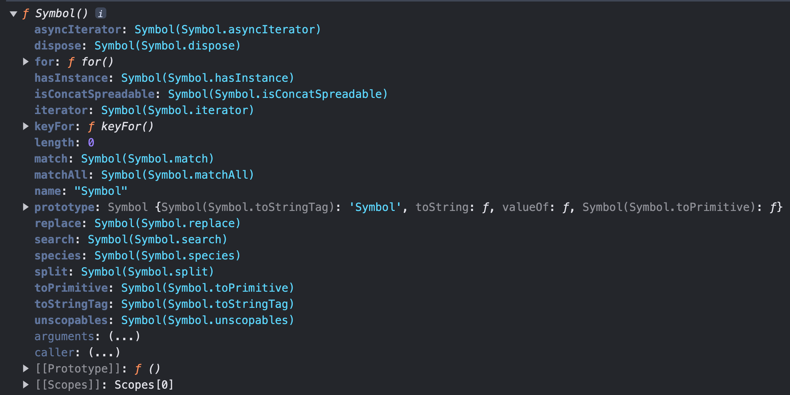

# 33.1 심벌이란?

1997년 자바스크립트가 ECMAScript로 표준화된 이래로 자바스크립트에는 6개의 타입 즉, `문자열, 숫자, 불리언, undefined, null, 객체` 타입이 있었다.

심벌은 ES6에서 도입된 7번째 데이터 타입으로 변경 불가능한 원시 타입의 값이다.
심벌은 다른 값과 중복되지 않는 유일무이한 값이다.
따라서 주로 이름의 충돌 위험이 없는 유일한 프로퍼티 키를 만들기 위해 사용한다.

<br />

# 33.2 심벌 값의 생성

## Symbol 함수

심벌 값은 `Symbol` 함수를 호출하여 생성한다. 다른 원시값은 리터럴 표기법을 통해 값을 생성할 수 있지만 심벌 값은 Symbol 함수를 호출하여 생성해야 한다.

이때 생성된 심벌 값은 외부로 노출되지 않아 확인할 수 없으며, **다른 값과 절대 중복되지 않는 유일무이한 값이다.**

```js
const mySymbol = Symbol();

console.log(typeof mySymbol); // symbol

// 외부로 노출되지 않아 확인할 수 없다.
console.log(mySymbol); // Symbol()
```

<br />

Symbol 함수는 생성자 함수와는 달리 new 연산자와 함께 호출하지 않는다. new 연산자와 함께 생성자 함수 또는 클래스를 호출하면 객체(인스턴스)가 생성되지만 심벌 값은 변경 불가능한 원시 값이다.

```js
new Symbol(); // TypeError: Symbol is not a constructor
```

<br />

Symbol 함수에는 선택적으로 문자열을 인수로 전달할 수 있다. 이 문자열은 생성된 심벌 값에 대한 설명으로 디버깅 용도로만 사용되며, 심벌 값 생성에 어떠한 영향도 주지 않는다.

즉, 심벌 값에 대한 설명이 같더라도 생성된 심벌 값은 유일무이한 값이다.

```js
const symbol1 = Symbol('mySymbol');
const symbol2 = Symbol('mySymbol');

console.log(symbol1 === symbol2); // false
```

<br />

심벌 값도 문자열, 숫자, 불리언과 같이 객체처럼 접근하면 암묵적으로 래퍼 객체를 생성한다.

```js
const mySymbol = Symbol('mySymbol');

// description 프로퍼티와 toString 메서드는 Symbol.prototype의 프로퍼티다.
console.log(mySymbol.description); // mySymbol
console.log(mySymbol.toString()); // Symbol(mySymbol)
```

<br />

심벌 값은 암묵적으로 문자열이나 숫자 타입으로 변환되지 않는다.

단, 불리언 타입으로는 암묵적으로 타입 변환된다. 이를 통해 if 문 등에서 존재 확인이 가능하다.

```js
const mySymbol = Symbol();

// console.log(mySymbol + '');
// TypeError: Cannot convert a Symbol value to a string
// console.log(+mySymbol);
// TypeError: Cannot convert a Symbol value to a number

console.log(!!mySymbol); // true

if (mySymbol) console.log('is not empty');
```

<br />
<br />

## `Symbol.for` / `Symbol.keyFor` 메서드

`Symbol.for` 메서드는 **인수로 전달받은 문자열을 키로 사용하여** 키와 심벌 값의 쌍들이 저장되어 있는 **전역 심벌 레지스트리**에서 해당 키와 일치하는 심벌 값을 검색한다.

- 검색에 성공하면 새로운 심벌 값을 생성하지 않고 검색된 심벌 값을 반환한다.

- 검색에 실패하면 새로운 심벌 값을 생성하여 Symbol.for 메서드의 인수로 전달된 키로 전역 심벌 레지스트리에 저장한 후, 생성된 심벌 값을 반환한다.

```js
const s1 = Symbol.for('mySymbol');
const s2 = Symbol.for('mySymbol');

console.log(s1 === s2); // true
```

<br />

Symbol 함수는 호출될 때마다 유일무이한 심벌 값을 생성한다. 이때 자바스크립트 엔진이 관리하는 심벌 값 저장소인 전역 심벌 레지스트리에서 심벌 값을 검색할 수 있는 키를 지정할 수 없으므로 전역 심벌 레지스트리에 등록되어 관리되지 않는다.

하지만 Symbol.for 메서드를 사용하면 애플리케이션 전역에서 중복되지 않는 유일무이한 상수인 심벌 값을 단 하나만 생성하여 전역 심벌 레지스트리를 통해 공유할 수 있다.

<br />

`Symbol.keyFor` 메서드를 사용하면 전역 심벌 레지스트리에 저장된 심벌 값의 키를 추출할 수 있다.

```js
const s1 = Symbol.for('mySymbol');
Symbol.keyFor(s1); // mySymbol

// Symbol 함수를 호출해 생성한 심벌 값은 전역 심벌 레지스트리에 등록되어 관리되지 않는다.
const s2 = Symbol();
Symbol.keyFor(s2); // undefined
```

<br />
<br />

# 33.3 심벌과 상수

예를 들어 4방향을 나타내는 상수를 정의한다고 생각해 보자.

```js
const Direction = {
  UP: 1,
  DOWN: 2,
  LEFT: 3,
  RIGHT: 4,
};
```

위와 같이 값에는 특별한 의미가 없고 상수 이름 자체에 의미가 있는 경우가 있다. 이때 문제는 상수 값이 변경될 수 있으며 다른 변수 값과 중복될 수도 있다는 것이다.

이러한 경우 변경/중복될 가능성이 있는 무의미한 상수 대신 중복될 가능성이 없는 심벌 값을 사용할 수 있다.

```js
const Direction = {
  UP: Symbol('up'),
  DOWN: Symbol('down'),
  LEFT: Symbol('left'),
  RIGHT: Symbol('right'),
};
```

<br />

> ### 💡 enum
>
> enum은 **명명된 숫자 상수의 집합**으로 **열거형**이라고 부른다.
> 자바스크립트는 enum을 지원하지 않지만 여러 프로그래밍 언어와 타입스크립트에서는 enum을 지원한다.
>
> 자바스크립트에서 enum을 흉내 내어 사용하려면 객체의 변경 방지를 위해 객체를 동결하는 `Object.freeze` 메서드와 심벌 값을 사용한다.
>
> ```js
> const Direction = Object.freeze({
>   UP: Symbol('up'),
>   DOWN: Symbol('down'),
>   LEFT: Symbol('left'),
>   RIGHT: Symbol('right'),
> });
> ```

<br />
<br />

# 33.4 심벌과 프로퍼티 키

객체의 프로퍼티 키는 빈 문자열을 포함하는 모든 문자열 또는 심벌 값으로 만들 수 있으며, 동적으로 생성할 수도 있다.

심벌 값을 프로퍼티 키로 사용하려면 프로퍼티 키로 사용할 심벌 값에 대괄호를 사용해야 한다. 접근할 때도 마찬가지이다.

```js
const obj = {
  [Symbol.for('mySymbol')]: 1,
};

obj[Symbol.for('mySymbol')]; // 1
```

**심벌 값은 유일무이한 값이므로 심벌 값을 프로퍼티 키로 만들면 다른 프로퍼티 키와 절대 충돌하지 않는다.**

<br />
<br />

# 33.5 심벌과 프로퍼티 은닉

심벌 값을 프로퍼티 키로 사용하여 생성한 프로퍼티는 for ... in 문이나 Object.keys, Object.getOwnPropertyNames 메서드로 찾을 수 없다.

이처럼 심벌 값을 프로퍼티 키로 사용하여 프로퍼티를 생성하면 외부에 노출할 필요가 없는 프로퍼티를 은닉할 수 있다.

```js
const obj = {
  [Symbol.for('mySymbol')]: 1,
};

for (const key in obj) {
  console.log(key); // 아무것도 출력되지 않는다.
}

console.log(Object.keys(obj)); // []
console.log(Object.getOwnPropertyNames(obj)); // []
```

<br />

하지만 프로퍼티를 완전하게 숨길 수 있는 것은 아니다. ES6에서 도입된 `Object.getOwnPropertySymbols` 메서드를 사용하면 심벌 값을 프로퍼티 키로 사용하여 생성한 프로퍼티를 찾을 수 있다.

```js
const obj = {
  [Symbol.for('mySymbol')]: 1,
};

console.log(Object.getOwnPropertySymbols(obj)); // [Symbol(mySymbol)]

const symbolKey = Object.getOwnPropertySymbols(obj)[0];
console.log(obj[symbolKey]); // 1
```

<br />
<br />

# 33.6 심벌과 표준 빌트인 객체 확장

일반적으로 표준 빌트인 객체에 사용자 정의 메서드를 직접 추가하여 확장하는 것은 권장하지 않는다.

그 이유는 개발자가 직접 추가한 메서드와 미래에 표준 사양으로 추가될 메서드의 이름이 중복될 수 있기 때문이다.

하지만 중복될 가능성이 없는 심벌 값으로 프로퍼티 키를 생성하여 표준 빌트인 객체를 확장하면 표준 빌트인 객체의 기존 프로퍼티 키와 충돌하지 않는 것은 물론, 표준 사양의 버전이 올라감에 따라 추가될지 모르는 어떤 프로퍼티 키와도 충돌할 위험이 없어 안전하게 객체를 확장할 수 있다.

```js
Array.prototype[Symbol.for('sum')] = function () {
  return this.reduce((acc, cur) => acc + cur, 0);
};

[1, 2][Symbol.for('sum')](); // 3
```

<br />
<br />

# 33.7 Well-known Symbol

자바스크립트가 기본 제공하는 빌트인 심벌 값이 있다. 빌트인 심벌 값은 Symbol 함수의 프로퍼티에 할당되어 있다.



이 값을 ECMASCript 사양에서는 `Well-known Symbol`이라 부른다.
이것은 자바스크립트 엔진의 내부 알고리즘에 사용된다.

예를 들어, Array, String, Map, Set, TypedArray, arguments, NodeList, HTMLCollection 과 같이 `for ... of` 문으로 순회 가능한 빌트인 이터러블은 Well-known Symbol인 `Symbol.iterator`를 키로 갖는 메서드를 가지며, 이 메서드를 호출하면 이터레이터를 반환하도록 ECMAScript 사양에 규정되어 있다.

만약 빌트인 이터러블이 아닌 일반 객체를 이터러블처럼 동작하도록 구현하고 싶다면 이터레이션 프로포콜을 따르면 된다.

즉, ECMAScript 사양에 규정되어 있는 대로 **Symbol.iterator를 키로 갖는 메서드를 객체에 추가하고 이터레이터를 반환**하도록 구현하면 그 객체는 이터러블이 된다.

```js
const iterable = {
  [Symbol.iterator]() {
    let cur = 1;
    const max = 5;

    return {
      next() {
        return { value: cur++, done: cur > max + 1 };
      },
    };
  },
};

for (const num of iterable) {
  console.log(num); // 1 -> 2 -> 3 -> 4 -> 5
}
```

Symbol.iterator는 기존 프로퍼티 키 또는 미래에 추가될 프로퍼티 키와 절대 중복되지 않을 것이다.

<br />

> ✅ 이처럼 심벌은 중복되지 않는 상수 값을 생성하는 것은 물론 기존에 작성된 코드에 영향을 주지 않고 새로운 프로퍼티를 추가하기 위해, 즉 하위 호환성을 보장하기 위해 도입되었다.
