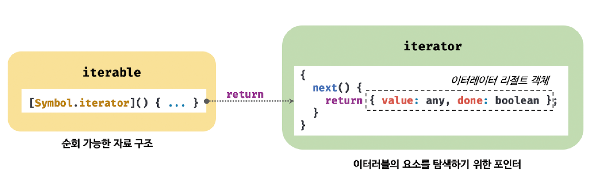
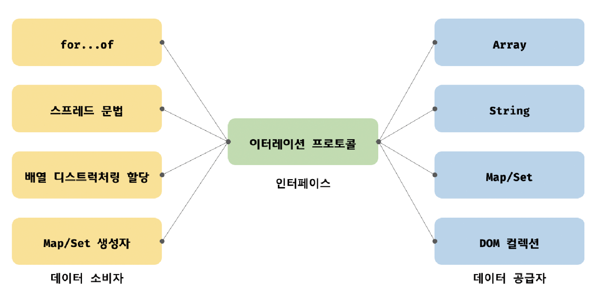

# 34.1 이터레이션 프로토콜

ES6에서 도입된 이터레이션 프로토콜은 순회 가능한 데이터 컬렉션을 만들기 위해 ECMAScript 사양에 정의하여 미리 약속한 규칙이다.

ES6 이전의 순회 가능한 데이터 컬렉션, 즉 배열, 문자열, 유사 배열 객체, DOM 컬렉션 등은 통일된 규약 없이 각자 나름의 구조를 가지고 `for 문, for ... in 문, forEach 메서드` 등 다양한 방법으로 순회할 수 있었다.

ES6에서는 순회 가능한 데이터 컬렉션을 이터레이션 프로토콜을 준수하는 이터러블로 통일하여 `for ... of 문, 스프레드 문법, 배열 디스턱처링 할당`의 대상으로 사용할 수 있도록 일원화했다.

이터레이션 프로토콜에는 이터러블 프로토콜과 이터레이터 프로토콜이 있다.

- **이터러블 프로토콜**

  - Well-known Symbol인 `Symbol.iterator`를 프로퍼티 키로 사용한 메서드를 직접 구현하거나 프로토테입 체인을 통해 상속받은 Symbol.iterator 메서드를 호출하면 이터레이터 프로토콜을 준수한 이터레이터를 반환한다.

    이러한 규약을 이터러블 프로토콜이라 하며, 이터러블 프로토콜을 준수한 객체를 **이터러블**이라 한다.
    이터러블은 for ... of 문으로 순회할 수 있으며 스프레드 문법과 배열 디스턱처링 할당의 대상으로 사용할 수 있다.

- **이터레이터 프로토콜**

  - 이터러블의 Symbol.iterator 메서드를 호출하면 이터레이터 프로토콜을 준수한 이터레이터를 반환한다.

    이터레이터는 next 메서드를 소유하며 next 메서드를 호출하면 이터러블을 순회하며 value와 done 프로퍼티를 갖는 **이터레이터 리절트 객체**를 반환한다.

    이러한 규약을 이터레이터 프로토콜이라 하며, 이를 준수한 객체를 **이터레이터**라 한다. 이터레이터는 이터러블의 요소를 탐색하기 위한 포인터 역할을 한다.

<p align="center">
  
</p>

<br />

## 이터러블

이터러블 프로토콜을 준수한 객체, 즉 이터러블은 `Symbol.iterator`를 프로퍼티 키로 사용한 메서드를 직접 구현하거나 프로토타입 체인을 통해 상속받은 객체를 말한다.

이터러블인지 확인하는 함수를 다음과 같이 구현할 수 있다.

```js
const isIterable = (v) => v != null && typeof v[Symbol.iterator] === 'function';

// true 값 가지는 것들
isIterable([]);
isIterable('');
isIterable(new Map());
isIterable(new Set());

isIterable({}); // false
```

<br />

Symbol.iterator 메서드를 직접 구현하지 않거나 상속받지 않은 일반 객체는 이터러블 프로토콜을 준수한 이터러블이 아니다.

따라서 일반 객체는 for ... of 문으로 순회할 수 없으며 스프레드 문법과 배열 디스트럭처링 할당의 대상으로 사용할 수 없다.

```js
const obj = { a: 1, b: 2 };

console.log(Symbol.iterator in obj); // false

for (const item of obj) {
  // TypeError: obj is not iterable
  console.log(item);
}
```

단, 일반 객체에 스프레드 문법의 사용을 허용한다.

```js
console.log({ ...obj }); // {a: 1, b: 2}
```

<br />
<br />

## 이터레이터

이터러블의 Symbol.iterator 메서드를 호출하면 이터레이터 프로토콜을 준수한 이터레이터를 반환한다.

이터러블의 Symbol.iterator 메서드가 반환한 이터레이터는 `next 메서드`를 갖는다.

```js
const arr = [1, 2, 3];

const iterator = arr[Symbol.iterator]();

console.log('next' in iterator); // true
```

이터레이터의 next 메서드는 **이터러블의 각 요소를 순회하기 위한 포인터의 역할**을 한다.

즉, next 메서드를 호출하면 이터러블을 순차적으로 한 단계씩 순회하며 순회 결과를 나타내는 `이터레이터 리절트 객체(iterator result object)`를 반환한다.

```js
const arr = [1, 2, 3];

const iterator = arr[Symbol.iterator]();

console.log(iterator.next()); // {value: 1, done: false}
console.log(iterator.next()); // {value: 2, done: false}
console.log(iterator.next()); // {value: 3, done: false}
console.log(iterator.next()); // {value: undefined, done: true}
```

이터레이터의 next 메서드가 반환하는 이터레이터 리절트 객체의 `value` 프로퍼티는 **현재 순회 중인 이터러블의 값**을 나타내며 `done` 프로퍼티는 **이터러블의 순회 완료 여부**를 나타낸다.

<br />
<br />

# 34.2 빌트인 이터러블

자바스크립트는 이터레이션 프로토콜을 준수한 객체인 빌트인 이터러블을 제공한다.

| 빌트인 이터러블 | Symbol.iterator 메서드                                                               |
| --------------- | ------------------------------------------------------------------------------------ |
| Array           | Array.prototype[Symbol.iterator]                                                     |
| String          | String.prototype[Symbol.iterator]                                                    |
| Map             | Map.prototype[Symbol.iterator]                                                       |
| Set             | Set.prototype[Symbol.iterator]                                                       |
| TypedArray      | TypedArray.prototype[Symbol.iterator]                                                |
| arguments       | arguments[Symbol.iterator]                                                           |
| DOM 컬렉션      | NodeList.prototype[Symbol.iterator] <br /> HTMLCollection.prototype[Symbol.iterator] |
|                 |

<br />
<br />

# 34.3 `for ... of` 문

for ... of 문은 이터러블을 순회하면서 이터러블의 요소를 변수에 할당한다.

`for (변수선언문 of 이터러블) { ... }`

<br />

for ... in 문의 형식과 매우 유사하다.

`for (변수선언문 in 객체) { ... }`

for ... in 문은 객체의 프로토타입 체인 상에 존재하는 모든 프로토타입의 프로퍼티 중에서 프로퍼티 어트리뷰트 [[Enumerable]]의 값이 true인 프로퍼티를 순회하며 열거한다. (이때 프로퍼티 키가 심벌인 프로퍼티는 열거하지 않는다.)

<br />

for ... of 문은 내부적으로 이터레이터의 next 메서드를 호출하여 이터러블을 순회하며 next 메서드가 반환한 이터레이터 리절트 객체의 `value` 프로퍼티 값을 for ... of 문의 변수에 할당한다.
그리고 이터레이터 리절트 객체의 done 프로퍼티 값이 false이면 이터러블의 순회를 계속하고 true이면 순회를 중단한다.

for ... of 문의 내부 동작은 for 문으로 표현하면 다음과 같다.

```js
const iterable = [1, 2, 3];

const iterator = iterable[Symbol.iterator]();

for (;;) {
  const res = iterator.next();

  if (res.done) break;

  const item = res.value;
  console.log(item);
}
```

<br />
<br />

# 34.4 이터러블과 유사 배열 객체

유사 배열 객체는 length 프로퍼티를 갖기 때문에 for 문으로 순회할 수 있고, 인덱스를 나타내는 숫자 형식의 문자열을 프로퍼티 키로 가지므로 마치 배열처럼 인덱스로 프로퍼티 값에 접근할 수 있다.

```js
const arrayLike = {
  0: 1,
  1: 2,
  2: 3,
  length: 3,
};

for (let i = 0; i < arrayLike.length; i++) {
  console.log(arrayLike[i]);
}
```

유사 배열 객체는 이터러블이 아닌 객체다. 따라서 유사 배열 객체에는 Symbol.iterator 메서드가 없기 때문에 for ... of 문으로 순회할 수 없다.

단, **arguments, NodeList, HTMLCollection**은 유사 배열 객체이면서 이터러블이다. 정확히 말하면 ES6에서 이터러블이 도입되면서 이 객체들에 Symbol.iterator 메서드를 구현하여 이터러블이 되었다.
하지만 이터러블이 된 이후에도 length 프로퍼티를 가지며 인덱스로 접근할 수 있는 것에는 변함이 없으므로 유사배열 객체이면서 이터러블인 것이다.

하지만 모든 유사 배열 객체가 이터러블인 것은 아니다. 위 예제처럼 arrayLike 객체는 유사 배열 객체지만 이터러블이 아니다.

ES6에서 도입된 `Array.from` 메서드를 사용하여 배열로 간단히 변환할 수 있다. 이 메서드는 유사 배열 객체 또는 이터러블을 인수로 전달받아 배열로 변환해 반환한다.

```js
const arr = Array.from(arrayLike);
```

<br />
<br />

# 34.5 이터레이션 프로토콜의 필요성

ES6에서는 순회 가능한 데이터 컬렉션을 이터레이션 프로토콜을 준수하는 이터러블로 통일하여 for ... of 문, 스프레드 문법, 배열 디스트럭처링 할당의 대상으로 사용할 수 있도록 일원화했다.

<br />

이터러블은 for ... of 문, 스프레드 문법, 배열 디스트럭처링 할당과 같은 데이터 소비자에 의해 사용되므로 **데이터 공급자**의 역할을 한다고 할 수 있다.

만약 다양한 데이터 공급자가 각자의 순회 방식을 갖는다면 데이터 소비자는 다양한 데이터 공급자의 순회 방식을 모두 지원해야 한다. 이는 효율적이지 않다.

하지만 다양한 데이터 공급자가 이터레이션 프로토콜을 준수하도록 규정하면 데이터 소비자는 이터레이션 프로토콜만 지원하도록 구현하면 된다.

즉, 이터러블을 지원하는 데이터 소비자는 내부에서 Symbol.iterator 메서드를 호출해 이터레이터를 생성하고 이터레이터의 next 메서드를 호출하여 이터러블을 순회하며 이터레이터 리절트 객체를 반환한다. 그리고 이터레이터 리절트 객체의 value/done 프로퍼티 값을 취득한다.

> 이처럼 이터레이션 프로토콜은 다양한 데이터 공급자가 하나의 순회 방식을 갖도록 규정하여 데이터 소비자가 효율적으로 다양한 데이터 공급자를 사용할 수 있도록 **데이터 소비자와 데이터 공급자를 연결하는 인터페이스의 역할을 한다.**

<p align="center">
  
</p>

<br/>
<br/>

# 34.6 사용자 정의 이터러블

## 사용자 정의 이터러블 구현

피보나치 수열을 구현한 간단한 사용자 정의 이터러블을 구현해보자.

```js
const fibonacci = {
  [Symbol.iterator]() {
    let [pre, cur] = [0, 1];
    const max = 10; // 피보나치 수열의 최대값 제한

    return {
      next() {
        [pre, cur] = [cur, pre + cur];

        return { value: cur, done: cur >= max };
      },
    };
  },
};

for (const num of fibonacci) {
  console.log(num); // 1 2 3 5 8
}
```

사용자 정의 이터러블은 이터레이션 프로토콜을 준수하도록 Symbol.iterator 메서드를 구현하고 Symbol.iterator 메서드가 next 메서드를 갖는 이터레이터를 반환하도록 한다.

그리고 next 메서드에서는 done 와 value 프로퍼티를 가지는 이터레이터 리절트 객체를 반환한다.
for ... of 문은 done 프로퍼티가 true가 될 때까지 반복하며 true가 되면 반복을 중지한다.

<br />

## 이터러블을 생성하는 함수

위에서 살펴본 fibonacci 이터러블은 내부에 수열의 최대값 max를 가지고 있다. 이 값은 외부에서 전달한 값으로 변경할 방법이 없다는 아쉬움이 있다.

수열의 최대값을 외부에서 전달할 수 있도록 해보자.

```js
const fibonacciFunc = function (max) {
  let [pre, cur] = [0, 1];

  return {
    [Symbol.iterator]() {
      return {
        next() {
          [pre, cur] = [cur, pre + cur];
          return { value: cur, done: cur >= max };
        },
      };
    },
  };
};

for (const num of fibonacciFunc(10)) {
  console.log(num);
}
```

<br />

## 이터러블이면서 이터레이터를 생성하는 함수

앞서 살펴본 fibonacciFunc 함수는 이터러블을 반환한다. 만약 이터레이터를 생성하려면 이터러블의 Symbol.iterator 메서드를 호출해야 한다.

```js
const iterable = fibonacciFunc(5);
const iterator = iterable[Symbol.iterator]();
```

이터러블이면서 이터레이터인 객체를 생성하면 Symbol.iterator 메서드를 호출하지 않아도 된다. 다음 객체는 Symbol.iterator 메서드와 next 메서드를 소유한 이터러블이면서 이터레이터다.

```js
{
  [Symbol.iterator]() { return this; },
  next() {
    return { value: any, done: boolean };
  }
}
```

Symbol.iterator 메서드는 this를 반환하므로 next 메서드를 갖는 이터레이터를 반환한다.

```js
const fibonacciFunc = function (max) {
  let [pre, cur] = [0, 1];

  return {
    [Symbol.iterator]() {
      return this;
    },
    next() {
      [pre, cur] = [cur, pre + cur];
      return { value: cur, done: cur >= max };
    },
  };
};

// iter는 이터러블이면서 이터레이터다.
let iter = fibonacciFunc(10);
```

<br />

## 무한 이터러블과 지연 평가

무한 이터러블을 통해 무한 수열을 간단히 구현할 수 있다.

```js
const fibonacciFunc = function () {
  let [pre, cur] = [0, 1];

  return {
    [Symbol.iterator]() {
      return this;
    },
    next() {
      [pre, cur] = [cur, pre + cur];
      // 무한을 구현해야 하므로 done 프로퍼티를 생략한다.
      return { value: cur };
    },
  };
};
```

이터러블은 데이터 공급자의 역할을 한다. 배열이나 문자열 등은 모든 데이터를 메모리에 미리 확보한 다음 데이터를 공급한다.

하지만 위 예제의 이터러블은 **`지연 평가`** 를 통해 데이터를 생성한다.

> 지연 평가는 데이터가 필요한 시점 이전까지는 미리 데이터를 생성하지 않다가 데이터가 필요한 시점이 되면 그때야 비로소 데이터를 생성하는 기법이다.
>
> 즉, 평가 결과가 필요할 때까지 평가를 늦추는 기법이 지연 평가다.

위 예제의 fibonacciFunc 함수는 무한 이터러블을 생성한다. 하지만 이 함수가 생성한 무한 이터러블은 데이터를 공급하는 메커니즘을 구현한 것으로 데이터 소비자인 for ... of 문이나 배열 디스트럭처링 할당 등이 실행되기 이전까지 데이터를 생성하지는 않는다.

for ... of 문에서 데이터를 순회할 때 내부에서 이터레이터의 next 메서드를 호출하는데 바로 이때 데이터가 생성된다.
즉, 데이터가 필요할 때까지 데이터의 생성을 지연하다가 데이터가 필요한 순간 데이터를 생성한다.

이처럼 지연 평가를 사용하면 불필요한 데이터를 미리 생성하지 않고 필요한 데이터를 필요한 순간에 생성하므로 **빠른 실행 속도**를 기대할 수 있고 **불필요한 메모리를 소비하지 않으며** 무한도 표현할 수 있다는 장점이 있다.
