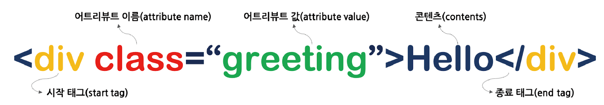
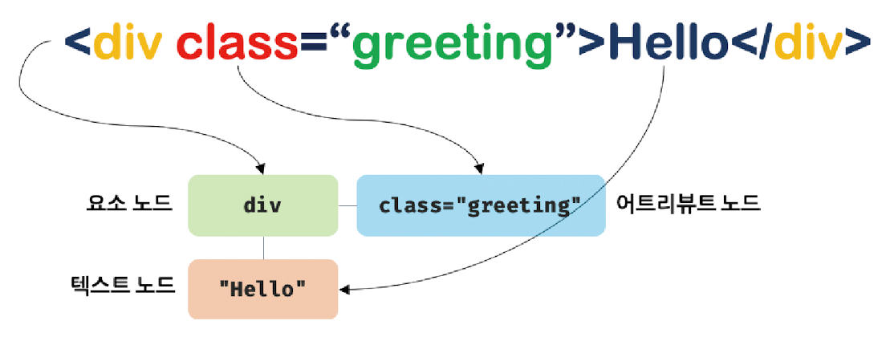
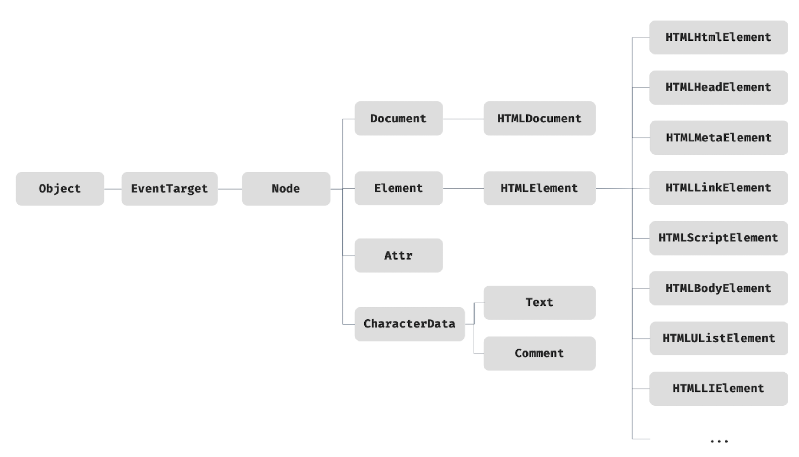
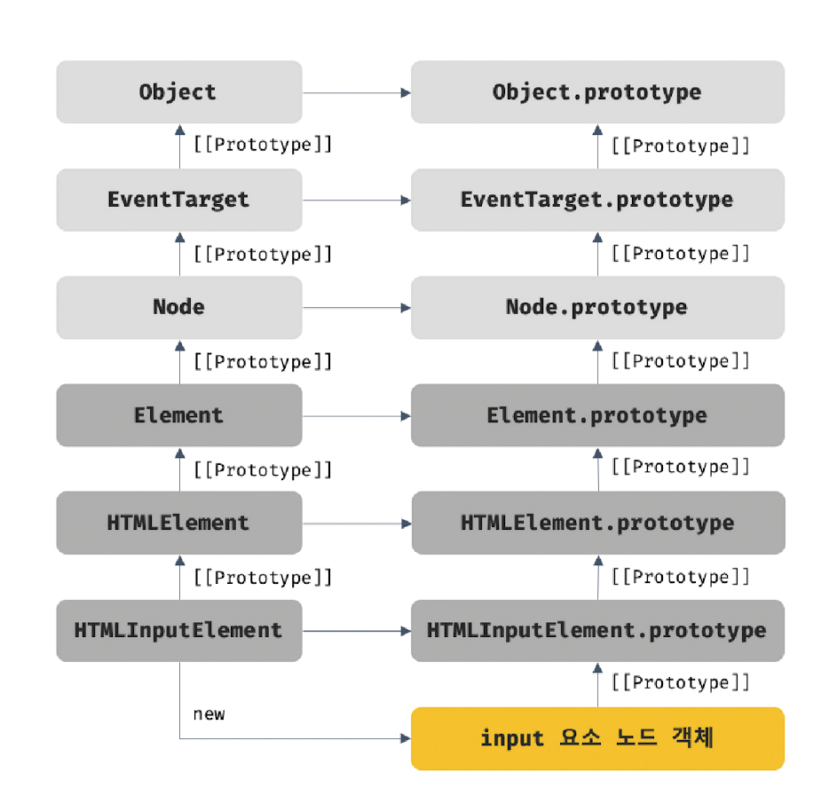

# 39.1 노드

## HTML 요소와 노드 객체

HTML 요소는 HTML 문서를 구성하는 개별적인 요소를 의미한다.

  

HTML 요소는 렌더링 엔진에 의해 파싱되어 DOM을 구성하는 요소 노드 객체로 변환된다. 이때 어트리뷰트는 어트리뷰트 노드로, 텍스트 콘텐츠는 텍스트 노드로 변환된다.

  

 

HTML 문서는 HTML 요소들의 집합으로 이뤄지며, HTML 요소는 중첩 관계를 갖는다. 즉 콘텐츠 영역에는 텍스트뿐만 아니라 다른 HTML 요소도 포함할 수 있다.

이러한 중첩 관계에 의해 계층적인 부자 관계가 형성된다. 이를 반영하여 HTML 요소를 객체화한 모든 노드 객체들을 트리 자료 구조로 구성한다.

**노드 객체들로 구성된 트리 자료 구조**를 DOM이라 한다. 노드 객체의 트리로 구조화되어 있기 때문에 DOM을 **DOM 트리**라고 부르기도 한다.

 

## 노드 객체의 타입

노드 객체는 총 12개의 종류가 있다. 그 중에서 다음 4가지 노드가 중요하다.

### 문서 노드

> DOM 트리의 최상위에 존재하는 루트 노드로서 `document` 객체를 가리킨다.

document 객체는 브라우저가 렌더링한 HTML 문서 전체를 가리키는 객체로서 전역 객체 `window`의 document 프로퍼티에 바인딩되어 있다.

브라우저 환경의 모든 자바스크립트 코드는 script 태그에 의해 분리되어 있어도 하나의 전역 객체 window를 공유한다. 즉, HTML 문서당 document 객체는 유일하다.

document 객체는 루트 노드이므로 DOM 트리의 노드들에 접근하기 위한 진입점 역할을 담당한다.

 

### 요소 노드

> HTML 요소를 가리키는 객체다.

요소 노드는 HTML 요소 간의 중첩에 의해 부자 관계를 가지며, 이 부자 관계를 통해 정보를 구조화한다. 따라서 요소 노드는 **문서의 구조**를 표현한다고 할 수 있다.

 

### 어트리뷰트 노드

> HTML 요소의 어트리뷰트를 가리키는 객체다.

어트리뷰트 노드는 어트리뷰트가 지정된 HTML 요소의 요소 노드와 연결되어 있다. 단, 요소 노드는 부모 노드와 연결되어 있지만 어트리뷰트 노드는 부모 노드와 연결되어 있지 않고 요소 노드에만 연결되어 있다.

따라서 어트리뷰트 노드에 접근하여 어트리뷰트를 참조하거나 변경하려면 먼저 요소 노드에 접근해야 한다.

 

### 텍스트 노드

> HTML 요소의 텍스트를 가리키는 객체다.

텍스트 노드는 **문서의 정보**를 표현한다고 할 수 있다. 텍스트 노드는 요소 노드의 자식 노드이며, 자식 노드를 가질 수 없는 리프 노드다. 즉, 텍스트 노드는 DOM 트리의 최종단이다.

 
 

## 노드 객체의 상속 구조

DOM을 구성하는 노드 객체는 자신의 구조와 정보를 제어할 수 있는 DOM API를 사용할 수 있다. 이를 통해 노드 객체는 자신의 부모, 형제, 자식을 탐색할 수 있으며 자신의 어트리뷰트와 텍스트를 조작할 수도 있다.

DOM을 구성하는 노드 객체는 ECMAScript 사양에 정의된 표준 빌트인 객체가 아니라 브라우저 환경에서 추가적으로 제공하는 **호스트 객체**다. 하지만 노드 객체도 자바스크립트 객체이므로 프로토타입에 의한 상속 구조를 갖는다.

  

위 그림과 같이 노드 객체는 `Object`, `EventTarget`, `Node` 인터페이스를 상속받는다.

 

문서 노드는 `Document`, `HTMLDocument` 인터페이스를 상속받고 어트리뷰트 노드는 `Attr`, 텍스느 노드는 `CharacterData` 인터페이스를 각각 상속받는다.

요소 노드는 `Element` 인터페이스를 상속받고 추가적으로 `HTMLElement`와 태그의 종류별로 세분화된 인터페이스를 상속받는다.

 

예를 들어, input 요소를 파싱하여 객체화한 input 요소 노드 객체는 HTMLInputElement, HTMLElement, Element, Node, EventTarget, Object의 prototype에 바인딩되어 있는 프로토타입 객체를 상속받는다.

즉, input 요소 노드 객체는 프로토타입 체인에 있는 모든 프로토타입의 프로퍼티나 메서드를 상속받아 사용할 수 있다.

  

 

| input 요소 노드 객체의 특성                                                | 프로토타입을 제공하는 객체 |
| -------------------------------------------------------------------------- | -------------------------- |
| 객체                                                                       | Object                     |
| 이벤트를 발생시키는 객체                                                   | EventTarget                |
| 트리 자료구조의 노드 객체                                                  | Node                       |
| 브라우저가 렌더링할 수 있는 웹 문서의 요소(HTML, XML, SVG)를 표현하는 객체 | Element                    |
| 웹 문서의 요소 중에서 HTML 요소를 표현하는 객체                            | HTMLElement                |
| HTML 요소 중에서 input 요소를 표현하는 객체                                | HTMLInputElement           |

 
 

HTML 요소가 객체화된 요소 노드 객체는 HTML 요소가 갖는 공통적인 기능이 있다.

예를 들어 input과 div 요소 노드 객체는 모두 HTML 요소의 스타일을 나타내는 style 프로퍼티가 있다.
이처럼 HTML 요소가 갖는 공통적인 기능은 HTMLElement 인터페이스가 제공한다.

 

하지만 요소 노드 객체는 HTML 요소의 종류에 따라 고유한 기능도 있다.

예를 들어 input 요소 노드 객체는 value 프로퍼티가 필요하지만 div 요소 노드 객체는 필요하지 않다.
따라서 필요한 기능을 제공하는 인터페이스가 HTML 요소의 종류에 따라 각각 다르다.

이처럼 노드 객체는 공통된 기능일수록 프로토타입 체인의 상위에, 개별적인 고유 기능일수록 프로토타입 체인의 하위에 프로토타입 체인을 구축하여 노드 객체에 필요한 기능, 즉 프로퍼티와 메서드를 제공하는 상속 구조를 갖는다.

> DOM은 HTML 문서의 계층적 구조와 정보를 표현하는 것은 물론 노드 객체의 종류, 즉 노드 타입에 따라 필요한 기능을 프로퍼티와 메서드의 집합인 DOM API로 제공한다.
>
> 이 DOM API를 통해 HTML의 구조나 내용 또는 스타일 등을 동적으로 조작할 수 있다.
