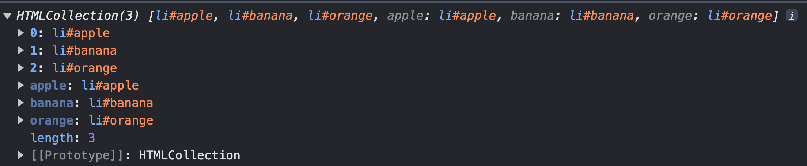
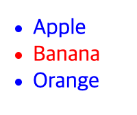

# 39.2 요소 노드 취득

HTML의 구조나 내용 또는 스타일을 동적으로 조작하려면 먼저 요소 노드를 취득해야 한다.

## `id`를 이용한 요소 노드 취득

`Document.prototype.getElementById` 메서드는 인수로 전달한 id 어트리뷰트 값을 갖는 하나의 요소 노드를 탐색하여 반환한다.

getElementById 메서드는 반드시 문서 노드인 `document`를 통해 호출해야 한다.

```html
<!DOCTYPE html>
<html>
  <body>
    <ul>
      <li id="apple">Apple</li>
      <li id="banana">Banana</li>
      <li id="orange">Orange</li>
    </ul>
    <script>
      const $elem = document.getElementById('banana');

      $elem.style.color = 'red';
    </script>
  </body>
</html>
```

id는 HTML 문서 내에서 유일한 값이어야 하며, class 어트리뷰트와는 달리 공백 문자로 구분하여 여러 개의 값을 가질 수 없다.

단, HTML 문서 내에 중복된 id 값을 갖는 HTML 요소가 여러 개 존재하더라도 어떠한 에러도 발생하지 않는다.

이러한 경우 getElementById 메서드는 인수로 전달된 id 값을 갖는 **첫 번째 요소 노드만 반환한다.**

만약 인수로 전달된 id 값을 갖는 HTML 요소가 존재하지 않는 경우 **`null`을 반환한다.**

<br />

HTML 요소에 id 어트리뷰트를 부여하면 **id 값과 동일한 이름의 전역 변수가 암묵적으로 선언되고 해당 노드 객체가 할당**되는 부수 효과가 있다.

```html
<!DOCTYPE html>
<html>
  <body>
    <div id="foo"></div>
    <script>
      console.log(foo === document.getElementById('foo')); // true

      // 암묵적 전역으로 생성된 전역 프로퍼티는 삭제되지만 전역 변수는 삭제되지 않는다.
      delete foo;
      console.log(foo); // <div> id="foo"</div>
    </script>
  </body>
</html>
```

단, id 값과 동일한 이름의 전역 변수가 **이미 선언되어 있으면 이 전역 변수에 노드 객체가 재할당되지 않는다.**

<br />

## 태그 이름을 이용한 요소 노드 취득

Document.prototype/Element.prototype.`getElementsByTagName` 메서드는 인수로 전달한 태그 이름을 갖는 모든 요소 노드들을 탐색하여 반환한다.

메서드 이름에 포함된 Elements가 복수형인 것에서 알 수 있듯이 getElementsByTagName 메서드는 여러 개의 요소 노드 객체를 갖는 DOM 컬렉션 객체인 `HTMLCollection` 객체를 반환한다.

```html
<!DOCTYPE html>
<html>
  <body>
    <ul>
      <li id="apple">Apple</li>
      <li id="banana">Banana</li>
      <li id="orange">Orange</li>
    </ul>
    <script>
      const $elems = document.getElementsByTagName('li');

      [...$elems].forEach((elem) => {
        elem.style.color = 'red';
      });
    </script>
  </body>
</html>
```

HTMLCollection 객체는 유사 배열 객체이면서 이터러블이다.

<p align="center">
  
</p>

HTML 문서의 모든 요소 노드를 취득하려면 메서드의 인수로 '\*'를 전달한다.

<br />

getElementsByTagName 메서드는 Document.prototype에 정의된 메서드와 Element.prototype에 정의된 메서드가 있다.

`Document.prototype.getElementsByTagName` 메서드는 document를 통해 호출하며 **DOM 전체에서** 요소 노드를 탐색하여 반환한다.

`Element.prototype.getElementsByTagName` 메서드는 특정 요소 노드를 통해 호출하며, **특정 요소 노드의 자손 노드 중에서** 요소 노드를 탐색하여 반환한다.

```html
<!DOCTYPE html>
<html>
  <body>
    <ul id="fruits">
      <li>Apple</li>
      <li>Banana</li>
      <li>Orange</li>
    </ul>
    <ul>
      <li>HTML</li>
    </ul>
    <script>
      const $lisFromDocument = document.getElementsByTagName('li');
      console.log($lisFromDocument); // HTMLCollection(4) [li, li, li, li]

      const $fruits = document.getElementById('fruits');
      const $lisFromFruits = $fruits.getElementsByTagName('li');
      console.log($lisFromFruits); //  HTMLCollection(3) [li, li, li]
    </script>
  </body>
</html>
```

만약 인수로 전달된 태그 이름을 갖는 요소가 존재하지 않는 경우 메서드는 빈 HTMLCollection 객체를 반환한다.

<br />

## `class`를 이용한 요소 노드 취득

Document.prototype/Element.prototype.`getElementsByClassName` 메서드는 인수로 전달한 class 어트리뷰트 값을 갖는 모든 요소 노드들을 탐색하여 반환한다. HTMLCollection 객체를 반환한다.

인수로 전달할 class 값은 공백으로 구분하여 여러 개의 class를 지정할 수 있다.

```js
const $elems = document.getElementsByClassName('fruit');
[...$elems].forEach((elem) => {
  elem.style.color = 'red';
});

const $apples = document.getElementsByClassName('fruit apple');
```

<br />

## CSS 선택자를 이용한 요소 노드 취득

[CSS 선택자](./CSS_선택자.md)는 스타일을 적용하고자 하는 HTML 요소를 특정할 때 사용하는 문법이다.

Document.prototype/Element.prototype.`querySelector` 메서드는 인수로 전달한 CSS 선택자를 만족시키는 하나의 요소 노드를 탐색하여 반환한다.

- 인수로 전달한 CSS 선택자를 만족시키는 요소 노드가 여러 개인 경우 **`첫 번째 요소 노드`만 반환한다.**

- 인수로 전달한 CSS 선택자를 만족시키는 요소 노드가 존재하지 않는 경우 `null`을 반환한다.

- 인수로 전달한 CSS 선택자가 문법에 맞지 않는 경우 `DOMException` 에러가 발생한다.

```js
const $elem = document.querySelector('.banana');
```

<br />

Document.prototype/Element.prototype.`querySelectorAll` 메서드는 인수로 전달한 CSS 선택자를 만족시키는 모든 요소 노드를 탐색하여 반환한다.

querySelectorAll 메서드는 여러 개의 요소 노드 객체를 갖는 DOM 컬렉션 객체인 `NodeList` 객체를 반환한다. NodeList 객체는 유사 배열 객체이면서 이터러블이다.

- 요소가 존재하지 않는 경우 빈 NodeList 객체를 반환한다.

- 인수로 전달한 CSS 선택자가 문법에 맞지 않을 경우 DOMException 에러가 발생한다.

```js
const $elems = document.querySelectorAll('ul > li');
console.log($elems); // NodeList(3) [li.apple, li.banana, li.orange]
```

HTML 문서의 모든 요소 노드를 취득하려면 인수로 전체 선택자 '\*'를 전달한다.

<br />

getElementsByTagName, getElementsByClassName 메서드와 마찬가지로 Document.prototype에 정의된 메서드는 DOM 전체에서 요소 노드를 탐색하고, Element.prototype에 정의된 메서드는 특정 요소 노드의 자손 노드 중에서 요소 노드를 탐색하여 반환한다.

<br />

CSS 선택자 문법을 사용하는 querySelector, querySelectorAll 메서드는 getElementById, getElementsBy\*\*\* 메서드보다 다소 느린 것으로 알려져 있다.

하지만 CSS 선택자 문법을 사용하여 좀 더 구체적인 조건으로 요소 노드를 취득할 수 있고 일관된 방식으로 요소 노드를 취득할 수 있다는 장점이 있다.

> 따라서 id 어트리뷰트가 있는 요소 노드를 취득하는 경우에는 getElementById 메서드를 사용하고 그 외의 경우에는 querySelector, querySelectorAll 메서드를 사용하는 것을 권장한다.

<br />
<br />

## 특정 요소 노드를 취득할 수 있는지 확인

`Element.prototype.matches` 메서드는 인수로 전달한 CSS 선택자를 통해 특정 요소 노드를 취득할 수 있는지 확인한다.

```js
const $apple = document.querySelctor('.apple');
console.log($apple.matches('#fruits > li.apple')); // true
```

matches 메서드는 이벤트 위임을 사용할 때 유용하다.

<br />

## HTMLCollection과 NodeList

DOM 컬렉션 객체인 HTMLCollection과 NodeList는 **DOM API가 여러 개의 결과값을 반환하기 위한 객체**다. 이 객체 모두 유사 배열 객체이면서 이터러블이다.
따라서 for ... of 문으로 순회할 수 있으며 스프레드 문법을 사용하여 간단하게 배열로 변환할 수 있다.

<br />

HTMLCollection과 NodeList의 중요한 특징은 노드 객체의 상태 변화를 실시간으로 반영하는 **살아있는 객체**라는 것이다.

HTMLCollection은 언제나 live 객체로 동작한다. 단, NodeList는 대부분의 경우 노드 객체의 상태 변화를 실시간으로 반영하지 않고 과거의 정적 상태를 유지하는 non-live 객체로 동작하지만 경우에 따라 live 객체로 동작할 때가 있다.

### HTMLCollection

`getElementsByTagName`, `getElementsByClassName` 메서드가 반환하는 HTMLCollection 객체는 노드 객체의 상태 변화를 실시간으로 반영하는 살아 있는 DOM 컬렉션 객체다.

```html
<!DOCTYPE html>
<html>
  <head>
    <style>
      .red {
        color: red;
      }
      .blue {
        color: blue;
      }
    </style>
  </head>
  <body>
    <ul id="fruits">
      <li class="red">Apple</li>
      <li class="red">Banana</li>
      <li class="red">Orange</li>
    </ul>
    <script>
      const $elems = document.getElementsByClassName('red');
      console.log($elems); // HTMLCollection(3) [li.red, li.red, li.red]

      for (let i = 0; i < $elems.length; i++) {
        $elems[i].className = 'blue';
      }

      console.log($elems); // HTMLCollection [li.red]
    </script>
  </body>
</html>
```

위 예제는 class 값이 'red'인 요소를 모두 취득하고, 취득된 모든 요소 노드를 담고 있는 HTMLCollection 객체를 for 문으로 순회하며 className 프로퍼티를 사용해 모든 요소의 class값을 'red'에서 'blue'로 변경한다.

모든 li 요소의 class 값이 'blue'로 변경되어 모든 li 요소가 파란색으로 렌더링 될 것으로 예상된다. 하지만 위 예제를 실행해 보면 다음처럼 두 번째 li 요소만 class 값이 변경되지 않는다.

<p align="center">
  
</p>

위 예제가 예상대로 동작하지 않은 이유는 다음과 같다. for 문의 반복을 살펴보자.

1. 첫 번째 반복 (i === 0)

   $elems[0]은 첫 번째 li 요소다. class 값이 'blue'로 변경되었으므로 getElementsByClassName 메서드의 인자로 전달한 'red'와 더는 일치하지 않기 때문에 $elems에서 실시간으로 제거된다.

2. 두 번째 반복 (i === 1)

   첫 번째 반복에서 첫 번째 li 요소는 $elems에서 제거되었다. 따라서 $elems[1]은 세 번째 li 요소다. 이 세 번째 li 요소의 class 값도 'blue'로 변경되고 마찬가지로 HTMLCollection 객체인 $elems에서 실시간으로 제외된다.

3. 세 번째 반복 (i === 2)

   $elems에는 두 번째 li 요소 노드만 남았다. 이때 $elems.length는 1이므로 for 문의 조건식 `i < $elems.length`가 false로 평가되어 반복이 종료된다.

<br />

이처럼 HTMLCollection 객체는 실시간으로 노드 객체의 상태 변경을 반영하여 요소를 제거할 수 있기 때문에 HTMLCollection 객체를 for 문으로 순회하면서 노드 객체의 상태를 변경해야 할 때 주의해야 한다.

이 문제는 for 문을 역방향으로 순회하는 방법으로 회피하거나 while 문을 사용하여 HTMLCollection 객체에 노드 객체가 남아 있지 않을 때까지 무한 반복하는 방법으로 회피할 수도 있다.

```js
for (let i = $elems.length - 1; i >= 0; i--) {
  $elems[i].className = 'blue';
}

// OR

let i = 0;
while ($elems.length > i) {
  $elems[i].className = 'blue';
}
```

더 간단한 해결책은 HTMLCollection 객체를 사용하지 않는 것이다. HTMLCollection 객체를 배열로 변환하면 부작용을 발생시키는 HTMLCollection 객체를 사용할 필요가 없다.

```js
[...$elems].forEach((elem) => {
  elem.className = 'blue';
});
```

<br />
<br />

### NodeList

`querySelectorAll` 메서드는 NodeList 객체를 반환한다. 이때 NodeList 객체는 실시간으로 노드 객체의 상태 변경을 반영하지 않는 객체다.

```js
const $elems = document.querySelectorAll('.red');

$elems.forEach((elem) => {
  elem.className = 'blue';
});
```

NodeList 객체는 NodeList.prototype.forEach 메서드를 상속받아 사용할 수 있다. 이 메서드는 Array.prototype.forEach 메서드와 사용방법이 동일하다.

NodeList 객체는 대부분의 경우 노드 객체의 상태 변경을 실시간으로 반영하지 않고 과거의 정적 상태를 유지하는 non-live 객체로 동작한다. 하지만 **`childNodes` 프로퍼티가 반환하는 NodeList 객체는 HTMLCollection 객체와 같이 실시간으로 노드 객체의 상태 변경을 반영하는 live 객체로 동작하므로 주의가 필요하다.**

```html
<!DOCTYPE html>
<html>
  <body>
    <ul id="fruits">
      <li>Apple</li>
      <li>Banana</li>
    </ul>

    <script>
      const $fruits = document.getElementById('fruits');

      const { childNodes } = $fruits;
      console.log(childNodes instanceof NodeList); // true

      // 공백 텍스트 노드를 포함해 모두 5개
      console.log(childNodes); // NodeList(5) [text, li, text, li, text]

      for (let i = 0; i < childNodes.length; i++) {
        $fruits.removeChild(childNodes[i]);
      }
      console.log(childNodes); // NodeList(2) [li, li]
    </script>
  </body>
</html>
```

이처럼 예상과 다르게 동작할 때가 있어 다루기 까다롭고 실수하기 쉽다.

> 따라서 **노드 객체의 상태 변경과 상관없이 안전하게 DOM 컬렉션을 사용하려면 HTMLCollection이나 NodeList 객체를 배열로 변환**하여 사용하는 것을 권장한다.
