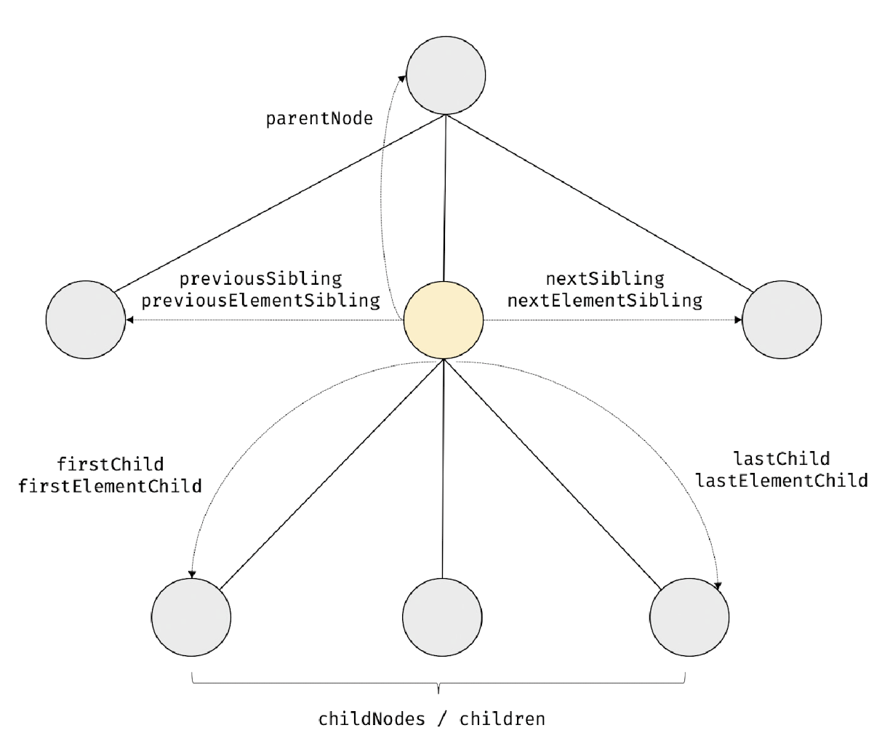
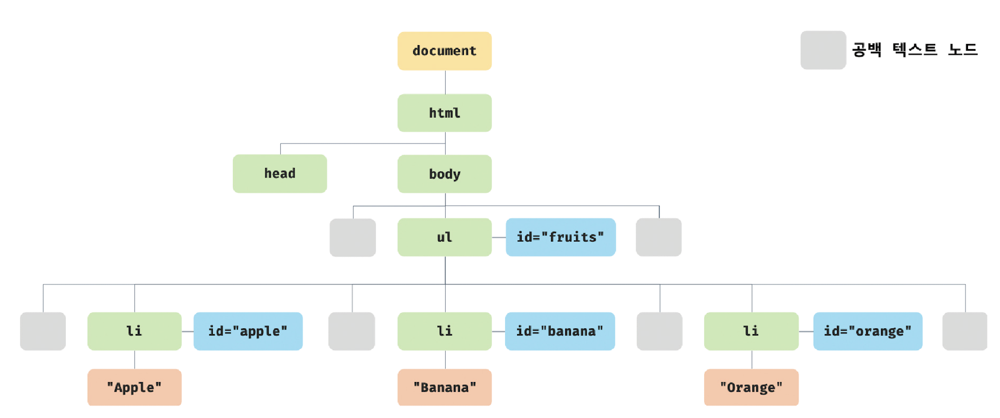

# 39.3 노드 탐색

요소 노드를 취득한 다음, 취득한 요소 노드를 기점으로 DOM 트리의 노드를 옮겨 다니며 부모, 형제, 자식 노드 등을 탐색해야 할 때가 있다.

DOM 트리 상의 노드를 탐색할 수 있도록 Node, Element 인터페이스는 트리 탐색 프로퍼티를 제공한다.

<p align="center">
  
</p>

- Node.prototype이 제공: `parentNode`, `previousSibling`, `firstChild`, `childNodes` 프로퍼티

- Element.prototype이 제공: 프로퍼티 키에 Element가 포함된 `previousElementSibling`, `nextElementSibling`과 `children`

<br />

노드 탐색 프로퍼티는 setter 없이 getter만 존재하여 참조만 가능한 읽기 전용 접근자 프로퍼티다.

<br />

## 공백 텍스트 노드

HTML 요소 사이의 스페이스, 탭, 줄바꿈 등의 공백 문자는 텍스트 노드를 생성한다. 이를 공백 텍스트 노드라 한다.

```html
<!DOCTYPE html>
<html>
  <body>
    <ul id="fruits">
      <li id="apple">Apple</li>
      <li id="banana">Banana</li>
      <li id="orange">Orange</li>
    </ul>
  </body>
</html>
```

위 HTML 문서는 파싱되어 다음과 같은 DOM을 생성한다.

<p align="center">
  
</p>

이처럼 HTML 문서의 공백 문자는 공백 텍스트 노드를 생성한다. 따라서 노드를 탐색할 때는 공백 문자가 생성한 공백 텍스트 노드에 주의해야 한다.

<br />

## 자식 노드 탐색

자식 노드를 탐색하기 위해 다음과 같은 노트 탐색 프로퍼티를 사용한다.

- Node.prototype.`childNodes`

  - 자식 노드를 모두 탐색하여 **NodeList**에 담아 반환한다. childNodes 프로퍼티가 반환한 NodeList에는 **요소 노드뿐만 아니라 텍스트 노드도 포함되어 있을 수 있다.**

- Element.prototype.`children`

  - 자식 노드 중에서 **요소 노드만 모두 탐색**하여 **HTMLCollection**에 담아 반환한다. children 프로퍼티가 반환한 HTMLCollection에는 텍스트 노드가 포함되지 않는다.

- Node.prototype.`firstChild`

  - 첫 번째 자식 노드를 반환한다. 이 노드는 텍스트 노드이거나 요소 노드다.

- Node.prototype.`lastChild`

  - 마지막 자식 노드를 반환한다. 이 노드는 텍스트 노드이거나 요소 노드다.

- Element.prototype.`firstElementChild`

  - 첫 번째 자식 요소 노드를 반환한다. 이 프로퍼티는 요소 노드만 반환한다.

- Element.prototype.`lastElementChild`
  - 마지막 자식 요소 노드를 반환한다. 이 프로퍼티는 요소 노드만 반환한다.

<br />

## 자식 노드 존재 확인

자식 노드가 존재하는지 확인하려면 Node.prototype.`hasChildNodes` 메서드를 사용한다.

단, hasChildNodes 메서드는 childNodes 프로퍼티와 마찬가지로 텍스트 노드를 포함하여 자식 노드의 존재를 확인한다.

자식 노드 중에 텍스트 노드가 아닌 요소 노드가 존재하는지 확인하려면 hasChildNodes 메서드 대신 `children.length` 또는 Element 인터페이스의 `childElementCount` 프로퍼티를 사용한다.

```html
<!DOCTYPE html>
<html>
  <body>
    <ul id="fruits"></ul>
    <script>
      const $fruits = document.getElementById('fruits');

      console.log($fruits.hasChildNodes()); // true

      console.log(!!$fruits.children.length); // false
      console.log(!!$fruits.childElementCount); // false
    </script>
  </body>
</html>
```

<br />

## 요소 노드의 텍스트 노드 탐색

요소 노드의 텍스트 노드는 요소 노드의 자식 노드다. 따라서 요소 노드의 텍스트 노드는 `firstChild` 프로퍼티로 접근할 수 있다.

## 부모 노드 탐색

부모 노드를 탐색하려면 Node.prototype.`parentNode` 프로퍼티를 사용한다. 텍스트 노드는 DOM 트리의 최종단 노드인 리프노드이므로 부모 노드가 텍스트 노드인 경우는 없다.

## 형제 노드 탐색

어트리뷰트 노드는 요소 노드와 연결되어 있지만 부모 노드가 같은 형제 노드가 아니기 때문에 반환되지 않는다. 즉, 아래 프로퍼티는 텍스트 노드
또는 요소 노드만 반환한다.

- Node.prototype.`previousSibling`

  - 부모 노드가 같은 형제 노드 중에서 자신의 이전 형제 노드를 탐색하여 반환한다. 이 프로퍼티가 반환하는 형제 노드는 **요소 노드뿐만 아니라 텍스트 노드일 수도 있다.**

- Node.prototype.`nextSibling`

  - 자신의 다음 형제 노드를 반환한다.

- Element.prototype.`previousElementSibling`

  - 자신의 이전 형제 **요소 노드**를 탐색하여 반환한다. 이 프로퍼티는 요소 노드만 반환한다.

- Element.prototype.`nextElementSibling`
  - 자신의 다음 형제 요소 노드를 탐색하여 반환한다.
