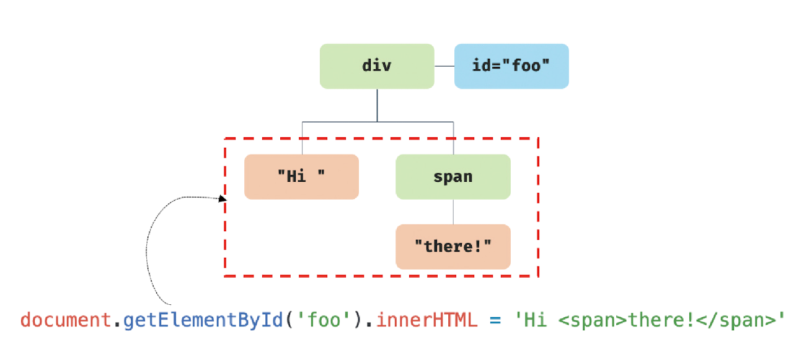
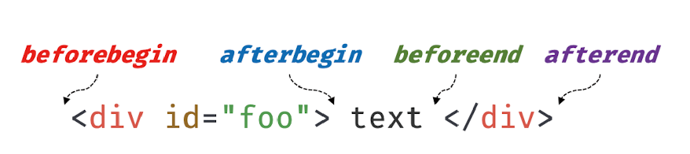
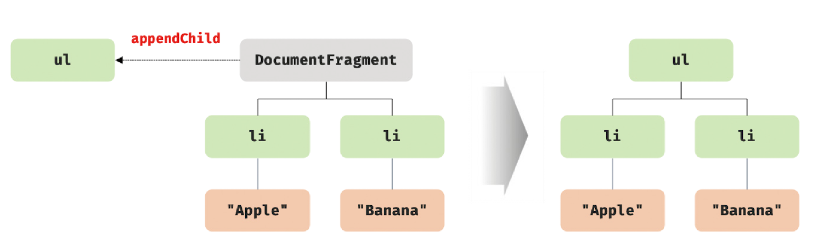

# 39.6 DOM 조작

> DOM 조작(DOM manipulation)은 새로운 노드를 생성하여 DOM에 추가하거나 기존 노드를 삭제 또는 교체하는 것을 말한다.
>
> DOM 조작에 의해 새로운 노드가 추가되거나 삭제되면 리플로우와 리페인트가 발생하는 원인이 되므로 성능에 영향을 준다. 따라서 복잡한 콘텐츠를 다루는 DOM 조작은 성능 최적화를 위해 주의해서 다루어야 한다.

## `innerHTML`

Element.prototype.`innerHTML` 프로퍼티는 setter와 getter 모두 존재하는 접근자 프로퍼티로서 요소 노드의 HTML 마크업을 취득하거나 변경한다.

요소 노드의 innerHTML 프로퍼티를 참조하면 **요소 노드의 콘텐츠 영역 내에 포함된 모든 HTML 마크업을 문자열로 반환한다.**

```html
<!DOCTYPE html>
<html>
  <body>
    <div id="foo">Hello <span>world!</span></div>
    <script>
      console.log(document.getElementById('foo').innerHTML); // "Hello <span>world!</span>"
    </script>
  </body>
</html>
```

앞서 살펴본 textContent 프로퍼티를 참조하면 마크업을 무시하고 텍스트만 반환하지만 innerHTML 프로퍼티는 HTML 마크업이 포함된 문자열을 그대로 반환한다.

<br />

innerHTML 프로퍼티에 문자열을 할당하면 요소 노드의 모든 자식 노드가 제거되고 할당한 문자열에 포함되어 있는 HTML 마크업이 파싱되어 요소 노드의 자식 노드로 DOM에 반영된다.

```html
<!DOCTYPE html>
<html>
  <body>
    <div id="foo">Hello <span>world!</span></div>
    <script>
      document.getElementById('foo').innerHTML = 'Hi <span>there!</span>';
    </script>
  </body>
</html>
```

<p align="center">
  
  
</p>

<br />

innerHTML 프로퍼티에 할당한 HTML 마크업 문자열은 렌더링 엔진에 의해 파싱되어 요소 노드의 자식으로 DOM에 반영된다. 이때 사용자로부터 입력받은 데이터를 그대로 innerHTML 프로퍼티에 할당하는 것은 **`크로스 사이트 스크립팅 공격(XSS)`** 에 취약하므로 위험하다.

HTML 마크업 내에 자바스크립트 악성 코드가 포함되어 있다면 파싱 과정에서 그대로 실행될 가능성이 있기 때문이다.

```html
<!DOCTYPE html>
<html>
  <body>
    <div id="foo">Hello</div>
    <script>
      document.getElementById('foo').innerHTML = '<script>alert(document.cookie)</script>';
    </script>
  </body>
</html>
```

HTML5는 innerHTML 프로퍼티로 삽입된 script 요소 내의 자바스크립트 코드를 실행하지 않는다. 따라서 HTML5를 지원하는 브라우저에서 위 예제는 동작하지 않는다.

하지만 script 요소 없이도 크로스 사이트 스크립팅 공격은 가능하다.

```html
<!DOCTYPE html>
<html>
  <body>
    <div id="foo">Hello</div>
    <script>
      document.getElementById(
        'foo',
      ).innerHTML = ``;
    </script>
  </body>
</html>
```

위 예제는 에러 이벤트를 강제로 발생시켜서 자바스크립트 코드가 실행되도록 한다.

이처럼 innerHTML 프로퍼티를 사용한 DOM 조작은 구현이 간단하고 직관적이라는 장점이 있지만 XSS에 취약한 단점도 있다.

> **💡 HTML 새니티제이션(HTML sanitization)**
>
> 사용자로부터 입력받은 데이터에 의해 발생할 수 있는 크로스 사이트 스크립팅 공격을 예방하기 위해 잠재적 위험을 제거하는 기능을 말한다.
>
> 새니티제이션 함수를 직접 구현할 수도 있겠지만 `DOMPurify` 라이브러리를 사용하는 것을 권장한다.
>
> DOMPurify는 잠재역 위험을 내포한 HTML 마크업을 새니티제이션(살균)하여 잠재젹 위험을 제거한다.
>
> ```js
> DOMPurify.sanitize(''); // => 
> ```

<br />

innerHTML의 또 다른 단점은 요소 노드의 innerHTML 프로퍼티에 HTML 마크업 문자열을 할당하는 경우 **요소 노드의 모든 자식 노드를 제거**하고 할당한 HTML 마크업 문자열을 파싱하여 DOM을 변경한다는 것이다.

```html
<!DOCTYPE html>
<html>
  <body>
    <ul id="fruits">
      <li class="apple">Apple</li>
    </ul>
    <script>
      const $fruits = document.getElementById('fruits');

      $fruits.innerHTML += '<li class="banana">Banana</li>';
    </script>
  </body>
</html>
```

위 예제는 #fruits 요소에 자식 요소 li.banana를 추가한다. 이때 #fruits 요소의 자식 요소 li.apple은 아무런 변경이 없으므로 다시 생성할 필요가 없다. 하지만 #fruits 요소의 모든 자식 노드를 제거하고 새롭게 요소 노드 li.apple과 li.banana를 생성하여 추가한다.

따라서 이는 효율적이지 않다.

<br />

또 다른 단점은 새로운 요소를 삽입할 때 삽입할 위치를 지정할 수 없다는 단점도 있다.

이처럼 innerHTML 프로퍼티는 복잡하지 않은 요소를 새롭게 추가할 때 유용하지만 기존 요소를 제거하지 않으면서 위치를 지정해 새로운 요소를 삽입해야 할 때는 사용하지 않는 것이 좋다.

<br />
<br />

## `insertAdjacentHTML` 메서드

Element.prototype.`insertAdjacentHTML(position, DOMString)` 메서드는 기존 요소를 제거하지 않으면서 위치를 지정해 새로운 요소를 삽입한다.

두 번째 인수로 전달한 HTML 마크업 문자열(DOMString)을 파싱하고 그 결과로 생성된 노드를 첫 번째 인수로 전달한 위치(position)에 삽입하여 DOM에 반영한다.

첫 번째 인수로 전달할 수 있는 문자열은 `'beforebegin'`, `'afterbegin'`, `'beforeend'`, `'afterend'`의 4가지다.

<p align="center">
  
</p>

<br />

insertAdjacentHTML 메서드는 새롭게 삽입될 요소만을 파싱하여 자식 요소로 추가하므로 innerHTML 프로퍼티보다 효율적이고 빠르다.

단, innerHTML 프로퍼티와 마찬가지로 HTML 마크업 문자열을 파싱하므로 크로스 사이트 스크립팅 공격에 취약하다는 점은 동일하다.

<br />

## 노드 생성과 추가

DOM은 노드를 직접 생성/삽입/삭제/치환하는 메서드도 제공한다.

```html
<!DOCTYPE html>
<html>
  <body>
    <ul id="fruits">
      <li>Apple</li>
    </ul>
    <script>
      const $fruits = document.getElementById('fruits');

      const $li = document.createElement('li');

      const textNode = document.createTextNode('Banana');

      $li.appendChild(textNode);

      $fruits.appendChild($li);
    </script>
  </body>
</html>
```

### 요소 노드 생성

Document.prototype.`createElement(tagName)` 메서드는 요소 노드를 생성하여 반환한다.

```js
const $li = document.createElement('li');
```

createElement 메서드로 생성한 요소 노드는 기존 DOM에 추가되지 않고 홀로 존재하는 상태다. 즉, 이 메서드는 **요소 노드를 생성할 뿐 DOM에 추가하지는 않는다.** 따라서 이후에 생성된 요소 노드를 DOM에 추가하는 처리가 별도로 필요하다.

그리고 createElement 메서드로 생성한 요소 노드는 아무런 자식 노드를 가지고 있지 않다.

<br />

### 텍스트 노드 생성

Document.prototype.`createTextNode(text)` 메서드는 텍스트 노드를 생성하여 반환한다.

```js
const textNode = document.createTextNode('Banana');
```

createElement 메서드와 마찬가지로 텍스트 노드를 생성할 뿐 요소 노드에 추가하지는 않는다.

<br />

### 텍스트 노드를 요소 노드의 자식 노드로 추가

Node.prototype.`appendChild(childNode)` 메서드는 매개변수 childNode에게 인수로 전달한 노드를 appendChild 메서드를 호출한 노드의 마지막 자식 노드로 추가한다.

```js
// 텍스트 노드를 $li 요소 노드의 자식 노드로 추가
$li.appendChild(textNode);
```

<br />

### 요소 노드를 DOM에 추가

Node.prototype.appendChild 메서드를 사용하여 텍스트 노드와 부자 관계로 연결한 요소 노드를 #fruits 요소 노드의 마지막 자식 요소로 추가한다.

```js
$fruits.appendChild($li);
```

이 과정에서 새롭게 생성한 요소 노드가 DOM에 추가된다. 기존의 DOM에 요소 노드를 추가하는 처리는 이 과정뿐이다.

위 예제는 단 하나의 요소 노드를 생성하여 DOM에 한번 추가하므로 DOM은 한 번 변경된다. 이때 리플로우와 리페인트가 실행된다.

<br />

## 복수의 노드 생성과 추가

```html
<!DOCTYPE html>
<html>
  <body>
    <ul id="fruits"></ul>
    <script>
      const $fruits = document.getElementById('fruits');
      ['Apple', 'Banana', 'Orange'].forEach((text) => {
        const $li = document.createElement('li');
        const textNode = document.createTextNode(text);

        $li.appendChild(textNode);

        $fruits.appendChild($li);
      });
    </script>
  </body>
</html>
```

위 예제는 DOM이 3번 변경된다. DOM을 변경하는 것은 높은 비용이 드는 처리이므로 가급적 횟수를 줄이는 편이 성능에 유리하다.
따라서 위 예제처럼 기존 DOM에 노드를 반복하여 추가하는 것은 비효율적이다.

DOM을 여러 번 변경하는 문제를 회피하기 위해 컨테이너 요소를 사용해 보자.
DOM에 추가해야 할 3개의 요소 노드를 컨테이너 요소에 자식 노드로 추가하고, 컨테이너 요소를 #fruits 요소에 자식으로 추가한다면 DOM은 한 번만 변경된다.

```js
const $container = document.createElement('div');

['Apple', 'Banana', 'Orange'].forEach((text) => {
  const $li = document.createElement('li');
  const textNode = document.createTextNode(text);

  $li.appendChild(textNode);

  $container.appendChild($li);
});
#fruits.appendChild($container);
```

위 예제는 DOM을 한 번만 변경하므로 성능에 유리하기는 하지만 불필요한 컨테이너 요소가 DOM에 추가되는 부작용이 있다. 이는 바람직하지 않다.

이러한 문제는 **`DocumentFragment` 노드**를 통해 해결할 수 있다.

DocumentFragment 노드는 문서, 요소, 어트리뷰트, 텍스트 노드와 같은 노드 객체의 일종으로, 부모 노드가 없어서 기존 DOM과는 별도로 존재한다는 특징이 있다.

그리고 위 예제의 컨테이너 요소와 같이 자식 노드들의 부모 노드로서 별도의 서브 DOM을 구성하여 기존 DOM에 추가하기 위한 용도로 사용한다.

<br />

DocumentFragment 노드는 기존 DOM과는 별도로 존재하므로 이 노드에 자식 노드를 추가하여도 기존 DOM에는 어떠한 변경도 발생하지 않는다.
또한 DocumentFragment 노드를 DOM에 추가하면 **자신은 제거되고 자신의 자식 노드만 DOM에 추가된다.**

<p align="center">
  
</p>

Document.prototype.`createDocumentFragment` 메서드는 비어 있는 DocumentFragment 노드를 생성하여 반환한다.

```js
const $fragment = document.createDocumentFragment();

['Apple', 'Banana', 'Orange'].forEach((text) => {
  const $li = document.createElement('li');
  const textNode = document.createTextNode(text);

  $li.appendChild(textNode);

  $fragment.appendChild($li);
});
#fruits.appendChild($fragment);
```

<br />
<br />

## 노드 삽입

### 마지막 노드로 추가

Node.prototype.`appendChild` 메서드는 인수로 전달받은 노드를 자신을 호출한 노드의 마지막 자식 노드로 추가한다.

이때 노드를 추가할 위치를 지정할 수 없고 언제나 마지막 자식 노드로 추가한다.

### 지정한 위치에 노드 삽입

Node.prototype.`insertBefore(newNode, childNode)` 메서드는 첫 번째 인수로 전달받은 노드를 두 번째 인수로 전달받은 노드 앞에 삽입한다.

```html
<!DOCTYPE html>
<html>
  <body>
    <ul id="fruits">
      <li>Apple</li>
      <li>Banana</li>
    </ul>
    <script>
      const $fruits = document.getElementById('fruits');

      const $li = document.createElement('li');
      $li.appendChild(document.createTextNode('Orange'));

      // $li 요소 노드를 #fruits 요소 노드의 마지막 자식 요소 앞에 삽입
      $fruits.insertBefore($li, $fruits.lastElementChild);
    </script>
  </body>
</html>
```

- 이때 두 번째 인수로 전달받은 노드는 반드시 `insertBefore` 메서드를 호출한 노드의 자식 노드이어야 한다. 그렇지 않으면 DOMException 에러가 발생한다.

- 두 번째 인수로 전달받은 노드가 null이면 첫 번째 인수로 전달받은 노드를 메서드를 호출한 노드의 마지막 자식 노드로 추가된다. 즉, appendChild 메서드처럼 동작한다.

<br />

## 노드 이동

DOM에 이미 존재하는 노드를 appendChild 또는 insertBefore 메서드를 사용하여 DOM에 다시 추가하면 **현재 위치에서 노드를 제거하고 새로운 위치에 노드를 추가한다. 즉, 노드가 이동한다.**

```html
<!DOCTYPE html>
<html>
  <body>
    <ul id="fruits">
      <li>Apple</li>
      <li>Banana</li>
      <li>Orange</li>
    </ul>
    <script>
      const $fruits = document.getElementById('fruits');

      const [$apple, $banana] = $fruits.children;

      $fruits.appendChild($apple); // Banana - Orange - Apple 순

      $fruits.insertBefore($banana, $fruits.lastElementChild); // Orange - Banana - Apple
    </script>
  </body>
</html>
```

<br />

## 노드 복사

Node.prototype.`cloneNode([deep: true | false])` 메서드는 노드의 사본을 생성하여 반환한다.

매개변수 deep에 true를 인수로 전달하면 노드를 깊은 복사하여 모든 자손 노드가 포함된 사본을 생성하고, false를 전달하거나 생략하면 노드를 얕은 복사하여 노드 자신만의 사본을 생성한다.

얕은 복사로 생성된 요소 노드는 자손 노드를 복사하지 않으므로 텍스트 노드도 없다.

```html
<!DOCTYPE html>
<html>
  <body>
    <ul id="fruits">
      <li>Apple</li>
    </ul>
    <script>
      const $fruits = document.getElementById('fruits');

      const $apple = $fruits.firstElementChild;

      const $shallowClone = $apple.cloneNode();
      $shallowClone.textContent = 'Banana';

      $fruits.appendChild($shallowClone);

      const $deepClone = $fruits.cloneNode(true);
      $fruits.appendChild($deepClone);
    </script>
  </body>
</html>
```

<br />

## 노드 교체

Node.prototype.`replaceChild(newChild, oldChild)` 메서드는 자신을 호출한 노드의 자식 노드를 다른 노드로 교체한다.

첫 번째 매개변수 newChild에는 교체할 새로운 노드를 인수로 전달하고, 두 번째 매개변수 oldChild에는 이미 존재하는 교체될 노드를 인수로 전달한다.

oldChild 매개변수에 인수로 전달한 노드는 replaceChild 메서드를 호출한 노드의 자식 노드이어야 한다.

```js
const $fruits = document.getElementById('fruits');

const $newChild = document.createElement('li');
$newChild.textContent = 'Banana';

$fruits.replaceChild($newChild, $fruits.firstElementChild);
```

<br />

## 노드 삭제

Node.prototype.`removeChild(child)` 메서드는 child 매개변수에 인수로 전달한 노드를 DOM에서 삭제한다.

인수로 전달한 노드는 removeChild를 호출한 노드의 자식 노드이어야 한다.
