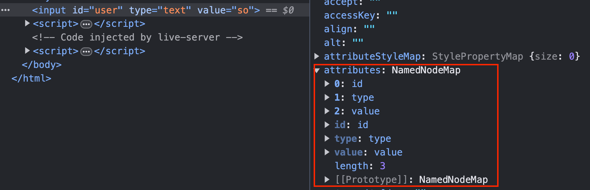
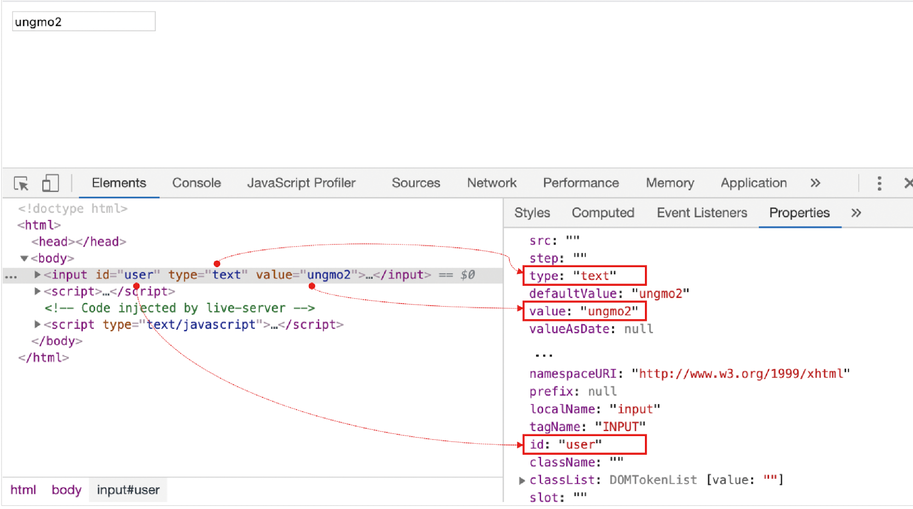

# 39.7 어트리뷰트

## 어트리뷰트 노드와 attributes 프로퍼티

HTML 문서의 구성 요소인 HTML 요소는 여러 개의 attribute(속성)를 가질 수 있다.

HTML 요소의 동작을 제어하기 위한 추가적인 정보를 제공하는 HTML 어트리뷰트는 HTML 요소의 시작 태그에 `어트리뷰트 이름="어트리뷰트 값"` 형식으로 정의한다.

```html
<input id="user" type="text" value="so" />
```

**글로벌 어트리뷰트**(id, class, style, title, lang, tabindex, draggable, hidden 등)와 **이벤트 핸들러 어트리뷰트**(onclick, onchange, onfocus, onblur, oninput, onkeypress, onkeydown, onkeyup, onmouseover, onsubmit, onload 등)는 모든 HTML 요소에서 공통적으로 사용할 수 있지만 특정 HTML 요소에만 한정적으로 사용 가능한 어트리뷰트도 있다.

예를 들어, type, value, checked 어트리뷰트는 input 요소에만 사용할 수 있다.

<br />

HTML 문서가 파싱될 때 HTML 요소의 어트리뷰트는 어트리뷰트 노드로 변환되어 요소 노드와 연결된다. 이때 HTML 어트리뷰트당 하나의 어트리뷰트 노드가 생성된다.

모든 어트리뷰트 노드의 참조는 유사 배열 객체이자 이터러블인 `NamedNodeMap` 객체에 담겨서 요소 노드의 `attributes` 프로퍼티에 저장된다.

<p align="center">
  
</p>

<br />

따라서 요소 노드의 모든 어트리뷰트 노드는 요소 노드의 `Element.prototype.attributes` 프로퍼티로 취득할 수 있다.

attributes 프로퍼티는 getter만 존재하는 읽기 전용 접근자 프로퍼티이며, 요소 노드의 모든 어트리뷰트 노드의 참조가 담긴 NamedNodeMap 객체를 반환한다.

```js
const { attributes } = document.getElementById('user');
console.log(attributes); // NamedNodeMap {0: id, 1: type, 2: value, id: id, type: type, value: value, length: 3}

console.log(attributes.id.value); // user
console.log(attributes.type.value); // text
console.log(attributes.value.value); // so
```

<br />

## HTML 어트리뷰트 조작

Element.prototype.`getAttribute`/`setAttribute` 메서드를 사용하면 attributes 프로퍼티를 통하지 않고 요소 노드에서 메서드를 통해 직접 HTML 어트리뷰트 값을 취득하거나 변경할 수 있어서 편리하다.

- 어트리뷰트 값 참조: `getAttribute(attributeName)` 메서드 사용

- 어트리뷰트 값 변경: `setAttribute(attributeName, attributeValue)` 메서드 사용

```js
const $input = document.getElementById('user');

const inputValue = $input.getAttribute('value');
console.log(inputValue); // so

$input.setAttribute('value', 'foo');
console.log($input.getAttribute('value')); // foo
```

<br />

- 특정 HTML 어트리뷰트가 존재하는지 확인: Element.prototype.`hasAttribute(attributeName)` 메서드 사용

- 특정 HTML 어트리뷰트를 삭제: Element.prototype.`removeAttribute(attributeName)` 메서드 사용

<br />

## HTML 어트리뷰트 vs DOM 프로퍼티

요소 노드 객체에는 HTML 어트리뷰트에 대응하는 프로퍼티(DOM 프로퍼티)가 존재한다. 이 DOM 프로퍼티들은 HTML 어트리뷰트 값을 초기값으로 가지고 있다.

예를 들어, `<input id="user" type="text" value="ungmo2">` 요소가 파싱되어 생성된 요소 노드 객체에는 id, type, value 어트리뷰트에 대응하는 id, type, value 프로퍼티가 존재하며, 이 DOM 프로퍼티들은 HTML 어트리뷰트의 값을 초기값으로 가지고 있다.

<p align="center">
  
</p>

<br />

DOM 프로퍼티는 setter와 getter 모두 존재하는 접근자 프로퍼티다. 따라서 참조와 변경이 가능하다.

```js
const $input = document.getElementById('user');

$input.value = 'foo';
console.log($input.value); // foo
```

이처럼 HTML 어트리뷰트는 다음과 같이 DOM에서 중복 관리되고 있는 것처럼 보인다.

- 요소 노드의 `attributes` 프로퍼티에서 관리하는 어트리뷰트 노드
- HTML 어트리뷰트에 대응하는 요소 노드의 프로퍼티(DOM 프로퍼티)

HTML 어트리뷰트는 DOM에서 중복 관리되고 있지 않다.

<br />

HTML 어트리뷰트의 역할은 HTML 요소의 초기 상태를 지정하는 것이다. 즉, **HTML 어트리뷰트 값은 HTML 요소의 초기 상태를 의미하며 이는 변하지 않는다.**

input 요소의 value 어트리뷰트는 어트리뷰트 노드로 변환되어 요소 노드의 `attributes` 프로퍼티에 할당된다. 따라서 input 요소의 요소 노드가 생성되어 첫 렌더링이 끝난 시점까지 어트리뷰트 노드의 어트리뷰트 값과 요소 노드의 value 프로퍼티에 할당된 값은 HTML 어트리뷰트 값과 동일하다.

```js
console.log($input.getAttribute('value')); // ungmo2
console.log($input.value); // ungmo2
```

하지만 첫 렌더링 이후 사용자가 input 요소에 무언가를 입력하기 시작하면 상황이 달라진다.

**요소 노드는 상태를 가지고 있다.** 예를 들어, input 요소 노드는 사용자가 입력 필드에 입력한 값을 상태로 가지고 있으며, checkbox 요소 노드는 사용자가 입력 필드에 입력한 체크 여부를 상태로 가지고 있다.

이러한 상태는 사용자의 입력에 의해 변화하는, 살아있는 것이다.

<br />

사용자가 input 요소의 입력 필드에 "foo"라는 값을 입력한 경우를 생각해보자. 이때 input 요소 노드는 사용자의 입력에 의해 변경된 **최신 상태**("foo")를 관리해야 하는 것은 물론, HTML 어트리뷰트로 지정한 **초기 상태**("ungmo2")도 관리해야 한다.

초기 상태 값을 관리하지 않으면 웹페이지를 처음 표시하거나 새로고침할 때 초기 상태를 표시할 수 없다.

> ✅ 이처럼 요소 노드는 2개의 상태, 즉 초기 상태와 최신 상태를 관리해야 한다. **요소 노드의 `초기 상태`는 `어트리뷰트 노드`가 관리하며, 요소 노드의 `최신 상태`는 `DOM 프로퍼티`가 관리한다.**

<br />
<br />

### 어트리뷰트 노드

> HTML 어트리뷰트로 지정한 HTML 요소의 초기 상태는 어트리뷰트 노드에서 관리한다.
>
> 노드에서 관리하는 어트리뷰트 값은 사용자의 입력에 의해 상태가 변경되어도 변하지 않고 HTML 어트리뷰트로 지정한 HTML 요소의 초기 상태를 그대로 유지한다.

어트리뷰트 노드가 관리하는 초기 상태 값을 취득하거나 변경하려면 `getAttribute/setAttribute` 메서드를 사용한다.

getAttribute 메서드로 취득한 값은 HTML 요소에 지정한 어트리뷰트 값, 즉 초기 상태 값이므로 결과는 언제나 동일하다.

setAttribute 메서드는 어트리뷰트 노드에서 관리하는 HTML 요소에 지정한 어트리뷰트 값, 즉 초기 상태 값을 변경한다.

<br />

### DOM 프로퍼티

> 사용자가 입력한 최신 상태는 HTML 어트리뷰트에 대응하는 요소 노드의 DOM 프로퍼티가 관리한다.
>
> **DOM 프로퍼티는 사용자의 입력에 의한 상태 변화에 반응하여 언제나 최신 상태를 유지한다.**

```js
const $input = document.getElementById('user');

$input.oninput = () => {
  // 사용자의 입력에 의해 동적으로 변경된다.
  console.log('value 프로퍼티 값', $input.value);
};

// 초기 상태 값은 변하지 않고 유지된다.
console.log('value 어트리뷰트 값', $input.getAttribute('value'));
```

<br />

DOM 프로퍼티에 값을 할당하는 것은 HTML 요소의 최신 상태 값을 변경하는 것을 의미한다. 이때 HTML 요소에 지정한 어트리뷰트 값에는 어떠한 영향도 주지 않는다.

```js
const $input = document.getElementById('user');
$input.value = 'foo';

console.log($input.value); // foo
console.log('value 어트리뷰트 값', $input.getAttribute('value')); // ungmo2
```

<br />

단, 모든 DOM 프로퍼티가 사용자의 입력에 의해 변경된 최신 상태를 관리하는 것은 아니다.

예를 들어, input 요소의 사용자 입력에 의한 상태 변화는 value 프로퍼티가 관리하고 checkbox 요소의 사용자 입력에 의한 상태 변화는 checked 프로퍼티가 관리한다. 하지만 id 어트리뷰트에 대응하는 id 프로퍼티는 사용자의 입력과 아무런 관계가 없다.

따라서 id 어트리뷰트와 id 프로퍼티는 사용자 입력과 관계없이 항상 동일한 값을 유지한다. 즉, id 어트리뷰트 값이 변하면 id 프로퍼티 값도 변하고 그 반대도 마찬가지다.

```js
$input.id = 'foo';

console.log($input.id); // foo
console.log($input.getAttribute('id')); // foo
```

<br />

> 이처럼 사용자 입력에 의한 상태 변화와 관계있는 DOM 프로퍼티만 최신 상태 값을 관리한다. 그 외의 상태 변화와 관계 없는 어트리뷰트와 DOM 프로퍼티는 항상 동일한 값으로 연동한다.

<br />
<br />

### HTML 어트리뷰트와 DOM 프로퍼티의 대응 관계

대부분의 HTML 어트리뷰트는 어트리뷰트 이름과 동일한 DOM 프로퍼티와 1:1로 대응한다. 단, 다음과 같이 HTML 어트리뷰트와 DOM 프로퍼티가 언제나 1:1로 대응하는 것은 아니며, HTML 어트리뷰트 이름과 DOM 프로퍼티 키가 반드시 일치하는 것도 아니다.

- id 어트리뷰트와 id 프로퍼티는 1:1 대응하며, 동일한 값으로 연동한다.

- input 요소의 value 어트리뷰트는 value 프로퍼티와 1:1 대응한다. 하지만 value 어트리뷰트는 초기 상태를, value 프로퍼티는 최신 상태를 갖는다.

- class 어트리뷰트는 className, classList 프로퍼티와 대응한다.

- for 어트리뷰트는 htmlFor 프로퍼티와 1:1 대응한다.

- td 요소의 colspan 어트리뷰트는 대응하는 프로퍼티가 존재하지 않는다.
- textContent 프로퍼티는 대응하는 어트리뷰트가 존재하지 않는다.

- 어트리뷰트 이름은 대소문자를 구별하지 않지만 대응하는 프로퍼티 키는 카멜 케이스를 따른다. (maxlength -> maxLength)

<br />

### DOM 프로퍼티 값의 타입

`getAttribute` 메서드로 취득한 어트리뷰트 값은 언제나 문자열이다.

하지만 DOM 프로퍼티로 취득한 최신 상태 값은 문자열이 아닐 수 있다. 예를 들어, checkbox 요소의 checked 어트리뷰트 값은 문자열이지만 checked 프로퍼티 값은 불리언 타입이다.

```html
<!DOCTYPE html>
<html>
  <body>
    <input type="checkbox" checked />
    <script>
      const $checkbox = document.querySelector('input[type=checkbox]');

      console.log($checkbox.getAttribute('checked')); // ''
      console.log($checkbox.checked); // true
    </script>
  </body>
</html>
```

<br />

## `data` 어트리뷰트와 `dataset` 프로퍼티

data 어트리뷰트와 dataset 프로퍼티를 사용하면 HTML 요소에 정의한 사용자 정의 어트리뷰트와 자바스크립트 간에 데이터를 교환할 수 있다.

data 어트리뷰트는 data-user-id, data-role과 같이 `data-` 접두사 다음에 임의의 이름을 붙여 사용한다.

data 어트리뷰트의 값은 `HTMLElement.dataset` 프로퍼티로 취득할 수 있다. dataset 프로퍼티는 HTML 요소의 모든 data 어트리뷰트의 정보를 제공하는 `DOMStringMap` 객체를 반환한다.

이 객체는 data 어트리뷰트의 data- 접두사 다음에 붙인 임의의 이름을 카멜 케이스로 변환한 프로퍼티를 가지고 있다. 이 프로퍼티로 data 어트리뷰트 값을 취득하거나 변경할 수 있다.

```html
<!DOCTYPE html>
<html>
  <body>
    <ul class="users">
      <li id="1" data-user-id="7621" data-role="admin">Lee</li>
      <li id="2" data-user-id="9524" data-role="subscriber">Kim</li>
    </ul>
    <script>
      const users = [...document.querySelector('.users').children];

      const user = users.find((user) => user.dataset.userId === '7621');
      console.log(user.dataset.role); // "admin"

      user.dataset.role = 'subscriber';

      console.log(user.dataset);
    </script>
  </body>
</html>
```
