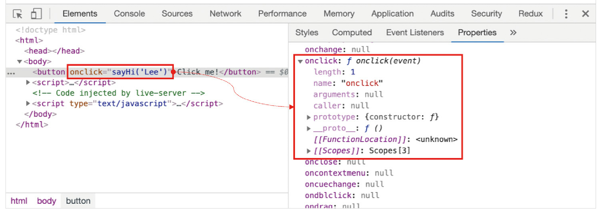
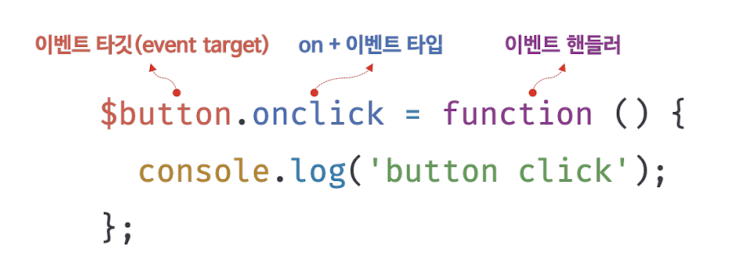
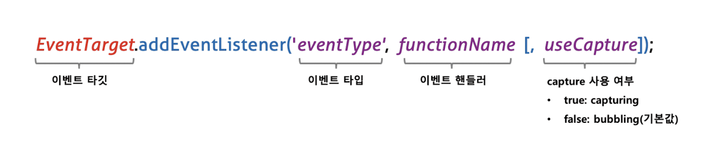
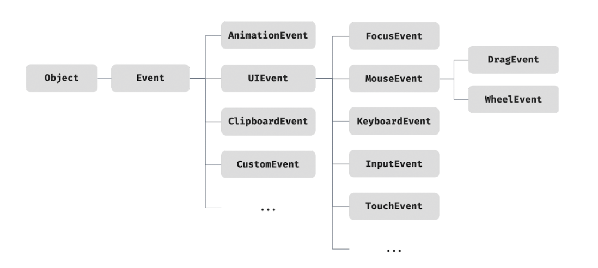
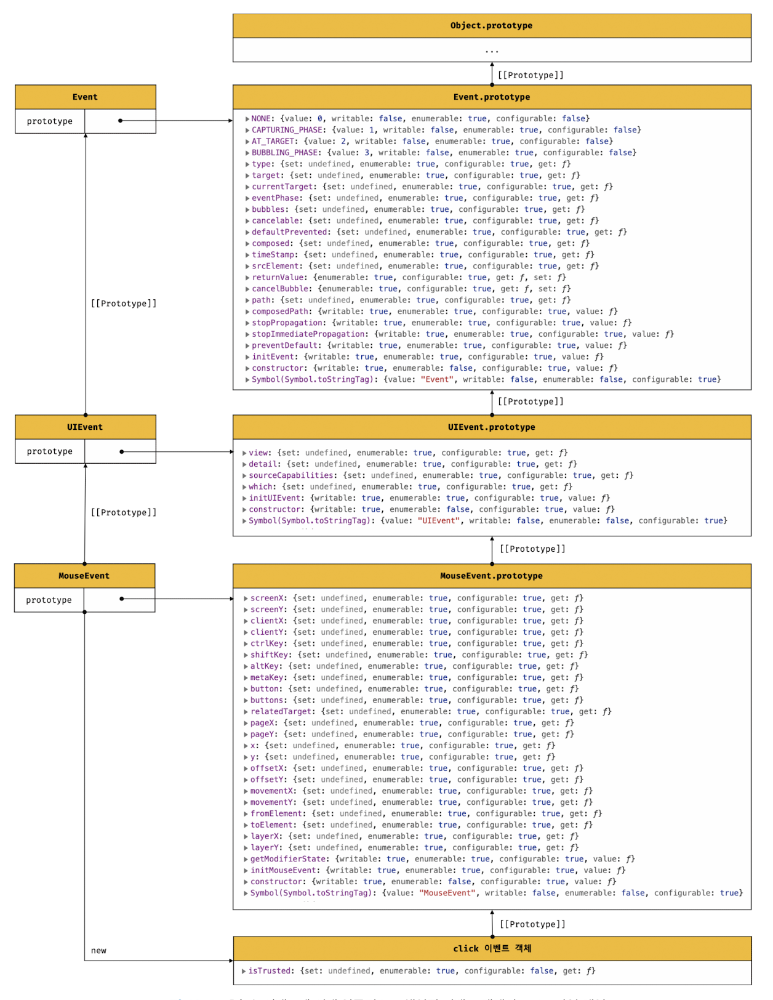
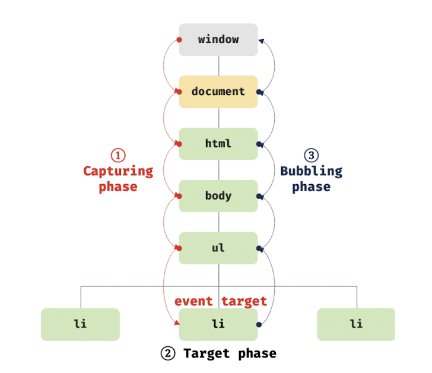

# 40.1 이벤트 드리븐 프로그래밍

브라우저는 클릭, 키보드 입력, 마우스 이동 등이 일어나면 이를 감지하여 특정한 타입의 이벤트를 발생시킨다.

- **이벤트 핸들러**: 이벤트가 발생했을 때 호출될 함수
  이벤트가 발생했을 때 브라우저에게 이벤트 핸들러의 호출을 위임하는 것을 이벤트 핸들러 등록이라 한다.

`Window`, `Document`, `HTMLElement` 타입의 객체는 onclick과 같이 특정 이벤트에 대응하는 다양한 이벤트 핸들러 프로퍼티를 가지고 있다. 이 이벤트 핸들러 프로퍼티에 함수를 할당하면 해당 이벤트가 발생했을 때 할당한 함수가 브라우저에 의해 호출된다.

> 이벤트와 그에 대응하는 함수(이벤트 핸들러)를 통해 사용자와 애플리케이션은 상호작용을 할 수 있다.
> 프로그램의 흐름을 이벤트 중심으로 제어하는 프로그래밍 방식을 **이벤트 드리븐 프로그래밍**이라 한다.

<br />

# 40.2 이벤트 타입

> 이벤트의 종류를 나타내는 문자열

## 40.2.1 마우스 이벤트

- `click` : 마우스 버튼을 클릭했을 때

- `dblclick`: 마우스 버튼을 더블 클릭했을 때
- `mousedown`: 마우스 버튼을 눌렀을 때
- `mouseup`: 누르고 있던 마우스 버튼을 놓았을 때
- `mousemove`: 마우스 커서를 움직였을 때
- `mouseenter`: 마우스 커서를 HTML 요소 안으로 이동했을 때(버블링되지 않는다)
- `mouseover`: 마우스 커서를 HTML 요소 안으로 이동했을 때(버블링된다)
- `mouseleave`: 마우스 커서를 HTML 요소 밖으로 이동했을 때(버블링되지 않는다)
- `mouseout`: 마우스 커서를 HTML 요소 밖으로 이동했을 때(버블링된다)

<br />

## 40.2.2 키보드 이벤트

- `keydown`: 모든 키를 눌렀을 때 발생한다.

  control, option, shift, tab, delete, enter, 방향 키와 문자, 숫자, 특수 문자 키를 눌렀을 때 발생한다.

  단, 문자, 숫자, 특수 문자, enter 키를 눌렀을 때는 연속적으로 발생하지만 그 외의 키를 눌렀을 때는 한번만 발생한다.

- `keypress`: 문자 키를 눌렀을 때 연속적으로 발생한다.

  문자, 숫자, 특수 문자, enter 키를 눌렀을 때만 발생한다. 폐지(deprecated)되었으므로 사용하지 않을 것을 권장한다.

- `keyup`: 누르고 있던 키를 놓았을 때 한 번만 발생한다.

  keydown 이벤트와 마찬가지로 control, option, shift, tab, delete, enter 키를 놓았을 때 발생한다.

<br />

## 40.2.3 포커스 이벤트

- `focus`: HTML 요소가 포커스를 받았을 때(버블링되지 않는다)

- `blur`: HTML 요소가 포커스를 잃었을 때(버블링되지 않는다)

- `focusin`: HTML 요소가 포커스를 받았을 때(버블링된다)

- `focusout`: HTML 요소가 포커스를 잃었을 때(버블링된다)

> `focusin`, `focusout` 이벤트 핸들러를 이벤트 핸들러 프로퍼티 방식으로 등록하면 크롬, 사파리에서 정상 동작하지 않는다. `addEventListener` 메서드를 사용해 등록해야 한다.

<br />

## 40.2.4 폼 이벤트

- `submit`

  1. form 요소 내의 input(text, checkbox, radio), select 입력 필드(textarea 제외)에서 엔터키를 눌렀을 때

  2. form 요소 내의 submit 버튼(`<button>`, `<input type="submit">`)을 클릭했을 때

  ✔️ submit 이벤트는 form 요소에서 발생한다.

- `reset`: form 요소 내의 reset 버튼을 클릭했을 때(최근에는 사용 안 함)

<br />

## 40.2.5 값 변경 이벤트

- `input`: input(text, checkbox, radio), select, textarea 요소의 값이 입력되었을 때
- `change`: input(text, checkbox, radio), select, textarea 요소의 값이 변경되었을 때

  ✔️ change 이벤트는 input 이벤트와 달리 HTML 요소가 포커스를 잃었을 때 사용자 입력이 종료되었다고 인식하여 발생한다. 즉, 사용자가 입력을 하고 있을 때는 input 이벤트가 발생하고 사용자 입력이 종료되어 값이 변경되면 change 이벤트가 발생한다.

- `readystatechange`: HTML 문서의 로드와 파싱 상태를 나타내는 `document.readyState` 프로퍼티 값('loading', 'interactive', 'complete')이 변경될 때

<br />

## 40.2.6 DOM 뮤테이션 이벤트

- `DOMContentLoaded`: **HTML 문서의 로드와 파싱이 완료되어 DOM 생성이 완료되었을 때**

## 40.2.7 뷰 이벤트

- `resize`: 브라우저의 윈도우(window) 크기를 리사이즈할 때 연속적으로 발생한다.

  ✔️ 오직 `window` 객체에서만 발생한다.

- `scroll`: 웹페이지(document) 또는 HTML 요소를 스크롤할 때 연속적으로 발생한다.

<br />

## 40.2.8 리소스 이벤트

- `load`: **`DomContentLoaded` 이벤트가 발생한 이후**, 모든 리소스(이미지, 폰트 등)의 로딩이 완료되었을 때(주로 window 객체에서 발생)

- `unload`: 리소스가 언로드될 때(주로 새로운 웹페이지를 요청한 경우)

- `abort`: 리소스 로딩이 중단되었을 때
- `error`: 리소스 로딩이 실패했을 때

<br />
<br />

# 40.3 이벤트 핸들러 등록

## 40.3.1 이벤트 핸들러 어트리뷰트 방식

이벤트 핸들러 어트리뷰트의 이름은 `on` 접두사와 이벤트의 종류를 나타내는 이벤트 타입으로 이루어져 있다.

이벤트 핸들러 어트리뷰드 값으로 함수 호출문 등의 문을 할당하면 이벤트 핸들러가 등록된다.

```html
<button onclick="sayHi('Lee')">Click me!</button>

<script>
  function sayHi(name) {
    console.log(`Hi! ${name}.`);
  }
</script>
```

> 주의할 점은 이벤트 핸들러 어트리뷰트 값으로 **함수 참조가 아닌 함수 호출문 등의 문을 할당**한다는 것이다.

<br />

이벤트 핸들러를 등록할 때 콜백 함수와 마찬가지로 함수 참조를 등록해야 브라우저가 이벤트 핸들러를 호출할 수 있다.
만약 함수 참조가 아니라 함수 호출문을 등록하면 함수 호출문의 평가 결과가 이벤트 핸들러로 등록된다.

함수를 반환하는 고차 함수 호출문을 이벤트 핸들러를 등록한다면 문제가 없겠지만 함수가 아닌 값을 반환하는 함수 호출문을 이벤트 핸들러로 등록하면 브라우저가 이벤트 핸들러를 호출할 수 없다.

하지만 위 예제에서는 이벤트 핸들러 어트리뷰트 값으로 함수 호출문을 할당했다.

🌟 이때 이벤트 핸들러 어트리뷰트 값은 사실 **암묵적으로 생성될 이벤트 핸들러의 함수 몸체**를 의미한다.

즉, `onclick="sayHi('Lee')"` 어트리뷰트는 파싱되어 다음과 같은 함수를 암묵적으로 생성하고, 이벤트 핸들러 어트리뷰트 이름과 동일한 키 onclick 이벤트 핸들러 프로퍼티에 할당한다.

```js
function onclick(event) {
  sayHi('Lee');
}
```



이처럼 동작하는 이유는 이벤트 핸들러에 인수를 전달하기 위해서다.

만약 이벤트 핸들러 어트리뷰트 값으로 함수 참조를 할당해야 한다면 이벤트 핸들러에 인수를 전달하기 곤란하다.

```js
<button onclick="sayHi">Click me!</button>
```

결국 이벤트 핸들러 어트리뷰트 값으로 할당한 문자열은 암묵적으로 생성되는 이벤트 핸들러의 함수 몸체다.

따라서 이벤트 핸들러 어트리뷰트 값으로 다음과 같이 여러 개의 문을 할당할 수 있다.

```js
<button onclick="console.log('Hi! '); console.log('Lee');">Click me!</button>
```

이벤트 핸들러 어트리뷰트 방식은 오래된 코드에서 간혹 이 방식을 사용한 것이 있기 때문에 알아둘 필요는 있지만 더는 사용하지 않는 것이 좋다.

HTML과 자바스크립트는 관심사가 다르므로 혼재하는 것보다 분리하는 것이 좋다.

하지만 모던 자바스크립트에서는 이벤트 핸들러 어트리뷰트 방식을 사용하는 경우가 있다.
CBD(Component Based Development) 방식의 Angular/React/Svelte/Vue.js 같은 프레임워크/라이브러리에서는 이벤트 핸들러 어트리뷰트 방식으로 이벤트를 처리한다.

CBD에서는 HTML, CSS, 자바스크립트를 관심사가 다른 개별적인 요소가 아닌, 뷰를 구성하기 위한 구성 요소로 보기 때문에 관심사가 다르다고 생각하지 않는다.

<br />
<br />

## 40.3.2 이벤트 핸들러 프로퍼티 방식

`window` 객체와 `Document`, `HTMLElement` 타입의 DOM 노드 객체는 이벤트에 대응하는 이벤트 핸들러 프로퍼티를 가지고 있다.

이벤트 핸들러 프로퍼티에 함수를 바인딩하면 이벤트 핸들러가 등록된다.

```js
const $button = document.querySelector('button');

$button.onclick = function () {
  console.log('button click');
};
```

<br />

이벤트 핸들러를 등록하기 위해서는 이벤트를 발생시킬 객체인 **이벤트 타깃**과 이벤트의 종류를 나타내는 문자열인 **이벤트 타입** 그리고 **이벤트 핸들러**를 지정할 필요가 있다.



이벤트 핸들러는 대부분 이벤트를 발생시킬 이벤트 타깃에 바인딩하지만 반드시 이벤트 타깃에 이벤트 핸들러를 바인딩해야 하는 것은 아니다.

이벤트 핸들러는 **이벤트 타깃 또는 전파된 이벤트를 캐치할 DOM 노드 객체**에 바인딩한다.

<br />

이벤트 핸들러 프로퍼티 방식은 이벤트 핸드러 어트리뷰트 방식의 HTML과 자바스크립트가 뒤섞이는 문제를 해결할 수 있다. 하지만 이벤트 핸들러 프로퍼티에 하나의 이벤트 핸들러만 바인딩할 수 있다는 단점이 있다.

```js
const $button = document.querySelector('button');

// 첫 번째로 바인딩된 이벤트 핸들러는 두 번째 바인딩된 이벤트 핸들러에 의해 재할당되어 실행되지 않는다.
$button.onclick = function () {
  console.log('button click 1');
};

$button.onclick = function () {
  console.log('button click 2');
};
```

<br />
<br />

## 40.3.3 `addEventListener` 메서드 방식

DOM Level 2에서 도입된 `EventTarget.prototype.addEventListener` 메서드를 사용하여 이벤트 핸들러를 등록할 수 있다.



`addEventListener` 메서드의 첫 번째 매개변수에는 이벤트의 종류를 나타내는 문자열인 이벤트 타입을 전달한다. 이때 앞서 나온 방식과는 달리 on 접두사를 붙이지 않는다.

두 번째 매개변수에는 이벤트 핸들러를 전달하고, 마지막 매개변수에는 이벤트를 캐치할 이벤트 전파 단계(캡쳐링 또는 버블링)를 지정한다.
생략하거나 false를 지정하면 버블링 단계에서 이벤트를 캐치하고, true를 지정하면 캡쳐링 단계에서 이벤트를 캐치한다.

```js
const $button = document.querySelector('button');

$button.addEventListener('click', function () {
  console.log('button click');
});
```

<br />

동일한 HTML 요소에서 발생한 동일한 이벤트에 대해 이벤트 핸들러 프로퍼티 방식과 addEventListener 메서드 방식을 모두 사용하여 이벤트 핸들러를 등록해보자.

```js
const $button = document.querySelector('button');

$button.onclick = function () {
  console.log('[이벤트 핸들러 프로퍼티 방식]');
};

$button.addEventListener('click', function () {
  console.log('[addEventListener 메서드 방식]');
});
```

addEventListener 메서드 방식은 이벤트 핸들러 프로퍼티에 바인딩된 이벤트 핸들러에 아무런 영향을 주지 않는다.
따라서 버튼 요소에서 클릭 이벤트가 발생하면 2개의 이벤트 핸들러가 모두 호출된다.

동일한 HTML 요소에서 발생한 동일한 이벤트에 대해 이벤트 핸들러 프로퍼티 방식은 하나 이상의 이벤트 핸들러를 등록할 수 없지만 addEventListener 메서드는 하나 이상의 이벤트 핸들러를 등록할 수 있다. 이때 이벤트 핸들러는 **등록된 순서대로 호출**된다.

⚠️ 단, addEventListener 메서드를 통해 **참조가 동일한 이벤트 핸들러를 중복 등록하면 하나의 이벤트 핸들러만 등록된다.**

```js
const $button = document.querySelector('button');

const handleClick = () => console.log('button click');

// 참조가 동일한 이벤트 핸들러를 중복 등록하면 하나의 핸들러만 등록된다.
$button.addEventListener('click', handleClick);
$button.addEventListener('click', handleClick);
```

<br />
<br />

# 40.4 이벤트 핸들러 제거

`addEventListener` 메서드로 등록한 이벤트 핸들러를 제거하려면 `EventTarget.prototype.removeEventListener` 메서드를 사용한다.
메서드에 전달할 인수는 addEventListener 메서드와 동일하다.

🌟 단, addEventListener 메서드에 전달한 인수와 `removeEventListener` 메서드에 전달한 인수가 일치하지 않으면 이벤트 핸들러가 제거되지 않는다.

```js
const $button = document.querySelector('button');

const handleClick = () => console.log('button click');

// 이벤트 핸들러 등록
$button.addEventListener('click', handleClick);

// 이벤트 핸들러 제거
$button.removeEventListener('click', handleClick, true); // 실패
$button.removeEventListener('click', handleClick); // 성공
```

<br />

`removeEventListener` 메서드에 인수로 전달한 이벤트 핸들러는 `addEventListener` 메서드에 인수로 전달한 등록 이벤트 핸들러와 동일한 함수이어야 한다. **따라서 무명 함수를 이벤트 핸들러로 등록한 경우 제거할 수 없다. 이벤트 핸들러를 제거하려면 이벤트 핸들러의 참조를 변수나 자료구조에 저장하고 있어야 한다.**

<br />

단, 기명 이벤트 핸들러 내부에서 removeEventListener 메서드를 호출하여 이벤트 핸들러를 제거하는 것은 가능하다. 이때 이벤트 핸들러는 단 한 번만 호출된다.

```js
$button.addEventListener('click', function foo() {
  console.log('button click');

  $button.removeEventListener('click', foo);
});
```

기명 함수를 이벤트 핸들러로 등록할 수 없다면 호출된 함수, 즉 함수 자신을 가리키는 `argument.callee` 를 사용할 수도 있다.

```js
$button.addEventListener('click', function () {
  console.log('button click');

  $button.removeEventListener('click', arguments.callee);
});
```

`argument.callee`는 코드 최적화를 방해하므로 `strict mode`에서 사용이 금지된다. 따라서 가급적 이벤트 핸들러의 참조를 변수나 자료구조에 저장하여 제거하는 편이 좋다.

<br />

이벤트 핸들러 프로퍼티 방식으로 등록한 이벤트 핸들러를 제거하려면 이벤트 핸들러 프로퍼티에 `null`을 할당한다.

```js
const $button = document.querySelector('button');

const handleClick = () => console.log('button click');

$button.onclick = handleClick;

// removeEventListener 메서드로 이벤트 핸들러를 제거할 수 없다.
$button.removeEventListener('click', handleClick);

// 이벤트 핸들러 프로퍼티에 null을 할당하여 이벤트 핸들러를 제거한다.
$button.onclick = null;
```

<br />
<br />

# 40.5 이벤트 객체

이벤트가 발생하면 이벤트에 관련된 다양한 정보를 담고 있는 이벤트 객체가 동적으로 생성된다.
**생성된 이벤트 객체는 이벤트 핸들러의 첫 번째 인수로 전달된다.**

이벤트 객체를 전달받으려면 이벤트 핸들러를 정의할 때 이벤트 객체를 전달받을 매개변수를 명시적으로 선언해야 한다.

```js
const $msg = document.querySelector('.message');

function showCoords(e) {
  $msg.textContent = `clientX: ${e.clientX}, clientY: ${e.clientY}`;
}

document.onclick = showCoords;
```

<br />

이벤트 핸들러 어트리뷰트 방식으로 이벤트 핸들러를 등록했다면 다음과 같이 `event` 를 통해 이벤트 객체를 전달받을 수 있다.

```html
<!DOCTYPE html>
<html>
  <head>
    <style>
      html,
      body {
        height: 100%;
      }
    </style>
  </head>
  <body onclick="showCoords(event)">
    <p>클릭하세요. 클릭한 곳의 좌표가 표시됩니다.</p>
    <em class="message"></em>
    <script>
      const $msg = document.querySelector('.message');

      function showCoords(e) {
        $msg.textContent = `clientX: ${e.clientX}, clientY: ${e.clientY}`;
      }
    </script>
  </body>
</html>
```

이 방식의 경우 이벤트 객체를 전달받으려면 이벤트 핸들러의 첫 번째 매개변수 이름이 반드시 `event` 이어야 한다. 만약 event가 아닌 다른 이름으로 매개변수를 선언하면 이벤트 객체를 전달받지 못한다.

앞에서 살펴본 바와 같이 이벤트 핸들러 어트리뷰트 값은 사실 암묵적으로 생성되는 이벤트 핸들러의 함수 몸체를 의미하기 때문이다. 즉, `onclick="showCoords(event)"` 어트리뷰트는 파싱되어 다음과 같은 함수를 암묵적으로 생성하여 onclick 이벤트 핸들러 프로퍼티에 할당한다.

```js
function onclick(event) {
  showCoords(event);
}
```

이때 암묵적으로 생성된 onclick 이벤트 핸들러의 첫 번째 매개변수 이름이 `event`로 암묵적으로 명명되기 때문에 event가 아닌 다른 이름으로는 이벤트 객체를 전달받지 못한다.

<br />

## 40.5.1 이벤트 객체의 상속 구조

이벤트가 발생하면 이벤트 타입에 따라 다양한 타입의 이벤트 객체가 생성된다.


`Event`, `UIEvent`, `MouseEvent` 등 모두는 생성자 함수다. 따라서 생성자 함수를 호출하여 이벤트 객체를 생성할 수 있다.

```js
// ===== foo 이벤트 타입의 Event 객체를 생성한다. ======
let e = new Event('foo');
console.log(e);
// Event {isTrusted: false, type: 'foo', target: null, currentTarget: null, eventPhase: 0, …}

console.log(e instanceof Event); // true
console.log(e instanceof Object); // true

// ===== FocusEvent 생성자 함수를 호출하여 focus 이벤트 타입의 FocusEvent 객체를 생성한다. =====
e = new FocusEvent('focus');
console.log(e);
// FocusEvent {isTrusted: false, relatedTarget: null, view: null, detail: 0, sourceCapabilities: null, …}

// ===== MouseEvent 생성자 함수를 호출하여 click 이벤트 타입의 MouseEvent 객체를 생성한다. =====
e = new MouseEvent('click');
console.log(e);
// MouseEvent {isTrusted: false, screenX: 0, screenY: 0, clientX: 0, clientY: 0, …}
```

이처럼 이벤트가 발생하면 암묵적으로 생성되는 이벤트 객체도 생성자 함수에 의해 생성된다. 그리고 생성된 이벤트 객체는 생성자 함수와 더불어 생성되는 프로토타입으로 구성된 프로토타입 체인의 일원이 된다.

예를 들어, click 이벤트가 발생하면 암묵적으로 생성되는 MouseEvent 타입의 이벤트 객체는 다음과 같은 프로토타입 체인의 일원이 된다.



<br />

이벤트 객체 중 일부는 사용자의 행위에 의해 생성된 것이고 일부는 자바스크립트 코드에 의해 인위적으로 생성된 것이다.

예를 들어, MouseEvent 타입의 이벤트 객체는 사용자가 마우스를 클릭하거나 이동했을 때 생성되는 이벤트 객체이며, CustomEvent 타입의 이벤트 객체는 자바스크립트 코드에 의해 인위적으로 생성한 이벤트 객체다.

<br />

## 40.5.2 이벤트 객체의 공통 프로퍼티

Event 인터페이스의 이벤트 관련 프로퍼티는 모든 이벤트 객체가 상속받는 공통 프로퍼티다.

| 공통 프로퍼티      | 설명                                                                                                                                                      | 타입          |
| ------------------ | --------------------------------------------------------------------------------------------------------------------------------------------------------- | ------------- |
| `type`             | 이벤트 타입                                                                                                                                               | `string`      |
| `target`           | 이벤트를 발생시킨 DOM 요소                                                                                                                                | DOM 요소 노드 |
| `currentTarget`    | 이벤트 핸들러가 바인딩된 DOM 요소                                                                                                                         | DOM 요소 노드 |
| `eventPhase`       | 이벤트 전파 단계 <br /> 0: 이벤트 없음, 1: 캡쳐링 단계, 2: 타깃 단계, 3: 버블링 단계                                                                      | `number`      |
| `bubbles`          | 이벤트를 버블링으로 전파하는지 여부                                                                                                                       | `boolean`     |
| `cancelable`       | `preventDefault` 메서드를 호출하여 이벤트의 기본 동작을 취소할 수 있는지 여부                                                                             | `boolean`     |
| `defaultPrevented` | `preventDefault` 메서드를 호출하여 이벤트를 취소했는지 여부                                                                                               | `boolean`     |
| `isTrusted`        | 사용자의 행위에 의해 발생한 이벤트인지 여부. <br /> 예를 들어, click 메서드 또는 dispatchEvent 메서드를 통해 인위적으로 발생시킨 이벤트인 경우 false이다. | `boolean`     |
| `timeStamp`        | 이벤트가 발생한 시각(1970/01/01/00:00:0 부터 경과한 밀리초)                                                                                               | `number`      |

<br />

## 40.5.3 마우스 정보 취득

`MouseEvent` 타입의 이벤트 객체는 다음과 같은 고유의 프로퍼티를 갖는다.

- 마우스 포인터의 좌표 정보를 나타내는 프로퍼티: `screenX`/`screenY`, `clientX`/`clientY`, `pageX`/`pageY`, `offsetX`/`offsetY`

- 버튼 정보를 나타내는 프로퍼티: `altKey`, `ctrlKey`, `shiftKey`, `button`

<br />
<br />

## 40.5.4 키보드 정보 취득

`KeyboardEvent` 타입의 이벤트 객체는 `altKey`, `ctrlKey`, `shiftKey`, `metaKey`, `key`, `keyCode` 같은 고유의 프로퍼티를 갖는다.

<br />

# 40.6 이벤트 전파

> 이벤트 전파(event propagation): DOM 트리 상에 존재하는 DOM 요소 노드에서 발생한 이벤트는 DOM 트리를 통해 전파된다.

```html
<html>
  <body>
    <ul id="fruits">
      <li id="apple">Apple</li>
      <li id="banana">Banana</li>
      <li id="orange">Orange</li>
    </ul>
  </body>
</html>
```

ul 요소의 두 번째 자식인 li 요소를 클릭하면 클릭 이벤트가 발생한다. 이때 생성된 이벤트 객체는 이벤트를 발생시킨 DOM 요소인 이벤트 타깃을 중심으로 DOM 트리를 통해 전파된다.



- **캡처링 단계**: 이벤트가 상위 요소에서 하위 요소 방향으로 전파

- **타깃 단계**: 이벤트가 이벤트 타깃에 도달
- **버블링 단계**: 이벤트가 하위 요소에서 상위 요소 방향으로 전파

<br />

```js
const $fruits = document.getElementById('fruits');

// #fruits 요소의 하위 요소인 li 요소를 클릭한 경우
$fruits.addEventLister('click', (e) => {
  console.log(`이벤트 단계: ${e.eventPhase}`); // 3: 버블링 단계
  console.log(`이벤트 타깃: ${e.target}`); // [object HTMLLIElement]
  console.log(`커런트 타깃: ${e.currentTarget}`); // [object HTMLUListElement]
});
```

li 요소를 클릭하면 클릭 이벤트가 발생하여 클릭 이벤트 객체가 생성되고 클릭된 li요소가 이벤트 타깃이 된다. 이때 클릭 이벤트 객체는 `window`에서 시작해서 이벤트 타깃 방향으로 전파된다.(캡처링 단계)
이후 이벤트 객체는 이벤트를 발생시킨 이벤트 타깃에 도달한다.(타깃 단계) 이후 이벤트 객체는 이벤트 타깃에서 시작해서 `window` 방향으로 전파된다.(버블링 단계)

<br />

이벤트 핸들러 어트리뷰트/프로퍼티 방식으로 등록한 이벤트 핸들러는 타깃 단계와 버블링 단계의 이벤트만 캐치할 수 있다. 하지만 `addEventListener` 메서드 방식으로 등록한 이벤트 핸들러는 타깃, 버블링 단계뿐만 아니라 메서드의 3번째 인수로 true를 전달하면 캡처링 단계의 이벤트도 캐치할 수 있다.

<br />

이벤트는 이벤트를 발생시킨 이벤트 타깃은 물론 상위 DOM 요소에서도 캐치할 수 있다. 즉, DOM 트리를 통해 전파되는 이벤트는 이벤트 패스(이벤트가 통과하는 DOM 트리 상의 경로,`Event.prototype.composedPath` 메서드로 확인할 수 있다)에 위치한 모든 DOM 요소에서 캐치할 수 있다.

대부분의 이벤트는 캡처링과 버블링을 통해 전파된다. 하지만 다음 이벤트는 버블링을 통해 전파되지 않는다. (이벤트객체의 공통 프로퍼티 `event.bubbles` 의 값이 모두 `false`)

- 포커스 이벤트: `focus`/`blur`
- 리소스 이벤트: `load`/`unload`/`abort`/`error`
- 마우스 이벤트: `mouseenter`/`mouseleave`

<br />

**캡처링 단계의 이베트와 버블링 단계의 이벤트를 캐치하는 이벤트 핸들러가 혼용되는 경우**

```html
<html>
  <body>
    <p>버블링과 캡처링 이벤트 <button>버튼</button></p>
    <script>
      // 버블링 단계의 이벤트를 캐치
      document.body.addEventListener('click', () => {
        console.log('Handler for body.');
      });

      // 캡처링 단계의 이벤트를 캐치
      document.querySelector('p').addEventListener(
        'click',
        () => {
          console.log('Handler for paragraph');
        },
        true
      );

      // 타깃 단계의 이벤트를 캐치
      document.querySelector('button').addEventListener('click', () => {
        console.log('Handler for button');
      });
    </script>
  </body>
</html>
```

위 예제의 경우 body 요소는 버블링 단계의 이벤트만을 캐치하고 p 요소는 캡처링 단계의 이벤트만 캐치한다.

이벤트는 캡처링 - 타깃 - 버블링 단계로 전파되므로 만약 button 요소에서 클릭 이벤트가 발생하면 먼저 캡처링 단계를 캐치하는 p 요소의 이벤트 핸들러가 호출되고, 그후 버블링 단계의 이벤트를 캐치하는 body 요소의 이벤트 핸들러가 순차적으로 호출된다.

<br />
<br />

# 40.7 이벤트 위임

> 여러 개의 하위 DOM 요소에 각각 이벤트 핸들러를 등록하는 대신 하나의 상위 DOM 요소에 이벤트 핸들러를 등록하는 방법

이벤트 위임을 통해 하위 DOM 요소에서 발생한 이벤트를 처리할 때 주의할 점은 상위 요소에 이벤트 핸들러를 등록하기 때문에 이벤트 타깃, 즉 이벤트를 실제로 발생시킨 DOM 요소가 개발자가 기대한 DOM 요소가 아닐 수도 있다는 것이다.

따라서 이벤트에 반응이 필요한 DOM 요소에 한정하여 이벤트 핸들러가 실행되도록 이벤트 타깃을 검사할 필요가 있다.
`Element.prototype.matches` 메서드는 인수로 전달된 선택자에 의해 특정 노드를 탐색 가능한지 확인한다.

<br />

일반적으로 이벤트 객체의 `target` 프로퍼티와 `currentTarget` 프로퍼티는 동일한 DOM 요소를 가리키지만 이벤트 위임을 통해 상위 DOM 요소에 이벤트를 바인딩한 경우 이 두 개의 프로퍼티가 다른 DOM 요소를 가리킬 수 있다.

<br />
<br />

# 40.8 DOM 요소의 기본 동작 조작

## 40.8.1 DOM 요소의 기본 동작 중단

DOM 요소는 저마다 기본 동작이 있다.
예를 들어, `a` 요소를 클릭하면 `href` 어트리뷰트에 지정된 링크로 이동하고, `checkbox` 또는 `radio` 요소를 클릭하면 체크 또는 해제된다.

이벤트 객체의 `preventDefault` 메서드는 이러한 DOM 요소의 기본 동작을 중단시킨다.

## 40.8.2 이벤트 전파 방지

이벤트 객체의 `stopPropagation` 메서드는 이벤트 전파를 중지시킨다.

이 메서드는 하위 DOM 요소의 이벤트를 개별적으로 처리하기 위해 이벤트의 전파를 중단시킨다.

<br />

# 40.9 이벤트 핸들러 내부의 `this`

## 40.9.1 이벤트 핸들러 어트리뷰트 방식

```html
<html>
  <body>
    <button onclick="handleClick()">Click me</button>
    <script>
      function handleClick() {
        console.log(this); // window
      }
    </script>
  </body>
</html>
```

이벤트 핸들러 어트리뷰트의 값으로 지정한 문자열은 암묵적으로 생성되는 이벤트 핸들러의 문이라고 했다. 따라서 handleClick 함수는 이벤트 핸들러에 의해 일반 함수로 호출되고, 이 함수 내부의 this는 전역 객체 window를 가리킨다.

단, 이벤트 핸들러를 호출할 때 인수로 전달한 this는 이벤트를 바인딩한 DOM 요소를 가리킨다.

```html
<html>
  <body>
    <button onclick="handleClick(this)">Click me</button>
    <script>
      function handleClick(button) {
        console.log(button); // 이벤트를 바인딩한 button 요소
        console.log(this); // window
      }
    </script>
  </body>
</html>
```

<br />

## 40.9.2 이벤트 핸들러 프로퍼티 방식과 `addEventListener` 메서드 방식

이벤트 핸들러 프로퍼티 방식과 addEventListener 메서드 방식 모두 이벤트 핸들러 내부의 this는 이벤트를 바인딩한 DOM 요소를 가리킨다. **즉, 이벤트 핸들러 내부의 this는 이벤트 객체의 `currentTarget` 프로퍼티와 같다.**

<br />

화살표 함수로 정의한 이벤트 핸들러 내부의 this는 상위 스코프의 this를 가리킨다. 화살표 함수는 함수 자체의 this 바인딩을 갖지 않는다.

```js
$button.onclick = (e) => {
  console.log(this); // window
  console.log(e.currentTarget); // $button
  console.log(this === e.currentTarget); // false
};
```

<br />

클래스에서 이벤트 핸들러를 바인딩하는 경우 this에 주의해야 한다.

```html
<html>
  <body>
    <button class="btn">0</button>
    <script>
      class App {
        constructor() {
          this.$button = document.querySelector('.btn');
          this.count = 0;

          this.$button.onclick = this.increase;
        }

        increase() {
          // increase 내부의 this는 DOM 요소(this.$button)를 가리킨다. 따라서 this.$button은 this.$button.$button과 같다.
          this.$button.textContent = ++this.count;
          // -> TypeError: Cannot set property 'textContent' of undefined
        }
      }
    </script>
  </body>
</html>
```

위 예제의 increase 메서드 내부의 this는 클래스가 생성할 인스턴스를 가리키지 않는다. 이벤트 핸들러 내부의 this는 이벤트를 바인딩한 DOM 요소를 가리키기 때문에 increase 메서드 내부의 this는 `this.$button`을 가리킨다.

따라서 increase 메서드를 이벤트 핸들러로 바인딩할 때 `bind` 메서드를 사용해 this를 전달하여 increase 메서드 내부의 this가 클래스를 생성할 인스턴스를 가리키도록 해야 한다.

```js
class App {
  constructor() {
    this.$button = document.querySelector('.btn');
    this.count = 0;

    // increase 메서드 내부의 this가 인스턴스를 가리키도록 한다.
    this.$button.onclick = this.increase.bind(this);
  }

  increase() {
    this.$button.textContent = ++this.count;
  }
}
```

<br />

또는 클래스 필드에 할당한 화살표 함수를 이벤트 핸들러로 등록하여 이벤트 핸들러 내부의 this가 인스턴스를 가리키도록 할 수 있다. 다만 이때 이벤트 핸들러는 프로토타입 메서드가 아닌 인스턴스 메서드가 된다.

```js
class App {
  constructor() {
    this.$button = document.querySelector('.btn');
    this.count = 0;

    this.$button.onclick = this.increase;
  }

  increase = () => (this.$button.textContent = ++this.count);
}
```

<br />
<br />

# 40.10 이벤트 핸들러에 인수 전달

이벤트 핸들러 프로퍼티 방식과 `addEventListener` 메서드 방식의 경우 이벤트 핸들러 내부에서 함수를 호출하면서 인수를 전달할 수 있다.

```js
const MIN_USER_NAME_LENGTH = 5;
const $input = document.querySelector('input[type=text]');
const $msg = document.querySelector('.message');

const checkUserNameLength = (min) => {
  $msg.textContent =
    $input.value.length < min ? `이름은 ${min}자 이상 입력해 주세요` : '';
};

$input.onblur = () => {
  checkUserNameLength(MIN_USER_NAME_LENGTH);
};
```

또는 이벤트 핸들러를 반환하는 함수를 호출하면서 인수를 전달할 수도 있다.

```js
const checkUserNameLength = (min) => (e) => {
  $msg.textContent =
    $input.value.length < min ? `이름은 ${min}자 이상 입력해 주세요` : '';
};

$input.onblur = checkUserNameLength(MIN_USER_NAME_LENGTH);
```

<br />
<br />

# 40.11 커스텀 이벤트

## 40.11.1 커스텀 이벤트 생성

이벤트가 발생하면 암묵적으로 생성되는 이벤트 객체는 발생한 이벤트 종류에 따라 이벤트 타입이 결정된다. 하지만 이벤트 생성자 함수를 호출하여 명시적으로 생성한 이벤트 객체는 임의로 이벤트 타입을 지정할 수 있다. 이처럼 개발자의 의도로 생성된 이벤트를 커스텀 이벤트라 한다.

이벤트 생성자 함수는 첫 번째 인수로 이벤트 타입을 나타내는 문자열을 전달받는다.
이때 이벤트 타입을 나타내는 문자열은 기존 이벤트 타입을 사용할 수도 있고, 임의의 문자열을 사용하여 새로운 이벤트 타입을 지정할 수도 있다. 이 경우 일반적으로 `CustomEvent` 이벤트 생성자 함수를 사용한다.

```js
const customEvent = new CustomEvent('foo');
console.log(customEvent.type); // foo
```

생성된 커스텀 이벤트 객체는 버블링되지 않으며 `preventDefault` 메서드로 취소할 수도 없다. 즉, 커스텀 이벤트 객체는 `bubbles`와 `cancelable` 프로퍼티의 값이 false로 기본 설정된다.

<br />

커스텀 이벤트 객체의 bubbles 또는 cancelable 프로퍼티를 true로 설정하려면 이벤트 생성자 함수의 두 번째 인수로 bubbles 또는 cancelable 프로퍼티를 갖는 객체를 전달한다.

```js
const customEvent = new MouseEvent('click', {
  bubbles: true,
  cancelable: true,
});
```

이 두 개의 프로퍼티뿐만 아니라 이벤트 타입에 따라 가지는 이벤트 고유의 프로퍼티 값을 지정할 수도 있다.

```js
const customEvent = new MouseEvent('click', {
  bubbles: true,
  cancelable: true,
  clientX: 50,
  clientY: 100,
});

const keyboardEvent = new KeyboardEvent('keyup', { key: 'Enter' });
```

<br />

이벤트 생성자 함수로 생성한 커스텀 이벤트는 `isTrusted` 프로퍼티의 값이 언제나 false다. 커스텀 이벤트가 아닌 사용자의 행위에 의해 발생한 이벤트에 의해 생성된 이벤트 객체의 `isTrusted` 프로퍼티의 값은 언제나 true다.

<br />

## 40.11.2 커스텀 이벤트 디스패치

생성된 커스텀 이벤트는 `dispatchEvent` 메서드로 디스패치(이벤트를 발생시키는 행위)할 수 있다. `dispatchEvent` 메서드에 이벤트 객체를 인수로 전달하면서 호출하면 인수로 전달한 이벤트 타입의 이벤트가 발생한다.

```html
<html>
  <body>
    <button class="btn">Click me</button>
    <script>
      const $button = document.querySelector('.btn');

      // 커스텀 이벤트를 디스패치하기 이전에 이벤트 핸들러를 등록해야 한다.
      $button.addEventListener('click', (e) => {
        console.log(e); // MouseEvent {isTrusted: false, ...}
        alert(`${e} Clicked!`);
      });

      const customEvent = new MouseEvent('click');

      // 커스텀 이벤트 디스패치(동기 처리)
      $button.dispatchEvent(customEvent);
    </script>
  </body>
</html>
```

일반적으로 이벤트 핸들러는 비동기 처리 방식으로 동작하지만 `dispatchEvent` 메서드는 이벤트 핸들러를 동기 처리 방식으로 호출한다.

다시 말해, `dispatchEvent` 메서드를 호출하면 커스텀 이벤트에 바인딩된 이벤트 핸들러를 직접 호출하는 것과 같다. 따라서 이벤트를 디스패치하기 이전에 커스텀 이벤트를 처리할 이벤트 핸들러를 등록해야 한다.

<br />

기존 이벤트 타입이 아닌 임의의 이벤트 타입을 지정하여 이벤트 객체를 생성하는 경우 CustomEvent 이벤트 생성자를 사용하고, 이 함수에는 두 번째 인수로 이벤트와 함께 전달하고 싶은 정보를 담은 `detail` 프로퍼티를 포함하는 객체를 전달할 수 있다.

```js
$button.addEventListener('foo', (e) => {
  alert(e.detail.message);
});

const customEvent = new CustomEvent('foo', {
  detail: { message: 'Hello' },
});

// 커스텀 이벤트 디스패치
$button.dispatchEvent(customEvent);
```

**기존 이벤트 타입이 아닌 임의의 이벤트 타입을 지정하여 커스텀 이벤트 객체를 생성한 경우 반드시 `addEventListener` 메서드 방식으로 이벤트 핸들러를 등록해야 한다.**

이벤트 핸들러 어트리뷰트/프로퍼티 방식을 사용할 수 없는 이유는 `on + 이벤트 타입`으로 이루어진 이벤트 핸들러 어트리뷰트/프로퍼티가 요소 노드에 존재하지 않기 때문이다.
예를 들어, 'foo'라는 임의의 이벤트 타입으로 커스텀 이벤트를 생성한 경우 'onfoo'라는 핸들러 어트리뷰트/프로퍼티가 요소 노드에 존재하지 않기 때문에 이 방식으로는 이벤트 핸들러를 등록할 수 없다.ㄴ
