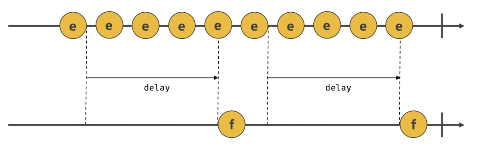

# 41.1 호출 스케줄링

함수를 명시적으로 호출하면 함수가 즉시 실행된다. 만약 함수를 명시적으로 호출하지 않고 일정 시간이 경과된 이후에 호출되도록 함수 호출을 예약하려면 타이머 함수를 사용한다.

자바스크립트는 타이머를 생성할 수 있는 타이머 함수 `setTimeout`과 `setInterval`, 타이머를 제거할 수 있는 타이머 함수 `clearTimeout`과 `clearInterval`을 제공한다.

타이머 함수는 ECMAScript 사양에 정의된 빌트인 함수가 아니다. 하지만 브라우저 환경과 Node.js 환경에서 모두 전역 객체의 메서드로서 타이머 함수를 제공한다. 즉, 타이머 함수는 호스트 객체다.

<br />

자바스크립트 엔진은 단 하나의 실행 컨텍스트 스택을 갖기 때문에 두 가지 이상의 태스크를 동시에 실행할 수 없다. 즉, 자바스크립트 엔진은 **싱글 스레드**로 동작한다. 이런 이유로 타이머 함수는 **비동기 처리 방식**으로 동작한다.

<br />
<br />

# 41.2 타이머 함수

## 41.2.1 `setTimeout` / `clearTimeout`

setTimeout 함수는 두 번째 인수로 전달받은 시간(ms, 1/1000초)으로 **단 한 번 동작하는 타이머를 생성**한다. 이후 타이머가 만료되면 첫 번째 인수로 전달받은 콜백 함수가 호출된다.

즉, setTimeout 함수의 콜백 함수는 두 번째 인수로 전달받은 시간 이후 단 한 번 실행되도록 호출 스케줄링된다.

```js
const timeoutId = setTimeout(func|code[, delay, param1, param2, ...])
```

- `func`: 타이머가 만료된 뒤 호출될 콜백 함수

  콜백 함수 대신 코드를 문자열로 전달할 수 있다. 이때 코드 문자열은 타이머가 만료된 뒤 해석되고 실행된다. 이는 흡사 `eval` 함수와 유사하며 권장하지는 않는다.

- `delay`: 타이머 만료 시간(밀리초 단위). 인수 전달을 생략한 경우 기본값 0이 지정된다.

  - delay 시간이 설정된 타이머가 만료되면 콜백 함수가 즉시 호출되는 것이 보장되지는 않는다. delay 시간은 태스크 큐에 콜백 함수를 등록하는 시간을 지연할 뿐이다.

  - delay가 4ms 이하인 경우 최소 지연 시간 4ms가 지정된다.

- param: 호출 스케줄링된 콜백 함수에 전달해야 할 인수가 존재하는 경우 세 번째 이후의 인수로 전달할 수 있다.

<br />

setTimeout 함수는 `생성된 타이머를 식별할 수 있는 고유한 타이머 id를 반환`한다. 이 id는 **브라우저 환경인 경우 숫자이며 Node.js 환경인 경우 객체다.**

setTimeout 함수가 반환한 타이머 id를 `clearTimeout` 함수의 인수로 전달하여 타이머를 취소할 수 있다.

```js
const timerId = setTimeout(() => console.log('Hi!'), 1000);

clearTimeout(timerId);
```

<br />

## 41.2.2 `setInterval` / `clearInterval`

setInterval 함수는 두 번째 인수로 전달받은 시간으로 **반복 동작하는 타이머를 생성한다.** 이후 타이머가 만료될 때마다 첫 번째 인수로 전달받은 콜백 함수가 반복 호출되고, 타이머가 취소될 때까지 계속된다.

즉, setInterval 함수의 콜백 함수는 두 번째 인수로 전달받은 시간이 경과할 때마다 반복 실행되도록 호출 스케줄링된다. 함수에 전달할 인수는 setTimeout 함수와 동일하다.

setTimeout과 마찬가지로 setInterval 함수는 생성된 타이머를 식별할 수 있는 고유한 타이머 id를 반환하고, `clearInterval` 함수의 인수로 전달하여 타이머를 취소할 수 있다.

```js
const timeoutId = setInterval(() => {
  console.log(count); // 1 2 3 4 5

  if (count++ === 5) clearInterval(timeoutId);
}, 1000);
```

<br />
<br />

# 41.3 디바운스와 스로틀

`scroll`, `resize`, `input`, `mousemove` 같은 이벤트는 짧은 시간 간격으로 연속해서 발생한다.
이러한 이벤트에 바인딩한 이벤트 핸들러는 과도하게 호출되어 성능에 문제를 일으킬 수 있다.

> ✔️ 디바운스와 스로틀은 짧은 시간 간격으로 연속해서 발생하는 이벤트를 그룹화해서 과도한 이벤트 핸들러의 호출을 방지하는 프로그래밍 기법이다.

<br />

## 41.3.1 디바운스(debounce)

짧은 시간 간격으로 이벤트가 연속해서 발생하면 이벤트 핸들러를 호출하지 않다가 일정 시간이 경과한 이후에 이벤트 핸들러가 한 번만 호출되도록 한다.

💡 즉, 디바운스는 짧은 시간 간격으로 발생하는 이벤트를 그룹화해서 **마지막에 한 번만 이벤트 핸들러가 호출되도록 한다.**

예를 들어, 텍스트 입력 필드에서 input 이벤트가 짧은 시간 간격으로 연속해서 발생하는 경우를 살펴보자.

```js
const $input = document.querySelector('input');
const $msg = document.querySelector('.msg');

const debounce = (callback, delay) => {
  let timerId;

  // debounce 함수는 timerId를 기억하는 클로저를 반환한다.
  return (...args) => {
    // delay가 경과하기 이전에 이벤트가 발생하면 이전 타이머를 취소하고 새로운 타이머 재설정
    // => delay보다 짧은 간격으로 이벤트가 발생하면 callback은 호출되지 않는다.
    if (timerId) clearTimeout(timerId);
    timerId = setTimeout(callback, delay, ...args);
  };
};

$input.oninput = debounce((e) => {
  $msg.textContent = e.target.value;
}, 300);
```

사용자가 입력을 완료했는지 여부는 정확히 알 수 없으므로 일정 시간 동안 입력 필드에 값을 입력하지 않으면 입력이 완료된 것으로 간주한다.

이를 위해 debounce가 반환한 함수는 debounce 함수에 두 번째 인수로 전달한 delay보다 짧은 간격으로 이벤트가 발생하면 이전 타이머를 취소하고 새로운 타이머를 재설정한다.

따라서 delay 보다 짧은 간격으로 이벤트가 연속해서 발생하면 debounce 함수의 첫 번째 인수로 전달한 콜백 함수는 호출되지 않다가 delay 동안 input 이벤트가 더 이상 발생하지 않으면 한 번만 호출된다.


디바운스는 resize 이벤트 처리나 input 요소에 입력된 값으로 ajax 요청하는 입력 필드 자동완성 UI 구현, 버튼 중복 클릭 방지 처리 등에 유용하게 사용된다.

위 예제의 debounce 함수는 이해를 위해 간략하게 구현하여 완전하지 않다. 실무에서는 Underscore의 debounce 함수나 Lodash의 debounce 함수를 사용하는 것을 권장한다.

<br />

## 41.3.2 스로틀(throttle)

스로틀은 짧은 시간 간격으로 이벤트가 연속해서 발생하더라도 일정 시간 간격으로 이벤트 핸들러가 최대 한 번만 호출되도록 한다.

💡 즉, 스로틀은 짧은 시간 간격으로 연속해서 발생하는 이벤트를 그룹화해서 **일정 시간 단위로 이벤트 핸들러가 호출되도록 호출 주기를 만든다.**

<br />

```js
const throttle = (callback, delay) => {
  let timerId;

  return (...args) => {
    // delay가 경과하기 이전에 이벤트가 발생하면 아무것도 하지 않다가 delay가 경과했을 때 이벤트가 발생하면 새로운 타이머 재설정
    // 따라서 delay 간격으로 callback이 호출된다.
    if (timerId) return;
    timerId = setTimeout(() => {
      callback(...args);
      timerId = null;
    }, delay);
  };
};
```

`scroll` 이벤트는 사용자가 스크롤할 때 짧은 시간 간격으로 연속해서 발생한다. 이처럼 짧은 시간 간격으로 연속해서 발생하는 이벤트의 과도한 이벤트 핸들러의 호출을 방지하기 위해 `throttle` 함수는 이벤트를 그룹화해서 일정 시간 단위로 이벤트 핸들러가 호출되도록 호출 주기를 만든다.



스로틀은 scroll 이벤트 처리나 무한 스크롤 UI 구현 등에 유용하게 사용된다.
